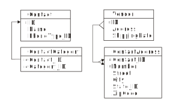

= Database Design Techniques
:author: Alphora
:doctype: book

:data-uri:
:lang: en
:encoding: iso-8859-1

[[DDGDatabaseDesignTechniques]]
== Summary

As we have seen in the previous chapters, a large part of Dataphor
Application development is simply database design. In fact, the Dataphor
platform tends to magnify artifacts of bad database design. If a given
database design requires a large amount of supporting hand-written code,
the developer should take a step back and consider an alternate solution
to the problem that may lend itself more easily to implementation within
the Dataphor framework.

That being said, it is worth noting that database design is both an art,
and a science. While there are some objective principles such as
normalization theory that can be used as guidelines when designing a
database, by and large the process takes practice and experience.

This chapter brings together various discussions on a broad range of
database design topics, with the intent of providing the developer with
some high-level database design guidelines. The discussions are
necessarily abstract in places, but we attempt to make them concrete by
utilizing some of the design decisions that were made while building the
Shipping application.

The discussion begins with a description of the modeling notation that
has been used throughout this part for visualizing database designs, and
then turns to a broad overview of what database design is and why it
plays such an important role in the Dataphor product. The remainder of
the chapter then discusses specific database design issues.

[[DDGDatabaseDesignTechniques-ModelingNotation]]
== Modeling Notation

While there are many different modeling notations available today, we
feel that none have effectively and simply captured the essence of
relational database design. As such, we have adopted a simple visual
notation for representing database designs. The notation makes no
attempt at capturing constraint definitions other than keys and
references, and is not intended as a complete notation for database
design.

The only elements that are represented by the notation are base table
variables, columns, keys, and references. This simplicity renders the
notation an effective tool for sketching database designs, while
capturing enough detail to communicate the major components of a given
design.

Base table variables are represented as a labeled box, the label is the
name of the base table variable being depicted. The columns of the table
are listed vertically within the box.

An asterisk to the left of a column indicates that it participates in a
key constraint. Any number of key constraints can be represented, with
multiple columns of asterisks to the left of the column list.

Reference constraints are depicted as directed lines connecting tables.
The lines originate in the source table, directly from the source
column, with multiple columns depicted as multiple leading lines into
the main reference line. The lines terminate at the target table,
directly into the target column, with multiple columns depicted as
multiple lines leading into the target table. Arrow heads terminate each
lead line of the reference.

The following example diagram illustrates each of these design notations:

.Modeling Notation Diagram

[[DDGDatabaseDesignTechniques-DatabaseDesign]]
== Database Design

Any serious discussion of database design must begin by answering a
simple question: Just what exactly _is_ database design? Intuitively,
the answer is simply the process of modeling some aspect of reality
within a database. But how exactly is this accomplished? What elements
of an application schema correspond with the concepts and entities of
the real world? Perhaps the simplest answer is an observation by Hugh
Darwen, paraphrasing slightly, that types are the concepts we want to
talk about, and relations are the things we want to say about those
concepts [3].

To put it another way, every table in the database carries some meaning
that can be directly interpreted in terms of objects in the real world.
In a properly designed database, every table will correspond one-to-one
with some statement about that segment of the real world that is being
modeled.

Another approach to determining just what database design really is
involves taking a step back and asking the question: What exactly is a
database? What purpose does a database application serve? The textbook
answer, of course, is that a database is an organized collection of
facts. But what does this mean in terms of solving a real-world problem?
The answer lies in the fundamental motivation behind the creation of
database applications in the first place: __automation__.

Computers have given us a wonderful tool for solving problems. They are
absolutely analytical, and completely obedient. They perform whatever
task is demanded without question, and give us an efficient mechanism
for performing mundane or complicated tasks, simply by instructing the
system. So the answer is, we build applications in order to automate the
tasks we would otherwise have to perform manually. In many cases, the
resulting automation enables us to perform tasks that would be
impossible to complete.

[[DDGDatabaseDesignTechniques-DatabaseDesign-Meaning]]
=== Meaning

In order to enable this automation, we need three things: first, a
general purpose framework for describing the real world; second, a model
built within this framework that describes that segment of the real
world we are interested in, and third, a language for manipulating that
model, and asking questions about it. The relational model provides us
with this general purpose framework, application schemas provide the
description of the real world, and a database language based on the
relational model provides us with the ability to manipulate the data in
that model, and ask questions about that data.

For example, in the Shipping application, that segment of the real world
we are interested in is the day-to-day operations of a fictitious
distribution business. Obviously, the system has no idea what a shipping
location is, or why it is important. But as users of the system, we
understand that the existence of a row in the Location table means that
the organization has a shipping location.

In addition to modeling the existence of entities in the real world, we
can model relationships between those entities. For example, the Invoice
table has a Location_ID column. The value of this column for a
particular row indicates that a given invoice originated at the
specified location. Again, the system has no idea what an invoice is, or
why it would originate at a location. But by enforcing the reference
constraint that a value in the Location_ID column must exist as a value
in the ID column of the Location row, we allow the system to enforce
that every invoice must originate in some location.

This simple example illustrates one of the most important overall
principles of database design: that the sum total of constraints in the
database are the best approximation of the _meaning_ of that data to the
system.

[[DDGDatabaseDesignTechniques-DatabaseDesign-Predicates]]
=== Predicates

So the basic elements available in an application schema, namely types,
table variables, and constraints, correspond roughly to the concepts of
nouns, statements, and rules. For instance, to return to the example of
shipping locations, we need to talk about location identifiers, phone
numbers, and addresses. We want to say, "There is a shipping location
with a unique identifier, that has some phone number, and some address."

The nouns in this sentence are modeled by various types within the
application schema. For example, in order to talk about location
identifiers, the Shipping application schema has a type LocationID.
Valid values for this type are well-formed location identifiers,
according to the rules for building location identifiers set out by the
organization.

By replacing the "variables" within the statement above with the values
of the corresponding columns for some row in the Location table, we
obtain the fact, "There is a shipping location with identifier '001',
that has phone number '555-0990', and address '123 West Frontage Rd.,
Provo, UT 84604'."

This simple relationship between tables in the database and statements
about the real world lies at the heart of the simplicity and power of
the relational model. Consequently, understanding that every table
actually corresponds to some facet of reality lies at the heart of good
database design.

[[DDGDatabaseDesignTechniques-ScalarTypes]]
== Scalar Types

Because scalar types describe the domains of discourse for the
application, they are a crucial element of the design effort. If done
properly, type design can isolate and prevent many design flaws before
they occur. Proper type design is the first step in ensuring that the
data for an application is represented correctly and completely. This
section discusses some of the issues that arise in connection with
designing scalar types for use in a relational database application.

[[DDGDatabaseDesignTechniques-ScalarTypes-UsingScalarTypes]]
=== Using Scalar Types

The first point to be made in connection with scalar types is that they
should be __used__. This sounds like a trivial observation, but the fact
is that type design is an often neglected facet of database design. For
example, the set of values for a Gender column is often simply defined
as a character string of length one (allowing any alphanumeric
character) when in fact, a Gender type with possible values representing
_male_ and _female_ is the more accurate description of the data for the
column.

Failure to enforce these types of constraints leads directly to a lack
of integrity in the application data. In many cases, this lack of
integrity translates directly to program failures. For example, a query
writer may reasonably assume that the only valid values for the Gender
column are in fact M and F, and proceed to construct an incorrect query
based on that reasonable, but false, assumption.

[[DDGDatabaseDesignTechniques-ScalarTypes-VerifyingSemantics]]
=== Verifying Semantics

One of the most significant benefits of defining types is that it helps
the compiler understand and verify the semantics of any given D4
program. For example, given the LocationItem table:

....
create table LocationItem
{
    Location_ID : LocationID,
    ItemType_ID : ItemTypeID,
    Price : Money,
    ...,
    key { Location_ID, ItemType_ID }
};
....

the compiler can resolve table-indexer expressions like the one
appearing in the operator below:

....
create operator InvoiceItemChangeItemTypeID(var ARow : typeof(InvoiceItem[])) : Boolean
begin
    result := false;
    if not(IsNil(ARow.ItemType_ID)) then
    begin
        update ARow
            set
            {
                Amount :=
                    LocationItem[CurrentLocationID(), ARow.ItemType_ID].Price
            };
        result := true;
    end;
end;
....

If the Location_ID and ItemType_ID columns were both defined to be of
type String, the compiler would have no way of resolving the index terms
to the corresponding key columns. Clearly, this is just one example of
the compiler facilitating development as a direct result of using types.
Anywhere that operator resolution occurs will also benefit from this
usage.

[[DDGDatabaseDesignTechniques-ScalarTypes-ScalarTypesasaLevelofIndirection]]
=== Scalar Types as a Level of Indirection

One of the key benefits of using types within an application is that
they provide a logical layer of indirection between the definition of
the set of values, and the usage of those values within table and
variable definitions in the application. For example, suppose we have
defined a Description type that is the set of all strings less than or
equal to fifty characters in length. If the application subsequently
needs to expand that constraint, only the definition of the Description
type needs to change.

In addition, types form a common repository for metadata about values of
that type. For example, the type of control to be used in the
presentation layer can be specified with the type definition. The title,
display width, and other presentation layer information, as well as
storage definitions can all be associated at the type level.

That being said, it must be noted that metadata is by default
__dynamic__, meaning that will be _inherited_ or inferred by any
reference to it. For example, a column defined in terms of a given
scalar type will inherit the dynamic tags from that scalar type.
Depending on the type of information being presented, this can be good
or bad.

For control-level information such as the __element type__, or __display
width__, this is useful because regardless of the context, this
information will be relevant. For visual indicators such as the
__title__, this information may be relevant, but it may not.

For example, given a general purpose type such as Description, a generic
title specified at the scalar type level will usually make sense no
matter the context in which a value of that type appears. For
specific-use types such as ContactID, however, a generic title at the
scalar type level may be too presumptuous. For the ID column of the
Contact table, the title may be __ID__, but for the Contact_ID column
within the ContactAddress table, the type is obviously still ContactID,
but the title may be __Contact ID__. Taking these types of issues into
consideration as part of the design process can simplify presentation
layer development later.

[[DDGDatabaseDesignTechniques-ScalarTypes-ScalarTypesVersusTableVariables]]
=== Scalar Types vs. Table Variables

Given that the logical representations for scalar types are structurally
identical to row type definitions, it is natural to ask the question:
What is the difference? In other words, if scalar types can be
arbitrarily complex, to the point that any table type definition could
in fact serve as the definition for a possible representation of a
scalar type, what justification is there for defining table variables?
Why not just define everything in terms of scalar types? We may also
take the opposite extreme and ask: why not just define everything in
terms of table variables, why allow for scalar types of arbitrary
complexity? This section addresses these issues footnote:[This section
is largely a summary of Appendix C: A Design Dilemma of The Third
Manifesto [3]]. The interested reader is referred to that discussion for
a more exhaustive treatment of this issue.].

To make the problem concrete, consider the following simplified Contact
table:

....
create table Contact
{
    ID : ContactID,
    Name : ProperName,
    Phone : Phone,
    key { ID }
};
....

Couldn't we also define a Contact type that would be capable of
representing the same information:

....
create type Contact
{
    representation Contact
    {
        ID : ContactID,
        Name : ProperName,
        Phone : Phone
    }
};
....

The answer, of course, is yes, but begs the question, What would be
gained by doing so? The first disadvantage of this approach is that in
order to actually store any contact information, we must still define a
table variable:

....
create table Contact
{
    Contact : Contact,
    key { Contact }
};
....

But now, in order to access any of the information about a given
contact, we must first access the components of the representation:

....
select Contact where Contact.ID = 1;
....

Of course, we could define a view to expose the original version of the
Contact table:

....
create view ContactDetail
    Contact { Contact.ID ID, Contact.Name Name, Contact.Phone Phone };
....

but now we are back to the original definition of the Contact table
without gaining any expressive power, but having added significant
complexity.

To take the opposite extreme, consider the Coordinate type:

....
create type Coordinate
{
    Coordinate
    {
        Latitude : Degree,
        Longitude : Degree
    }
};
....

Obviously, rather than define this type, we could define a table
variable containing columns for the Latitude and Longitude components:

....
create table ZipCode
{
    ZipCode : Zip,
    ...
    Latitude : Degree,
    Longitude : Degree,
    key { ZipCode }
};
....

With this design however, we lose the ability to discuss the coordinate
as a single piece of information. This forces all operators that would
more naturally be defined in terms of coordinates, to be defined in
terms of the components of a coordinate. For example:

....
create operator Distance
(
    Latitude1 : Degree,
    Longitude1 : Degree,
    Latitude2 : Degree,
    Longitude2 : Degree
) : Distance;
....

rather than the more natural:

....
create operator Distance
(
    Coordinate1 : Coordinate,
    Coordinate2 : Coordinate
) : Distance;
....

Clearly, neither extreme provides the ideal solution for all cases. The
key insight is that types and tables are both required, and that only by
combining the two elements do we take advantage of the flexibility and
expressive power provided by the D4 language. The answer to all these
questions then lies in the simple observation that scalar types should
be provided at the level of detail required by the application in
question. Although this guideline is rather subjective, the examples
provided in this section should illustrate the effects of moving too far
in either direction.

[[DDGDatabaseDesignTechniques-Operators]]
== Operators

Because operators provide the primary mechanism for modeling the
behavior of an application, they must also be considered as a
significant part of database design. Broadly, there are at least two
different categories of operators to be considered: operators that are
provided as part of a type definition in order to manipulate values of
that type, and high-level operators that model the process logic of the
application, either as event handlers, or directly invoked processes.
This section discusses the various issues encountered when designing and
implementing operators in D4 both for manipulation of user-defined
types, and for modeling process logic.

[[DDGDatabaseDesignTechniques-Operators-Overloading]]
=== Overloading

Operators in D4 can be __overloaded__. In other words, two operators can
share the same operator name, so long as they have different signatures.
The natural question then becomes: When should overloads be used?

The answer to this question is that, as a general rule, the semantics of
an operator should be reflected in the name of the operator. By
implication, the different overloads of an operator should all have the
same semantics.

Operator overloading is particularly useful when defining scalar types
such as Distance in the Shipping application. In this case, the
following overload of the multiplication operator is used:

....
create operator iMultiplication
(
    const ADistance : Distance,
    const ARate : ShippingRate
) : Money
begin
    result := ADistance.Miles * ARate.Rate;
end;
....

This overload enables multiplication to be used with the Distance type
just as we would expect:

....
select Miles(12) * DollarsPerMile(10);
....

Another use for overloads is to provide defaults for parameters of a
given operator. For example, consider the following DateTime overloads:

....
create operator DateTime
(
    const AYear : Integer,
    const AMonth : Integer,
    const ADay : Integer,
    const AHour : Integer,
    const AMinute : Integer,
    const ASecond : Integer
) : DateTime;

create operator DateTime
(
    const AYear : Integer,
    const AMonth : Integer,
    const ADay : Integer
) : DateTime
begin
    result := DateTime(AYear, AMonth, ADay, 12, 0, 0);
end;
....

The second overload simply invokes the first, providing defaults for the
last three parameters.

[[DDGDatabaseDesignTechniques-Operators-Method-StyleInvocation]]
=== Method-Style Invocation

For any given operator, D4 allows standard invocation, as well as
object-oriented style "method" invocation using the dot (.) operator.
Because of this we may reasonably ask: Which one is better? When should
one be used over the other?

The reason that both styles are included in the language is to allow for
personal taste to dictate usage. That being said, conventions should be
put in place once an invocation style is agreed upon within an
organization.

However, it should be noted that the different invocation styles tend to
change the conceptual meaning of the invocation. Taking a step back, the
reason that we have computer languages in the first place is to enable
us as humans to express formal instructions in a way that is as close to
our native language as possible. In other words, we would like the code
we write to be as readable as possible, while still understood by the
compiler. To this end, we choose names for the objects we reference in
our expressions that match the intended meaning.

For example, we provide the Split operator to _split_ a string into
components, based on some set of delimiters. Naming the operator in this
way we intuitively know what it does when we read an invocation in some
expression:

....
var LStrings := Split(AString, ',');
....

This is in contrast to the absurd:

....
var LVar1 := StringOperator1(AString, ',');
....

Not to belabor the point, but the importance of choosing names carefully
cannot be overstated. In object-oriented style invocation, we have:

....
var LStrings := AString.Split(',');
....

In this case the meaning is still abundantly clear, but some would argue
that this style of invocation is more intuitive, or at the very least,
more familiar to someone with a background in today's programming
languages. But consider what happens when we use a different operator in
this way:

....
var LIndex := Pos(',', AString);
....

Using this style of invocation, the Pos operator intuitively reads: The
position of _this_ (',') string in _that_ (AString) string. Using
method-style invocation however, we have:

....
var LIndex := ','.Pos(AString);
....

which is completely the opposite of what we would intuitively want to
express. To this end, the D4 string library actually includes IndexOf,
which reverses the order of the arguments to allow for this style of
invocation:

....
var LIndex := AString.IndexOf(',');
....

which reads: Given the string (AString), find the index of this string
(','). Clearly, then, the choice of invocation style affects how we
intuitively read operator invocations within expressions, and hence the
names that will be chosen for a given operator. To this end, we
recommend that the naming convention for operators be consistent with
the convention for invocation style.

[[DDGDatabaseDesignTechniques-TableVariables]]
== Table Variables

Table variables are arguably the most important product of database
design. They correspond to the concepts of the problem domain being
modeled, and the statements we wish to make about them. In addition,
through table-valued expressions, they provide the mechanism for
answering questions about the problem domain based on the current state
of the database. This section contains several discussions relating to
the design of table variables in a database.

[[DDGDatabaseDesignTechniques-TableVariables-Normalization]]
=== Normalization

Any discussion of database design will inevitably arrive at the concept
of __normalization__. Normalization is the process of producing a set of
table variable definitions that are in some __normal form__.
_Normalization theory_ is the formal basis for this process and an
active branch of database theory.

An exhaustive treatment of normalization is beyond the scope of this
guide, but the discussion will attempt to provide a general overview of
the process, and why it is important.

Intuitively, normalization simply involves identifying the key concepts,
and ensuring that each table variable definition corresponds with one,
and only one, concept in the problem domain. To put it another way,
every column in a fully normalized table definition depends on the key,
the whole key, and nothing but the key.

As a discipline, normalization seeks to identify certain types of
redundancy with the intention of providing a formal basis for removing
it. In general, redundancy in database design leads to __update
anomalies__, or inconsistencies in the data due to updates that affect
only part of a redundant set of information. Normalization removes these
certain types of redundancies, and avoids the resulting update
anomalies.

At this point it should be noted that redundancy in and of itself is not
necessarily a problem. Representing the same information in different
ways can be useful for a variety of practical reasons. The problem is
_uncontrolled_ redundancy. If the same information is represented in
different ways, and an update operation changes only one of the
representations, the database is inconsistent.

As long as redundancy is controlled, either with a constraint, or using
event handlers to synchronize different representations, the system
remains consistent.

For more information on normalization, refer to the recommended reading
section at the end of this chapter.

[[DDGDatabaseDesignTechniques-TableVariables-PhysicalConsiderations]]
=== Physical Considerations

Generally speaking, fully normalized database designs are the most
desirable. They do not suffer from the various update anomalies that
arise in connection with storing redundant information, and therefore do
not require special constraint enforcement or update propagation to
control the redundancy.

In many ways, Dataphor enables, and even encourages, more normalized
designs. However, the Dataphor platform is not immune from the physical
characteristics of existing systems. Usage patterns in each application
will be different and performance issues may arise as applications scale
in terms of number of users, and data volume.

The process of _denormalization_ refers to the deliberate introduction
of redundancy in order to improve the performance of certain queries
against the database. While there are practical cases for
denormalization, there is _always_ a trade-off to be made.

That trade-off is the additional performance cost and development
complexity of controlling the redundancy introduced by the
denormalization. If the redundancy is not controlled, the database will
inevitably be updated in such a way that the data becomes inconsistent,
and any performance gains that may have been achieved by the
denormalization are far outweighed by the fact that the database is now
incorrect, and will in general produce wrong answers.

In addition, any performance gains achieved by the denormalization,
usually for retrieval based queries, will be offset by the performance
cost associated with controlling the redundancy, usually for
modification operations.

In short, denormalization should always be used carefully, and only when
the costs and benefits are fully understood. We therefore recommend
starting with a fully normalized design, and only introducing controlled
redundancy when it is absolutely necessary. In addition, each
denormalization decision should be documented fully with the
application.

For more information on denormalization, refer to the recommended
reading section at the end of this chapter.

[[DDGDatabaseDesignTechniques-Constraints]]
== Constraints

The various types of constraints available within the D4 language
provide an extremely powerful medium for enforcing the business rules of
an application. Perhaps the most important point to be made in
conjunction with constraints is that they should be used as much as
possible.

Whenever a business requirement can be expressed as a constraint, it
should be. Not only will the constraint definition serve to ensure that
the data in the database conforms to established business policies, each
constraint definition provides the system with more information about
the meaning of the data.

This section discusses some of the issues that arise in connection with
defining constraints in a Dataphor application.

[[DDGDatabaseDesignTechniques-Constraints-TypeVersusColumnandRowConstraints]]
=== Type Constraints vs. Column and Row Constraints

Because D4 provides for several different levels of constraints, a
natural question to ask is: when should each type of constraint be used?
For keys and references, the answer is trivial, but for type-, column-,
and row-level constraints, the answer is not as obvious.

For example, we may ask: what is the benefit of defining a constraint on
a type, rather than a column? Conversely, we may wonder whether there is
ever a reason to define a constraint on a column, rather than a type.
The answer to this question lies in the observation that type
constraints and column constraints are fundamentally different things.

A type constraint specifies the set of valid values for a given type,
whereas a column constraint restricts the values that may be assigned to
a particular variable, namely the column of each row within a table
variable. In other words, the column-level constraint, like all the
other categories of constraints, involves a _variable_ within the
database. The type constraint does not.

With this insight, we can easily distinguish between constraints that
describe the valid set of values for a type, and constraints that would
restrict the values for a variable. For example, the NameSince column in
the Contact table in the Shipping application includes a constraint that
requires the value of the column to be less than or equal to the current
date and time. Clearly, this is not a restriction on the valid values
for the type, rather it is a restriction on the values that constitute
valid data for the variable in question.

To differentiate between the usage of column and row constraints,
several points should be made:

* Column constraints cannot reference global state.
+
As a result, row constraints are more powerful in terms of the business
rules that can be enforced with them. To put it another way, row
constraints can always be used to enforce column constraints, but the
reverse is not true in general.
* Column constraints cannot be transition constraints.
+
Again, only row-level constraints can specify transitions.
* Column constraints will be checked immediately during data entry,
providing the user with immediate feedback if something is wrong.
Row-level constraints, by contrast, will be checked as part of a
validation phase when accepting the entire entry.

With these points in mind, a general guideline emerges, namely that
constraints should be specified at the most specific point possible. In
other words, if a constraint can be expressed as a type-level
constraint, it should be. Similarly, if it can be expressed as a
column-level constraint, it should be. Only if the constraint expression
references multiple columns in the table, or multiple tables, should
row-level or higher constraints be used.

[[DDGDatabaseDesignTechniques-Constraints-User-FriendlyConstraints]]
=== User-Friendly Constraints

From a development standpoint, constraints are critical mechanisms for
ensuring the integrity of the data in the database. From the end-user's
standpoint, however, constraints are seen largely as a nuisance. There
are at least two ways to minimize the perceived negative impact of
constraint enforcement by the user's of an application.

First, constraint definitions in D4 can include a custom violation
message that will be displayed to the user when the constraint is
violated. Take advantage of this feature. Clear and concise error
messages can be the difference between a good user interface experience,
and a frustrated user. Along these same lines, constraint expressions
consisting of multiple conditions should be broken out into multiple
constraint definitions, each with a specific message describing the
condition. This will help the user identify which part of the constraint
has been violated.

Second, business rules can be enforced _actively_ by the system using
event handlers. Active enforcement for a constraint means that the
system will take steps to ensure that a constraint is satisfied, rather
than raising an error and requiring the user to resolve the issue.

For example, suppose a contact must always have a primary phone number
specified among the list of phone numbers for that contact. The
user interface to satisfy this requirement may involve simply providing
an editable indicator for each phone number showing whether or not it is
the primary phone number for the contact. Rather than require the user
to select a phone number as primary by raising an error, the system
could simply select one. In this way, the constraint is enforced, but
the user is not required to take any extra action.

[[DDGDatabaseDesignTechniques-Constraints-Keys]]
=== Keys

Keys form the basis for identity in the database. They form the sole
logical addressing mechanism within the D4 language. In addition, keys
are one of the primary means of declaring the meaning of the data in the
database to the system. Key inference is one of the primary enabling
factors in the advanced capabilities of the Dataphor platform such as
view updatability and query elaboration.

Because of this importance, it is critical to specify _all_ keys
completely. We note for emphasis that D4 does not have the concept of a
primary key, and that multiple keys can and should be declared where
appropriate.

[[DDGSurrogateVersusNaturalKeys]]
==== Surrogate Keys vs. Natural Keys

A _natural_ key is one that occurs naturally within the problem domain,
such as Social Security Number footnote:[It may be immediately argued
that SSN is not a very good natural key for a variety of reasons, not
the least of which is that not everyone has one, and even among those
that do, they are not necessarily unique. Nevertheless, the point is
clear, and the example useful for that reason.]. A _surrogate_ key, by
contrast, is one in which the unique identifiers are generated in some
way, usually by the system.

It should be noted that natural keys are extremely rare in practice.
This is not to say that they do not exist, nor to imply that surrogate
keys should always be used. We simply note that natural keys should be
selected with extreme caution. In addition, we stress that the selection
of keys, especially the choice between surrogate and natural keys, is
somewhat subjective and situational. The following list details some
general guidelines that can be useful in the process of selecting a key:

* Keys should be static
+
Key values should be fixed for all time. If some attribute of a given
entity is unique, but is constantly changing, it is probably not a good
choice for a key.
* Keys should be stable
+
The real world definition should be commonly used and accepted, from an
authoritative body (i.e. a standards body, government, or industry
convention), and unlikely to change definition within the life of the
system.
* Keys should be unique
+
Of course this sounds like a trivial observation, but before a natural
key is selected, it should be an absolute guarantee that the values in
question will always be unique. If there is even a possibility that the
values will be duplicate, use a surrogate key.
* Keys should be simple
+
Even though a combination of several attributes of a given entity may
constitute a unique identifier, it may be desirable to select a more
simple key. This is of course subjective, and the next section will
discuss some issues surrounding the compound versus surrogate key
choice.
* Keys should be digestible
+
Remember that even surrogate keys will be viewed by humans. If not by
the users of the application directly, at least by administrators or
other developers. While GUIDs (Globally Unique Identifiers usually
represented as 36 character strings) do provide a simple generator for
unique identifiers, in practice they are extremely cumbersome to work
with if the need arises.

[[DDGSurrogateVersusCompoundKeys]]
==== Surrogate Keys vs. Compound Keys

Another issue surrounding the selection of keys is the choice between
using a __compound__, or multi-column, key, and using a surrogate key.
Database designs will almost always include _detail_ tables that
associate multiple rows of information with every row of a particular
_master_ table.

In these types of relationships, there is usually a reference from the
detail table to the master table to enforce referential integrity. When
there is no natural key to be had for the detail table, selecting the
surrogate can be done in two different ways.

First, a new surrogate key can be defined using a generator for the
detail table as though it were a stand-alone entity. Second, a
detail-specific generator can be introduced that is unique only within
the master key.

Here is an example of using surrogate keys for detail tables:

....
create table ContactAddress
{
    ID : ContactAddressID,
    Contact_ID : ContactID,
    ...,
    key { ID }
};
....

In this design, ID is unique for all ContactAddress rows.

Here is an alternate design for the ContactAddress table utilizing a
compound key:

....
create table ContactAddress
{
    Contact_ID : ContactID,
    Number : Integer,
    ...,
    key { Contact_ID, Number }
};
....

In this design, Number is only unique within a given contact, i.e.
multiple contacts may have an address numbered 1.

The following sections will consider some of the advantages and
disadvantages of each design with respect to implementation, expression
queries, and enforcing constraints.

[[DDGImplementingGenerators]]
===== Implementing Generators

The first difference between the two approaches appears in the
implementation of the generator. For the surrogate key design, the new
key value is not required to be unique within the selected master key,
so the surrogate can be generated in the same way that other surrogates
are generated.

For the compound key approach, the Number column must be unique within
the given Contact_ID, and so a special-purpose generator must be
provided. This can be done either by building a specific generator
table, as is the case with the InvoiceItem table in the Shipping
application, or by using the current maximum number plus one, as is the
case with the ContactAddress table in the Shipping application.

Note that both of these approaches to the implementation of a compound
key generator have concurrency implications. However, this is usually
not an issue, as the master key generally coincides with the desired
granularity for concurrency.

[[DDGExpressingQueries]]
===== Expressing Queries

The second difference between the two approaches is that some queries
are expressed more easily against one, and some are expressed more
easily against the other. For example, suppose each item on an order
could be shipped to a separate address:

....
create table OrderItem
{
    ID : OrderItemID,
    Order_ID : OrderID,
    ...,
    ContactAddress_ID : ContactAddressID,
    key { ID }
};
....

Given this design, the following query could be used to retrieve the
name of the contact:

....
select OrderItem
    join (Order { ID Order_ID, Contact_ID })
        join (Contact { ID Contact_ID, Name });
....

The equivalent design using compound keys:

....
create table OrderItem
{
    Order_ID : OrderID,
    Number : Integer,
    Contact_ID,
    Address_Number,
    ...,
    key { Order_ID, Number }
};
....

allows the query to be written:

....
select OrderItem
    join (Contact { ID Contact_ID, Name });
....

Using these same designs, queries using conditioned joins are easier to
express in the surrogate key approach:

....
select OrderItem rename OI
    join (ContactAddress rename CA)
        by OI.ContactAddress_ID = CA.ID;
....

And the compound key formulation:

....
select OrderItem rename OI
    join (ContactAddress rename CA)
        by OI.Contact_ID = CA.Contact_ID
            and OI.Address_Number = CA.Number
....

[[DDGEnforcingReferences]]
===== Enforcing References

Another significant different between the two approaches is that using
the surrogate key design, there is reduced dependency on the data being
referenced. This can be both an advantage and a disadvantage, depending
on the specific circumstances involved.

For example, using the surrogate ContactAddress design, because the key
value is independent of the contact, a given address may be "moved" to a
different contact without affecting references to that contact address.

However, using the compound key approach, there is more information
present in the key, which allows certain reference constraints to be
enforced more easily. For example, consider the following table
definition:

....
create table Order
{
    ID : OrderID,
    Contact_ID : ContactID,
    Address_Number : Integer,
    key { ID }
};
....

In this design, an order is placed by a particular contact, and the
shipping address is selected, presumably from the set of addresses for
that contact. With the compound key design, the reference already
enforces that the address is for the contact placing the order.

With the surrogate key design, we must declare an additional constraint
to ensure that the address being selected is an address of the contact
placing the order. Note that this can be accomplished in this case with
a reference because references can target superkeys, but this
information is not always readily available, as in the previous
OrderItem design for example.

Ultimately, the choice must be made by weighing the relative advantages
and disadvantages of each approach for the specific circumstances. Any
decision should consider the implications not only for development and
system implementation, but for query expression and usability of the
resulting design.

[[DDGDatabaseDesignTechniques-Constraints-References]]
=== References

In addition to keys, references form a critical component of the design
of any database. Next to keys, they are perhaps the most common type of
constraint, and are used not only to enforce referential integrity, but
to enable the more sophisticated features of the Dataphor Frontend such
as query elaboration and user interface derivation.

As a result, references should _always_ be declared. Note that this does
not necessarily imply enforcement, as we shall discuss in the following
sections.

[[DDGReferencingSuperkeys]]
==== Referencing Superkeys

An important aspect of references is that they are allowed to target
__superkeys__. In other words, as long as the target columns of the
reference completely include some key of the target table variable, the
reference is allowed. This fact is useful for enforcing additional
constraints that would otherwise require hand-written transition
constraints to enforce. For example, consider the following table
definitions:

....
create table LocationItemType
{
    Location_ID : LocationID,
    ItemType_ID : ItemTypeID,
    key { Location_ID, ItemType_ID },
    reference LocationItemType_Location { Location_ID }
        references Location { ID },
    reference LocationItemType_ItemType { ItemType_ID }
        references ItemType { ID }
};

create table Invoice
{
    ID : InvoiceID,
    Location_ID : LocationID,
    ...,
    key { ID },
    reference Invoice_Location { Location_ID }
        references Location { ID }
};

create table InvoiceItem
{
    Invoice_ID : InvoiceID,
    Location_ID : LocationID,
    ItemType_ID : ItemTypeID,
    ...,
    key { Invoice_ID, ItemType_ID },
    reference InvoiceItem_Invoice { Invoice_ID, Location_ID }
        references Invoice { ID, Location_ID },
    reference InvoiceItem_LocationItemType { Location_ID, ItemType_ID }
        references LocationItem { Location_ID, ItemType_ID }
};
....

In this design, the invoice items are required to be specified at a
particular location. Obviously, the constraint should be enforced that
the items on an invoice are available at the location at which the
invoice is being placed. This constraint is enforced by the
InvoiceItem_Invoice reference, which targets the superkey \{ ID,
Location_ID } of the Invoice table.

[[DDGUsingReferentialActions]]
==== Using Referential Actions

Referential actions provide an _active_ enforcement option for
referential integrity constraints, but care should be taken when using
these features. As a general rule, cascading updates and deletes should
only be used in cases where the cascading action will affect only pure
detail and extension data for the target of the reference.

In other words, if the information in the detail or extension table has
no independent identity, cascading actions may be appropriate. For
example, given the following table definitions:

....
create table EmployeeType
{
    ID : EmployeeTypeID,
    ...,
    key { ID }
};

create table Employee
{
    ID : EmployeeID,
    Type_ID : EmployeeTypeID,
    ...,
    key { ID },
    reference Employee_EmployeeType { Type_ID }
        references EmployeeType { ID }
};

create table EmployeeAddress
{
    Employee_ID : EmployeeID,
    ...,
    key { Employee_ID },
    reference EmployeeAddress_Employee { Employee_ID }
        references Employee { ID }
        update cascade delete cascade
}

create table EmployeePhone
{
    Employee_ID : EmployeeID,
    Phone : Phone,
    ...,
    key { Employee_ID, Phone },
    reference EmployeePhone_Employee { Employee_ID }
        references Employee { ID }
        update cascade delete cascade
};
....

[[DDGUnenforcedReferences]]
==== Unenforced References

Because references form the basis for user interface derivation in the
Frontend, references can be used simply to guide derivation, rather than
enforcing an actual constraint.

For example, consider the following table definitions:

....
create table ContactDescription
{
    Description : Description,
    key { Description }
};

create table Contact
{
    ID : ContactID,
    Description : Description,
    ...,
    key { ID }
};
....

In this design the Description column of the Contact table may or may
not draw its value from the ContactDescription table. The lookup list is
merely a convenience for data entry for the end-users. Rather than build
the user interface for this manually in the Frontend, we can simply
declare an unenforced reference:

....
create reference Contact_ContactDescription
    Contact { Description }
    references ContactDescription { Description }
    tags { DAE.Enforced = "false" };
....

With the DAE.Enforced tag set to false, the Dataphor Server will not
enforce the constraint. Regardless of this setting, the reference is
still part of the application schema and will be inferred just as any
other reference would.

This pattern is particularly useful for exposing relationships between
views defined in the application schema. So much so that by default,
references involving views are not enforced by the Dataphor Server.

Another usage for an unenforced reference is to allow the target system
to enforce the constraint. For example, if an existing database schema
has foreign keys declared, the references can still be defined in the
Dataphor Server, but enforced by the target system. Note that this
strategy would be subject to deferred constraint checking in the target
system, and that not all DBMSs support this functionality.

[[DDGImmediateVersusDeferredChecking]]
==== Immediate vs. Deferred Checking

References, like any database-level constraint, will be checked
_deferred_ by default. Rather than evaluating the constraint enforcement
expression immediately, the Dataphor Server records the row causing the
constraint check, and actually performs the check as part of a
validation phase during transaction commit.

This deferred checking is necessary in general with references because
there is no guarantee that the updates involved will be performed in the
correct order. For example, when inserting a ContactPhone row, the
Contact row that it references must already be present in the system.

However, for lookup references, this deferred checking is unnecessary.
For example, consider the following table definitions:

....
create table EmployeeType
{
    ID : EmployeeTypeID,
    Description,
    key { ID }
};

create table Employee
{
    ID : EmployeeID,
    Type_ID : EmployeeTypeID,
    ...,
    key { ID },
    reference Employee_EmployeeType { Type_ID }
        references EmployeeType { ID }
        tags { DAE.IsDeferred = "false" }
};
....

When entering an Employee, the corresponding EmployeeType will already
be present in the database when the entry is posted. In this case, the
constraint can be checked immediately. This is done by setting the
DAE.IsDeferred tag to false. Note that this is only valid if the
Employee row will always be entered after the EmployeeType row. In other
words, this enforcement strategy depends on certain user interface
patterns.

[[DDGDatabaseDesignTechniques-RepresentingTemporalData]]
== Representing Temporal Data

The problem of representing temporal, or time-related, data is
surprisingly complex and has been the subject of much research. This
section discusses some of these issues, and some of the design
guidelines that have been proposed in the book Temporal Data and the
Relational Model [19]. In fact, the discussion that follows is largely a
summary of the database design proposals in this reference, and is
necessarily lacking in detail. For an exhaustive treatment of these
issues, the interested reader is referred to that work.

One of the key insights of the approach identified in reference [19] is
that databases are variables, i.e. time-varying, and therefore the idea
of _temporalization_ as it has been called in the literature applies
generally to any data that may be stored in a database, not just to
historical information.

SemitemporalizedFully TemporalizedWith this in mind, the authors
approach the problem of storing information _semitemporalized_ (i.e.
Some fact has been true _since_ some time), and _fully temporalized_
(i.e. Some fact was true _during_ some interval).

The obvious approach to storing these _timestamped_ propositions is to
add the appropriate columns to every table that we wish to store the
extra information for. For example, consider the following simplified
Contact table:

....
create table Contact
{
    ID : ContactID,
    Name : ProperName,
    City : City,
    Since : DateTime,
    key { ID }
};
....

In this design the Since column indicates that the proposition recorded
by the given row is true and has been _since_ the given time, and we
have a semitemporal table definition.

To record the information historically, we could use the following
definition:

....
create table Contact
{
    ID : ContactID,
    Name : ProperName,
    City : City,
    From : DateTime,
    To : DateTime,
    key { ID, From }
};
....

In this design the From and To columns record the interval _during_
which the information was recorded, and we have a fully temporal table
definition. However, there are two major problems with both of these
approaches.

First, neither design fully captures the idea of time-varying
information. The semitemporal design is incapable of representing
information historically. In other words, the information _before_ the
Since time cannot be represented. However, the fully temporal design is
incapable of representing current information, because the To column
must represent the _moving point "now."_

Second, both designs ignore the fact that the various attributes of an
entity will, in general, change at different rates. In the semitemporal
design, the value of the Since column applies to the proposition as a
whole, and the since value is only known for the most recent change.
Similarly, in the fully temporal design, the timestamp applies to _all_
the columns in the table. In effect, both designs "timestamp too much."

The key to resolving the first issue is provided by the insight that the
semitemporal and fully temporal designs are _different_ propositions. In
other words, we need both semitemporal and fully temporal tables in
order to completely model temporal data. Using both tables, we are now
capable of storing both current and historical information, while at the
same time avoiding the difficulties of storing current information in
the fully temporal design.

The key to resolving the second issue is provided by recognizing and
designing for the fact that the column values will change independently.
For the semitemporal design, this is accomplished by introducing
multiple _since_ attributes, one for each column:

....
create table Contact
{
    ID : ContactID,
    Since : DateTime,
    Name : ProperName,
    NameSince : DateTime,
    City : City,
    CitySince : DateTime,
    key { ID }
};
....

For the fully temporal design, this is accomplished by decomposing the
table into multiple tables, one for each column:

....
create table ContactDuring
{
    Contact_ID : ContactID,
    From : DateTime,
    To : DateTime,
    key { Contact_ID, From }
};

create table ContactNameDuring
{
    Contact_ID : ContactID,
    From : DateTime,
    To : DateTime,
    Name : ProperName,
    key { Contact_ID, From }
};

create table ContactCityDuring
{
    Contact_ID : ContactID,
    From : DateTime,
    To : DateTime,
    City : City,
    key { Contact_ID, From }
};
....

Using both these revised _since_ (semitemporal) and _during_ (fully
temporal) designs, the database is now capable of completely
representing both the current and historical information for each
contact. As discussed in Enforcing Stimulus-Response Rules, this
information can be maintained transparently with the addition of a few
simple event handlers.

Note that in the ContactAddress example discussed in that chapter, the
address is considered as a whole, rather than tracking the changes to
each column. This illustrates one of the most useful aspects of these
proposals, namely that the granularity at which temporal data is to be
tracked is a design decision, rather than assumed by the system. Because
this design leads to some amount of redundancy in the historical
information, we document the reasons for the decision with the
application.

Obviously, this section excludes a discussion of many of the more
in-depth issues surrounding temporal data. The discussion presented is
intended to provide practical guidelines for the design of temporal
databases. For a complete discussion, we strongly recommend reading
reference [19].

[[DDGDatabaseDesignTechniques-Conclusions]]
== Conclusions

Database design plays such an important role in developing Dataphor
applications that the more time spent producing a good database design
for a given application, the more easily the application can be realized
within the Dataphor framework. As such, database design as a discipline
should be given as much attention as possible. This chapter, and indeed
this entire part of the guide, has attempted to provide a good basis for
understanding the overriding goals and underlying fundamentals of
database design, and the implementation of database designs within the
Dataphor product.

Perhaps the most important key to good database design is a correct and
complete understanding of the relational model. In addition to the
references listed in the bibliography section of this guide, the
following list gives some excellent references for further study in
database design principles and techniques:

* Principle of Orthogonal Design
+
The Principle of Orthogonal Design basically states that within a given
database, no two tables should have overlapping meanings. In other
words, it should always be possible to determine in which table a given
proposition should be placed, based on the predicate of the tables in
the database. This principle is introduced in the paper A New Database
Design Principle published in Relational Database Writings 1991-1994
[9].
* Principle of Cautious Design
+
The Principle of Cautious Design is a general guideline, not just for
database design, but for software development in general. Basically, the
principle states that whenever we are faced with a choice between two
designs, and the first design is upward compatible with the second (i.e.
the first design is more restrictive, and implementing design two would
not affect functionality provided by design one), and the full
implications of the second design are not yet known, the first design
choice is recommended. This principle is discussed fully in the paper
The Principle of Cautious Design published in Relational Database
Writings 1989-1991 [8].
* Database Design
+
Obviously, this topic is extremely broad, but a particularly concise and
insightful treatise on the subject can found in the paper titled A
Practical Approach to Database Design by C. J. Date, published in
Relational Database Selected Writings [6].
* Normalization Theory
+
Perhaps the best introduction to normalization theory can be found in An
Introduction to Database Systems [1]. In addition, several papers
available from _www.dbdebunk.com_ discuss the various costs associated
with denormalization. In particular The Costly Illusion: Normalization,
Integrity, and Performance [22] provides an in-depth discussion of these
issues.
* Temporal Data
+
As mentioned in the section on temporal data, the book Temporal Data and
the Relational Model [19] provides an excellent treatment of this
complex problem.
