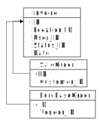

= Enforcing Business Rules Declaratively
:author: Alphora
:doctype: book

:data-uri:
:lang: en
:encoding: iso-8859-1

[[DDGEnforcingBusinessRulesDeclaratively]]
== Summary

Perhaps the most important aspect of any application is the enforcement
of business rules. Applications exist to help users make decisions
without violating business policies and practices, enabling them to
perform their duties faster, and more effectively. As a result, most of
the development effort exerted in building applications today is devoted
to enforcing business rules.

In traditional client-server programming, this enforcement is done
largely through procedural means, either within a stored procedure on
the server, a "business object" in a middleware layer, or even directly
within the client-side application. One of the primary goals of the
Dataphor platform is to provide an environment where business-rules can
be expressed declaratively, rather than enforced procedurally.

This chapter discusses the various features of the Dataphor Server that
can be used to enforce business rules as declaratively as possible
within an application. The discussion covers the first of two broad
classes of business rules: constraints, or rules that state what
conditions must hold within the database, and stimulus-response rules,
or rules that specify an action to be taken in response to some event
occurring within the database. The second type of business rule will be
discussed in the next chapter but one.

[[DDGEnforcingBusinessRulesDeclaratively-Defaults]]
== Defaults

Defaults are business rules that provide a default value for either a
scalar type, or for some column of a table variable. In both cases, the
default expression is an arbitrary expression that must evaluate to a
value of the type of the scalar type or column on which the default is
defined. In addition, the default value generated must satisfy any
constraints on the scalar type or column in question.

The expression is allowed to reference table variables in the global
database, and is not required to be functional or deterministic. This
makes defaults ideal for use in implementing surrogate keys using
generators. In fact, the pattern is so common that the D4 System Library
includes an operator to help ease implementation of generators called
EnsureGenerators.

The following script provides an example of the use of a default
definition to provide the value for a surrogate key, as well as for a
simple default set to the current date and time:

....
// Ensure that a generators table exists for this library.
EnsureGenerators();

//* Table: Contact
// The Contact named [Name], is identified by [ID],
// with primary phone type [Primary_PhoneType_ID]
// Customers and Vendors are both contacts.
create table Contact
{
    ID : ContactID
        { default GetNextGenerator("Shipping.Contact.ID") },
    Name : ProperName,
    NameSince : DateTime { default DateTime() },
    NameBy : UserID { default UserID() },
    Primary_PhoneType_ID : PhoneTypeID,
    key { ID }
};
....

Because defaults are part of the application schema and available to the
Frontend clients, they can provide the default values for new rows
during the data entry process within the user interface. This is done
using the _default_ proposable interface available through the CLI. If
the expression for a default does not reference table variables in the
database, then the default is considered __remotable__, and the default
expression will be downloaded to the client and evaluated remotely,
preventing a network round trip.

The default proposable interface will be covered in more detail with the
other proposable interfaces in Part III of this guide. At this point, it
suffices to say that default definitions are available through the
Frontend, and the logic does not have to be repeated in the presentation
layer once it has been declared in the application schema.

[[DDGEnforcingBusinessRulesDeclaratively-Constraints]]
== Constraints

Constraints are business rules that allow a given condition that must
hold to be stated within the database. The database system is then
responsible for ensuring that no data modification statement is ever
allowed to violate the stated condition. D4 allows constraints to be
expressed at several different levels, both for simplicity and
completeness of the implementation. The following list itemizes these
levels:

* Type Constraints
+
Type constraints are defined on scalar types, and specify valid values
for a given type. These constraints are unique in that they are not a
special case of a database wide integrity constraint, as all the other
constraints are. As such, these constraints are not allowed to reference
table variables in the database.
* Column Constraints
+
Column constraints are defined on table variable columns, either base or
derived, and specify valid values for columns of the table variable.
These constraints are enforced in addition to any constraints defined on
the type of the column. Because all column constraints are considered
immediately checked constraints, column constraint expressions are not
allowed to reference table variables in the database.
* Row Constraints
+
Row level constraints are defined in terms of a single row of a given
table variable, either base or derived. These constraints specify valid
values for rows within the table variable. Row level constraints may be
either simple, or transition constraints. Transition constraints allow
an insert, update, and delete transition expression to be specified.
Whether a row constraint is simple, or transition, it is allowed to
reference table variables in the database. Row constraints that do not
reference table variables in the database are checked immediately.
Otherwise, the row constraint is considered deferred and checked at
transaction commit.
* Table Constraints
+
Table constraints are defined in terms of a single table in the
database. Only key constraints fall under this category in D4. Note that
although key constraints technically reference table variables in the
database, they are checked immediately.
* Database Constraints
+
Database constraints are defined in terms of an arbitrary expression
involving any number of table variables in the database. Reference
constraints are an important special case of this class of constraint,
and as such have a specific syntax.

All constraint expressions must be functional, meaning that they do not
perform any modification of the database, and deterministic, meaning
that for any given input, the expression will always return the same
result. The compiler will ensure that the expression satisfies these
requirements.

Note that if a given constraint expression evaluates to *nil* for some
context, the constraint is considered satisfied. This convention
simplifies writing constraint expressions, and roughly corresponds to
asserting that if a value is not present, it cannot violate any
constraint footnote:[Of course, a constraint could be written stating
that a value is required, e.g. not(IsNil(value)). The specification not
nil as part of a column definition (the default nilability) is
effectively shorthand for this constraint.].

All constraint expressions are allowed to reference the current context
being validated. For database-level constraints, this context is simply
the global database. For other types of constraints, this context is
available through implicit variables, as shown in the following table:
Constraints Implicit VariablesImplicit Variables Constraints

[cols=",",options="header",]
|=======================================================================
|Constraint Type |Implicit Variable
|Scalar Type Constraints |The value being validated is available as a
variable named *value* of the scalar type on which the constraint is
defined.

|Column Constraints |The value being validated is available as a
variable named *value* of the type of the column on which the constraint
is defined.

|Row Constraints |Columns of the row being validated are available by
name.

|Transition Constraints - Insert Transition |Columns of the new row
being validated are available by name, namespaced by the keyword
**new**.

|Transition Constraints - Update Transition |Columns of the new row
being validated are available by name, namespaced by the keyword
**new**. Columns of the old row being replaced are available by name,
namespaced by the keyword **old**.

|Transition Constraints - Delete Transition |Columns of the row being
deleted are available by name, namespaced by the keyword **old**.
|=======================================================================

[[DDGEnforcingBusinessRulesDeclaratively-Constraints-CustomErrorMessages]]
=== Custom Error Messages

All constraint definitions are allowed to specify custom error messages
to be used when displaying a constraint violation to the user. This is
accomplished using the DAE.Message and DAE.SimpleMessage tags. By
default, keys and references define custom error messages based on the
current values being validated and the name of the table variables
involved in the constraint. The DAE.SimpleMessage tag is a string which
is displayed without modification to the user whenever the constraint is
violated. The DAE.Message tag is a D4 expression that evaluates to a
string which is displayed to the user whenever the constraint is
violated. This expression can reference the same implicit variables that
are available within the constraint expression to access the values
being validated.

[[DDGEnforcingBusinessRulesDeclaratively-Constraints-RowConstraints]]
=== Row Constraints

Row constraints are formulated in terms of a single row of the table on
which they are defined. The columns of the table are available by name
within the constraint expression. Row constraints are allowed to
reference global table variables. The compiler detects when this is the
case, and marks the constraint deferred, rather than immediate.

The following example depicts an immediate row constraint:

....
alter table ContactNameDuring
{
    create constraint DatesValid From <= To
};
....

This constraint enforces that for each row in the ContactNameDuring
table, the value of the From column is less than or equal to the value
of the To column.

The following example depicts a deferred row constraint:

....
alter table InvoiceItem
{
    create constraint ItemsSupplied
        exists (VendorItemType rename VIT where VIT.ItemType_ID = .ItemType_ID)
    tags
    {
        DAE.Message =
            "'Item type ' + ItemType_ID + ' is not supplied by any vendor.'"
    }
};
....

This constraint ensures that the item type for each invoice item is
supplied by some vendor.

[[DDGEnforcingBusinessRulesDeclaratively-Constraints-References]]
=== References

Next to keys and type constraints, references are perhaps the most
common type of constraint. As such, they have an explicit syntax. This
syntax not only provides a shorthand in D4 for expressing the
relationship, but it allows the Dataphor Server to understand the
semantics of the data involved. The Dataphor Server can then use this
information in a variety of ways, from providing an efficient
implementation for enforcing the constraint, to using the meaning of the
relationship to elaborate queries, and produce user interfaces for the
presentation layer.

The following example shows a simple reference constraint from Invoice
to Location:

....
create reference Invoice_Location
    Invoice { Location_ID }
    references Location { ID };
....

This constraint simply specifies that for every row in the Invoice
table, the value of the Location_ID column must appear in the ID column
for some row of the Location table.

As stated earlier, references are shorthand for an equivalent
database-wide constraint definition. In this case, the equivalent
formulation is:

....
not exists (Invoice { Location_ID ID }) minus (Location { ID });
....

Although this formulation is logically equivalent, it is by no means the
most efficient formulation in terms of enforcing the constraint. In this
formulation, every modification to the Invoice or Location tables would
result in the entire constraint being checked. Internally, therefore,
the Dataphor Server uses an entirely difference formulation that only
checks the constraint for rows that have been changed. This mechanism
will be discussed in the next section.

In addition to the enforcement, the compiler builds descriptive error
messages that include the data being validated.

Because references play such an important role in presentation layer
development, they will be discussed from that perspective in detail in
Part III.

[[DDGEnforcingBusinessRulesDeclaratively-Constraints-TransitionConstraints]]
=== Transition Constraints

Transition constraints allow for data transitions to be validated. There
are three different transitions that can be validated: **insert**,
**update**, and **delete**, corresponding to the modifications that can
be performed. A given transition constraint may have an expression
specified for each transition. Within the insert transition, the values
of the new row are available by column name, namespaced with the *new*
keyword. Within the delete transition, the values of the old row are
available by column name, namespaced with the *old* keyword. Within the
update transition, both old and new row values are available.

Transition constraints are expressed and validated row-level. Transition
constraints are allowed to reference global table variables. The
compiler detects when this is the case, and marks the constraint as
deferred, rather than immediate.

The following example depicts an immediate transition constraint:

....
alter table Invoice
{
    create transition constraint StatusValid
        on update
            (old.Status_ID = new.Status_ID)
                or
                (
                    (old.Status_ID = "NEW")
                        and (new.Status_ID = "PRO")
                )
                or
                (
                    (old.Status_ID = "PRO")
                        and (new.Status_ID = "COM")
                )
        tags
        {
            DAE.SimpleMessage =
                "
                    Invoice status can only be changed from New to Processed,
                    or from Processed to Completed.
                "
        }
};
....

This constraint enforces that the status of an invoice can only be
changed from NEW to PRO, or from PRO to COM.

As an example of a deferred transition constraint, we will discuss the
reformulation of a reference constraint in terms of transition
constraints. To enforce a reference constraint, the D4 compiler will
build two transition constraints: one on the source table, and one on
the target. The following listing shows the equivalent formulations for
the Invoice_Location reference constraint:

....
alter table Invoice
{
    create transition constraint Invoice_Location
        on insert
                exists (Location where ID = new.Location_ID)
        on update
            (old.Location_ID = new.Location_ID)
                or exists (Location where ID = new.Location_ID)
};

alter table Location
{
    create transition constraint Invoice_Location
        on update
            (old.ID = new.ID)
            or not exists (Invoice where Location_ID = old.ID)
        on delete not exists (Invoice where Location_ID = old.ID)
};
....

The first constraint on the originating table specifies that if a row is
inserted or updated in the Invoice table, a row with the same
Location_ID exists in the Location table. The second constraint, on the
targeted table, specifies that if a row is updated or deleted in the
Location table, there are no rows in the Invoice table with the same
Location_ID.

[[DDGEnforcingBusinessRulesDeclaratively-Constraints-GeneralizedKeysandReferences]]
=== Generalized Keys and References

As an example of a somewhat more complicated constraint, consider the
relationship between the Invoice, SaleOrder, and PurchaseOrder tables.
As the following diagram shows, an Invoice may be a SaleOrder or a
PurchaseOrder:

.Shipping Database Design: Invoice Specialization

The references from SaleOrder and PurchaseOrder to Invoice ensure that
every sales or purchase order in the system is also an invoice. But the
design as given is incomplete. Namely, it allows for two types of
invalid data. First, there is nothing to prevent an Invoice row from
being entered with a corresponding row in both the SaleOrder _and_
PurchaseOrder tables. Second, there is nothing to prevent an Invoice row
from being entered without a corresponding row in either the SaleOrder
_or_ the PurchaseOrder tables.

Both of these problems can be solved using transition constraints. The
first problem is solved with what is essentially a key constraint
defined over the ID column of both the SaleOrder and PurchaseOrder
tables. The following listing shows the transition constraint
definitions involved:

....
//* Constraint: InvoiceExclusive
// An invoice cannot be both a sale order and a purchase order.
// Catalog formulation:
// create constraint InvoiceExclusive
//      not exists ((SaleOrder over { ID }) join (PurchaseOrder over { ID }));

alter table SaleOrder
{
    create transition constraint InvoiceExclusive
        on insert not exists (PurchaseOrder where ID = new.ID)
        on update
            (old.ID = new.ID)
                or not exists (PurchaseOrder where ID = new.ID)
};

alter table PurchaseOrder
{
    create transition constraint InvoiceExclusive
        on insert not exists (SaleOrder where ID = new.ID)
        on update
            (old.ID = new.ID)
                or not exists (SaleOrder where ID = new.ID)
};
....

Rendered in English, these constraints simply state that 1) When a row
is inserted into one table, no row with the same ID exists in the other
table, and 2) Whenever a row is updated in one table, either the value
of the ID column is the same, or no row with the new ID exists in the
other table.

The second problem (that an invoice could exist that is neither a sale
order nor a purchase order) is solved with what is essentially a
reference constraint that originates in the Invoice table, and targets
both the SaleOrder and PurchaseOrder tables. The following listing shows
the transition constraint definitions involved:

....
//* Constraint: InvoiceValid
// An invoice must be either a sale order or a purchase order.
// Catalog formulation:
//  create constraint InvoiceValid
//  not exists (Invoice { ID } minus (SaleOrder { ID } union PurchaseOrder { ID });

alter table Invoice
{
    create transition constraint InvoiceValid
        on insert
            exists (SaleOrder where ID = new.ID)
                or exists (PurchaseOrder where ID = new.ID)
        on update
            (old.ID = new.ID)
                or exists (SaleOrder where ID = new.ID)
                or exists (PurchaseOrder where ID = new.ID)
};

alter table SaleOrder
{
    create transition constraint InvoiceValid
        on update
            (old.ID = new.ID)
                or not exists (Invoice where ID = old.ID)
                or exists (PurchaseOrder where ID = old.ID)
        on delete
            not exists (Invoice where ID = old.ID)
                or exists (PurchaseOrder where ID = old.ID)
};

alter table PurchaseOrder
{
    create transition constraint InvoiceValid
        on update
            (old.ID = new.ID)
                or not exists (Invoice where ID = old.ID)
                or exists (SaleOrder where ID = old.ID)
        on delete
            not exists (Invoice where ID = old.ID)
                or exists (SaleOrder where ID = old.ID)
};
....

Enforcement of this constraint is somewhat more involved, and really
breaks down into two separate components: the originating constraint
defined on the Invoice table, and the targeting constraint defined on
the SaleOrder and PurchaseOrder tables.

Rendered in English, the originating constraint specifies that 1) When a
row is inserted into the Invoice table, a row with the same ID exists in
either the SaleOrder or PurchaseOrder tables, and 2) When a row is
updated in the Invoice table, either the ID is the same, or the insert
condition is satisfied.

The targeting constraint specifies that 1) When a row is deleted from
the SaleOrder or PurchaseOrder tables, either there is no row with the
same ID in the Invoice table, or there is a row with the same ID in the
other table, and 2) When a row is updated in the SaleOrder or
PurchaseOrder tables, either the ID is the same, or the condition for
deletion is satisfied.

Clearly, these constraint expressions reference the global state of the
database, and are therefore not checked until transaction commit time.
To see why this is the case, suppose the constraints were checked
immediately. There is a reference constraint from SaleOrder to Invoice
so in order to insert a SaleOrder row, an Invoice row must be defined,
but now we have created a constraint that says that in order to insert
an Invoice row, a SaleOrder row must be defined (or a PurchaseOrder row,
but the same problem arises). As a result, if the constraints as
specified were checked immediately, there would be no way to enter data
into the system. The problem is resolved by deferring the constraint
check until the transaction is being committed.

Notice that in each of these transition constraint definitions, the
update formulation includes a comparison of the old and new values of
the ID column. This is an optimization that allows the query processor
to decide whether the execution of the more expensive *exists* condition
is necessary.

Note also the convention in both of these solutions of naming the
transition constraints in each table the same name. This makes it clear
that they are all enforcing the same constraint from different
perspectives.
