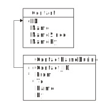
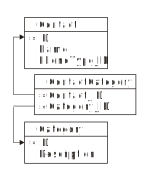

= Enforcing Stimulus-Response Rules
:author: Alphora
:doctype: book

:data-uri:
:lang: en
:encoding: iso-8859-1

[[DDGEnforcingStimulus-ResponseRules]]
== Summary

Many business rules involve actions to be taken in response to some
event occurring within the system. These types of rules can be modeled
within a Dataphor application schema using __event handlers__. An event
handler is a D4 operator that has been attached to a given event in
order to take some specific action in response to the event.

There are two main types of events: data modification events such as
before insert, or after update, and proposable events, such as default,
change, and validate.

Each event has a specific invocation signature. In order for a given
operator to be attached to an event, it must have the same signature as
the event. Any number of operators can be attached to a given event.
This is done using the *attach* and *detach* statements.

When multiple handlers are attached to a single event, the order in
which the handlers are invoked can be controlled using the *invoke*
statement.

The _before_ table-level events occur just prior to an insert, update,
or delete to a given table variable. For the insert and update events,
handlers are allowed to modify the _new_ row, which has the affect of
replacing the value to be inserted or updated.

In addition, for each of the before events, the signature includes a
boolean-valued variable that can be used to indicate whether the
modification should take place. By default, the value of this variable
is true. Setting it to false within the event handler will prevent the
modification from occurring. Of course, the handler could still perform
the modification directly, but the initial modification that fired the
event would not occur.

The _after_ table-level events occurs after an insert, update, or delete
to a given table variable. These handlers are not allowed to modify the
_old_ or _new_ rows.

Note that the _after_ table-level event handlers can all be deferred in
the same way that constraint checks can be deferred. By default, these
handlers are deferred if they reference global table variables. This
behavior can be changed using the DAE.IsDeferred tag on the attach
statement for the event handler.

The _proposable_ handlers occur in response to the various proposable
calls, either from the CLI directly, or during a data modification. Note
that the _default_ event will only be fired for an insert, and the
_validate_ event will only be fired for an insert or update. The
_change_ event will never be fired for a data modification, it can only
be invoked through the CLI, or by calling Change directly for a cursor.
In addition, the _validate_ event will only be called during variable
assignment or its logical equivalent, not on expression evaluation.

[[DDGEnforcingStimulus-ResponseRules-UsingEventHandlers]]
== Using Event Handlers

As mentioned previously, event handlers provide another mechanism for
enforcing various types of business rules. In fact, because they can be
deferred until transaction commit time, event handlers can completely
enforce all the types of constraints that have been discussed so far, as
well as the stimulus response type rules that cannot be enforced using
constraints.

Because of this, it is natural to ask the question, which method should
be used to enforce a given business rule? The answer is, of course, if
it can be done with constraints, it should be. Event handlers are
intended to handle the imperative side of business rule enforcement.
Inevitably, some business rules require action to be taken by the
system, such as updating inventory levels, auditing changes, or simply
changing the update or client-side behavior of a particular view.

In the sections that follow, some examples of using event handlers to
enforce these types of business rules are given. It should be noted that
there are drawbacks to attaching event handlers in some cases. For
example, if an event handler were attached to the InvoiceItem table to
update inventory levels, it would effectively remove the primitive
operation of inserting an invoice item for an invoice. In other words,
there would be no way to add an invoice (such as for an import) without
affecting inventory levels. Of course, this is not to say that attaching
event handlers to base table variables is always problematic, we simply
point out that there are implications to doing so that should be
considered in each case.

[[DDGEnforcingStimulus-ResponseRules-UsingEventHandlersToAffectDataModifications]]
== Affecting Data Modifications

A common usage of event handlers is to provide a hook for affecting data
as it is entered. For example, in the Shipping Application, each contact
has notes for recording miscellaneous information. As the requirements
dictate, changes to these notes must be audited, rather than simply
allowing the user to update the entire notes column directly.

To do this, we will create a view of the ContactNotes table, and attach
two event handlers to it to provide the specific behavior. The following
listing shows the view definition:

....
//* View: EnterContactNotes
// View used to enter contact notes
create view EnterContactNotes
    ContactNotes
        add
        {
            nil as Notes NewNotes
                tags { DAE.IsComputed = "false" }
        }
        over { Contact_ID, NewNotes, Notes }
        adorn
        {
            NewNotes tags { Frontend.Title = "Enter Notes" },
            Notes tags { Frontend.ReadOnly = "true" }
        }
    tags
    {
        Frontend.Title = "Notes"
    };
....

This view works by introducing a new column NewNotes with an extension
operator. In addition to appearing in the result set, the DAE.IsComputed
tag will allow it to be an editable column in the user interface.

By default, update propagation for the extension operator will simply
discard the values for the extended columns and propagate the update
directly. To change this behavior, we use event handlers that will merge
the new notes with the existing notes, and record the extra auditing
information:

....
//* Operator: UpdateNotesRow
create operator UpdateNotesRow
(
    var ARow : typeof(EnterContactNotes[])
)
begin
    if not(IsNil(ARow.NewNotes)) then
    begin
        update ARow
            set
            {
                Notes :=
                    UserID() + " wrote on " + DateTime().ToString()
                    + " -->" + Unicode({ 13, 10 }) + NewNotes
                    +
                    (
                        if IsNil(Notes) then ""
                        else (Unicode({ 13, 10, 13, 10 }) + Notes)
                    )
            };
    end;
end;

//* Operator: EnterContactNotesInsert
create operator EnterContactNotesInsert
(
    var ARow : typeof(EnterContactNotes[]),
    var APerformUpdate : Boolean
)
begin
    UpdateNotesRow(var ARow);
end;
attach EnterContactNotesInsert
    to EnterContactNotes on before insert;

//* Operator: EnterContactNotesUpdate
create operator EnterContactNotesUpdate
(
    const AOldRow : typeof(EnterContactNotes[]),
    var ANewRow : typeof(EnterContactNotes[]),
    var APerformUpdate : Boolean
)
begin
    UpdateNotesRow(var ANewRow);
end;
attach EnterContactNotesUpdate
    to EnterContactNotes on before update;
....

Note the use of the *typeof* operator to specify the type of the
parameters of these operators. Because the signature for table-level
event handlers is based on row type of the table firing the event, the
use of this operator allows the signature to be easily specified.

Note also that the table-indexer expression would normally give a
compile-time warning, but since it is contained within a **typeof**, the
compiler determines that the expression will never be evaluated, and
does not issue the warning.

The UpdateNotesRow operator simply updates the Notes column of the ARow
variable with the new notes entered, and records the current user, date,
and time information, appending any existing notes to the end of the new
notes. In this way, a reverse chronological history is maintained for
the notes.

The UpdateNotesRow operator is then called from an insert and update
event handler attached to the EnterContactNotes view.

[[DDGEnforcingStimulus-ResponseRules-UsingEventHandlersToAuditDataChanges]]
== Auditing Data Changes

One of the initial requirements of the Shipping application is that
changes to demographic information be tracked for Customers and Vendors.
The contact structures are specifically designed to handle this problem.
For a complete discussion of the design aspects of this solution, refer
to the <<DatabaseDesignTechniques.adoc#DDGDatabaseDesignTechniques, Database Design Techniques>> 
chapter later in this part.

The following diagram details the main Contact table, and the
ContactNameDuring table that will track changes to the Name column of
the Contact table:

.Shipping Database Design: Contact Name During

In order to track the changes, we will attach three event handlers to
the Contact table. The first handler, a before update handler, simply
updates the value of the NameSince and NameBy columns for the row being
updated, recording when the update was made, and the user making the
change:

....
create operator ContactBeforeUpdate
(
    const AOldRow : typeof(Contact[]),
    var ANewRow : typeof(Contact[]),
    var APerformUpdate : Boolean
)
begin
    if AOldRow.Name <> ANewRow.Name then
        update ANewRow
            set
            {
                NameSince := DateTime(),
                NameBy := UserID()
            };
end;
attach ContactBeforeUpdate
    to Contact on before update;
....

Note that this example illustrates that before modification handlers can
change the values of the row being inserted or updated.

The second handler, an after update handler, records the name change in
the ContactNameDuring table, noting the user that recorded the name, and
the dates during which that name was recorded:

....
create operator ContactAfterUpdate
(
    const AOldRow : typeof(Contact[]),
    const ANewRow : typeof(Contact[]))
begin
    if (AOldRow { ID, Name }) <> (ANewRow { ID, Name }) then
        insert
            table
            {
                AOldRow
                {
                    ID Contact_ID,
                    Name,
                    NameSince From,
                    DateTime() To,
                    NameBy By
                }
            }
            into ContactNameDuring;
end;
attach ContactAfterUpdate
    to Contact on after update;
....

The third handler, an after delete hander, records the name of the
deleted contact in the ContactNameDuring table:

....
create operator ContactAfterDelete
(
    const ARow : typeof(Contact[])
)
begin
    insert
        table
        {
            ARow
            {
                ID Contact_ID,
                Name,
                NameSince From,
                DateTime() To,
                NameBy By
            }
        }
        into ContactNameDuring;
end;
attach ContactAfterDelete
    to Contact on after delete;
....

Note that these handlers occur after the modification has already taken
place, so they cannot change the values of the rows being modified.
However, they do have access to the values of the rows when the
modification was performed, meaning in this case that the modified
NameSince and NameBy values from the before update handler will be
visible in the after update handler.

_During_ tables for the phone number and address history are maintained
with similar handlers on the ContactPhone and ContactAddress tables. For
a complete listing, refer to the ContactTables d4 script in the
Sample.Shipping library.

[[DDGEnforcingStimulus-ResponseRules-ControllingViewUpdatabilityUsingEventHandlers]]
== Controlling View Updatability

In some cases, the default view updatability behavior may not provide
the desired behavior. An example of this in the Shipping Application is
the user interface to select contact categories. The following diagram
depicts the base table variables involved:

.Shipping Database Design: Contact Categories

Rather than utilizing the default user interfaces, the application would
be much more user-friendly if the list of categories to which a contact
belonged could be entered as a comma-separated list. To achieve this, we
define a view, ContactCategories, and attach an event handler to replace
the default update behavior of the view.

These types of event handlers are often referred to as "instead-of"
handlers because they dictate the operation to be performed "instead-of"
the actual modification. We note that in practice, these types of event
handlers are rarely required, given the level of view updatability
provided by the D4 language.

We begin with the view definition itself, which uses the Concat system
aggregate operator to produce the comma-separated list of categories to
which a given contact belongs:

....
//* View: ContactCategories
create view ContactCategories
    Contact { ID }
        add
        {
            Concat
            (
                { Description, Delimiter } from
                (
                    ContactCategory where Contact_ID = ID
                        join (Category { ID Category_ID, Description })
                        add { ', ' Delimiter }
                )
            ) Categories tags { DAE.IsComputed = "false" }
        }
        rename { ID Contact_ID }
    tags { Frontend.Title = "Categories"   };
....

The default update behavior for this view definition is simply to
propagate the update to the ID column of the Contact table. The
following operator and attach statement will change this behavior,
allowing the list of categories to be edited directly:

....
//* Operator: ContactCategoriesUpdate
create operator ContactCategoriesUpdate
(
    const AOldRow : typeof(ContactCategories[]),
    var ANewRow : typeof(ContactCategories[]),
    var APerformUpdate : Boolean
)
begin
    APerformUpdate := false;
    delete ContactCategory
        where Contact_ID = AOldRow.Contact_ID;
    var LCategories := ANewRow.Categories.Split();
    for LIndex : Integer := 0 to LCategories.Count() - 1 do
    begin
        var LCategory := LCategories[LIndex].Trim();

        if IfNil(LCategory.Length(), 0) > 0 then
        begin
            var LCategoryID := Category[LCategory].ID;
            if IsNil(LCategoryID) then
            begin
                LCategoryID := GetNextGenerator("Shipping.Category.ID");
                insert
                    table { row { LCategoryID ID, LCategory Description } }
                    into Category;
            end;

            insert
                table
                {
                    row
                    {
                        ANewRow.Contact_ID Contact_ID,
                        LCategoryID Category_ID
                    }
                }
                into ContactCategory adorn with { PropagateInsert = "Ignore" };
        end;
    end;
end;
attach operator ContactCategoriesUpdate
    to ContactCategories on before update;
....

Setting the value of the APerformUpdate variable to false indicates that
the event handler will take over update processing, and the query
processor should stop processing the update. The Split system string
operator is then invoked to separate the categories into a list of
string values. Each of these values is then added as a category for the
given contact, adding new categories as necessary.

[[DDGEnforcingStimulus-ResponseRules-UsingEventHandlersToUpdateValuesDuringDataEntry]]
== Affecting Client-Side Data Entry

In addition to using event handlers to handle server-side tasks such as
auditing and updatability processing, event handlers provide the ability
to modify client-side behavior through the _proposable_ interfaces.
Although these interfaces will be discussed in greater detail in part
III, this section will cover the use of these handlers to update values
during data entry.

As the motivating example, consider the user interface for recording the
address of a Location, with City, State_ID, and ZipCode columns. We
would like the user interface to auto-populate the city and state values
based on the current contents of the ZipCode table for the selected
zipcode.

To allow for this type of client-side behavior modeling, the Dataphor
Server provides proposable interfaces that enable Dataphor Frontend
Clients to participate in the enforcement of business rules declared on
the server. In this particular instance, we will make use of the
_change_ proposable, which corresponds to the question: "What would
happen if I changed the value of this column?"

The following program listing depicts the event handler that provides
this behavior:

....
//* Operator: LocationZipCodeChange
create operator LocationZipCodeChange
(
    var ARow : typeof(Location[])
) : Boolean
begin
    result := false;
    if
        not(IsNil(ARow.ZipCode))
            and IsNil(ARow.City)
            and IsNil(ARow.State_ID) then
    begin
        result := true;
        var LZipRow :=
            ZipCode[ARow.ZipCode] { ZipCode, City, State_ID };
        update ARow
            set
            {
                City := LZipRow.City,
                State_ID := LZipRow.State_ID
            };
    end;
end;
attach LocationZipCodeChange
    to ZipCode in Location on change;
....

This operator is called with the current values of the Location row
being entered. This means that in general the row will be only partially
filled out when this operator is invoked. As such, the operator first
checks to see if the zipcode has been entered, and that the city and
state are empty. This ensures that the change call will not overwrite
data the user has already entered.

Using the value of the ZipCode column, the city and state for that
zipcode are looked up in the ZipCode table, and the city and state
columns in ARow are updated.

Note that the *result* variable is set to *true* when the values of ARow
have been changed. To prevent unnecessary copying, the effects of a
proposable call will only be apparent if the result of calling the event
handler is true, so it is very important to set the result appropriately
in all proposable event handlers.
