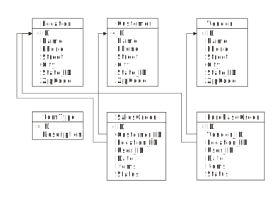

= Preliminaries
:author: Alphora
:doctype: book

:data-uri:
:lang: en
:encoding: iso-8859-1

[[DDGPreliminaries]]
== Summary

This chapter introduces the process of designing and building
applications using Dataphor. It begins by providing a brief overview of
the development environment, including common facilities that will be
used throughout the development process, as well as discussing common
development scenarios.

[[DDGPreliminaries-DataphorApplications]]
== Dataphor Applications

Fundamentally, a Dataphor Application is simply a set of libraries
residing in a Dataphor Server. These libraries contain various elements
of the application schema, and serve as a high-level logical grouping of
the components of the application. The application is exposed to the
user starting with a main form that serves as an entry point into the
various processes of the application.

Generally, one library will serve as the core of the application,
providing the basic schema elements that are used by all parts of the
application. This library will typically include at least one storage
device definition, which provides the persistent store for the
application data. For simplicity during the development process, this
device can be a temporary device that allows the application to be
easily re-created at any time. Once the structures are relatively
stable, the device can be switched to one that allows for persistent
storage.

Each library has a status that indicates whether the library is
__available__, __registered__, or __suspect__. Registering a library
registers any extensions implemented by the library, and creates the
schema that the library contains by running the Register script for the
library.

The persistent storage devices use a process called _schema
reconciliation_ to ensure that the Dataphor catalog is synchronized with
the catalog of the target system. Each device has reconciliation
settings of _mode_ and _master_ that determine when and how the process
occurs.

Libraries also form the basis for project management in the Dataphor
platform by acting as a repository for documents such as database
creation scripts and form definitions. Note that when a document is
stored in a library, it is physically located with the library in the
Dataphor Server, not necessarily on the local computer. This is the
primary difference between a document and a file in the Dataphor
environment. Files can be opened and saved in the same way that
documents can, but files will be saved by the Dataphoria IDE, whereas
documents will be saved centrally by the Dataphor Server.

Because Dataphor is a declarative development environment, much of the
application will be defined in terms of declarative constructs like
tables, views, and constraints. The Dataphor Frontend Clients take
advantage of these constructs and attempt to automate as much of the
work of building user interfaces as possible. For this reason, the
resulting applications are extremely dynamic and react instantly to
changes in the application schema. This flexibility allows the
application to evolve as it is being developed, and even extends into
the maintenance phase of the application.

Overall, Dataphor application development typically consists of:

* Designing a database to meet the data requirements of the application.
* Identifying the main entry points into the application and refining
the derived user interfaces.
* Development of the process logic required to provide a working
solution.

The rest of this manual focuses on providing the developer with the
information necessary to take advantage of the flexibility provided by
the Dataphor platform during development and maintenance of an
application.

[[DDGPreliminaries-DevelopmentEnvironment]]
== Development Environment

Dataphoria is the Integrated Development Environment (IDE) used to
develop Dataphor applications. It is essentially a Dataphor Frontend
Client itself, and many of the user interfaces it exposes are derived
from the system catalog of the Dataphor Server. One of the most
important aspects of the Dataphoria IDE is designer support, and several
designers are provided for opening and manipulating documents within
libraries.

The primary result of Dataphor development is a set of libraries. The
Dataphor platform is designed so that these logical libraries correspond
directly with physical directories on disk, allowing libraries to
function as a deployment unit for applications. On disk, these libraries
consist of files which are exposed as documents within the Dataphoria
IDE. Each document type can be associated with various designers that
can be used to view and manipulate documents of that type.

One of the most important of these designers is the D4 Script Editor.
This designer is a full-featured text editor for viewing, building, and
executing D4 scripts. Scripts can be executed in their entirety, or
portions of a script can be selected and executed individually. Note
that the Dataphor Server will compile and run each top-level statement
in isolation. This allows for statements to reference catalog objects
created in previous statements.

The results of executing a script are displayed in the results window
attached to the bottom of the D4 Script Editor. Any errors that were
encountered during compilation or execution of the script are displayed
in the Warnings window of the IDE. Note that there is only one Warnings
window, even though each instance of the D4 Script Editor has a separate
results window. This can be confusing when switching between designers,
as the errors displayed in the Warnings window are not specific to the
current editor.

The D4 Script Editor also allows scripts to be __prepared__, or compiled
but not executed. This is useful for checking the syntax of a particular
statement, or for checking for warnings from the compiler. When a
statement is prepared, any errors or warnings encountered are displayed
in the Warnings window. The compiler will issue warnings when a
situation is encountered that is not necessarily an error, but could
lead to problems. For example, the compiler will issue a warning when an
expression attempts to extract a row from a result set that may contain
multiple rows.

Another important element of the Dataphoria IDE is the Dataphor
Explorer. This window provides a tree-based representation of the
current catalog of the Dataphor Server. Each library is depicted as a
node in this tree, with the schema and documents of that library
displayed beneath it. Context menus are available on each node of the
tree for performing actions such as browsing tables, or opening
documents.

[[DDGPreliminaries-DevelopmentPhases]]
== Development Phases

Managing the development lifecycle is a complex problem ranging in scope
from market analysis, requirements gathering, and risk management to
database design, application architecture, and change management. The
Dataphor product focuses on the implementation side of the development
lifecycle including application development and maintenance. The
platform is designed to minimize the impact of change on production
applications by automating as much application behavior as possible.

Within application development, there are three main perspectives,
logical, presentation, and physical. As mentioned previously, these
perspectives are each treated separately in different parts of this
manual. However, this separation is largely used to organize the
material in these manuals, just as it is used to structure the
architecture of the product. Because the presentation layer is
intimately tied to the logical model, a little time spent thinking about
user interfaces up front will go a long way towards producing usable
derived interfaces from the outset. Similarly, the physical layer should
not be completely ignored when initially designing the application.
Planning for the target environment can be the difference between a
smooth transition to production, and a major adjustment of the
application.

Once an application transitions into production, the problem of change
management becomes a central issue. Once again, libraries play a major
role in providing a solution to the problem. Each library is stamped
with a version number that is incremented whenever a change is made to
the application. Each change is stored within the library as a D4 script
containing the statements necessary to upgrade an existing deployment to
the new version. These scripts are then deployed with the updated
library, and run sequentially on the production environment.

Because most of the user interfaces in a Dataphor application are
derived, changes to the structures of the application schema will
automatically propagate to the user interfaces. In cases where derived
user interfaces have been customized, or forms have been manually built,
changes to the structures may affect the form definitions, and these
will have to be updated. Because the updated documents are deployed with
the updated library, the Dataphor Frontend Clients will download the new
form definitions automatically.

The resulting development paradigm allows the developer to focus more on
design and architecture issues, and less on implementation, deployment,
and change management.

[[DDGPreliminaries-DevelopmentScenarios]]
== Development Scenarios

The Dataphoria IDE can connect to an existing Dataphor Server instance,
or it can host an instance in-process. When developing Dataphor
applications, the IDE is typically run with an in-process server using a
local copy of the libraries. For team development efforts, an external
version control system can be used to synchronize the development
effort, with each developer working on a local copy of the application
libraries.

In this scenario, once a persistent device is being used, each developer
can either connect to the same back-end DBMS on a centrally located
server, or connect to a local DBMS instance on their own machine. In
either case, upgrades must be coordinated between the different
developers. Although this can be accomplished using version control on
the library descriptions, it is useful to designate one team member as
the librarian. As upgrade scripts are built, the librarian is
responsible for injecting them into the appropriate libraries. This
eliminates the possibility that two upgrades are assigned the same
version number, and ensures that the injection order is consistent.

[[DDGPreliminaries-TheRunningExample]]
== The Running Example

In order to help illustrate the overall process, and to provide a
concrete example along the way, we introduce a running example that will
be used throughout this part and the rest of the manual. This example is
a hypothetical information system to manage the business of a
distribution company. Briefly, it will have to track inventory levels,
vendors and clients, as well as sales and purchase orders. The following
list itemizes the requirements of the application:

* The organization purchases and ships multiple types of items.
* The organization has multiple locations which must all be kept
stocked, according to some predetermined inventory levels.
* The organization fills orders from multiple customers, each of which
may have multiple addresses and phone numbers.
* The organization purchases items from multiple vendors, each of which
may have multiple addresses and phone numbers.
* The organization must know not only the current set of demographic
information for any given customer or vendor, but also a historical
account of what the information was at any given point, when that
information changed, and what user was responsible for the change.
* The organization tracks notes for customers and vendors. It is
important that once a note is entered, it cannot be changed. The date,
time, and author of each note must be recorded with the note.
* For each vendor, the organization must track a shipping rate, as well
as whether or not a given item is supplied by that vendor, and the cost
of each item supplied.
* Sales orders for customers must be tracked whenever a sale is made.
The sales order must specify an address of the customer to use as the
shipping address. The sales order must be filled from inventory on hand
at the location. Once the order has been shipped, the net effect of that
sale on the inventory of the location involved is recorded.
* Purchase orders for vendors must be issued whenever the inventory
level at a particular location falls below par. When the purchase order
is received, the net effect of that purchase on the inventory of the
location involved is recorded.
* The application must be able to generate simulated bids from different
vendors by calculating the cost of the items required, plus the shipping
cost using the shipping rate of the vendor and the distance between the
vendor and the location.
* The users of the system will fall under three basic categories:
Management, Customer Service, and Inventory Clerk. Users in the
management role must be allowed to manage users of the system, and
control the access rights of those users. Customer Service users must
have the ability to manage customer information, and place and ship
sales orders. Inventory Clerks must have the ability to manage the
inventory and par levels, maintain vendor information, and place and
receive purchase orders.
* The application must also provide various reports required by the
organization.

These requirements are intentionally somewhat vague. As we develop the
application, the less detailed areas will be more completely specified
as necessary. They are also somewhat simplistic. A typical application
would be more detailed than this, but the example is sufficient to
illustrate the overall process.

[[DDGPreliminaries-ApplicationDesign]]
== Application Design

As covered in the introductory part of this manual, database design
plays a central role in the architecture of most, if not all,
applications. This is particularly true of Dataphor applications, which
are defined almost exclusively by a database design adorned with
metadata. Because of this close relationship between database design and
application design, we begin the discussion of the running example by
covering some basic approaches to database design.

Note that database design will be covered in more detail in the later
chapters of this guide, but it is such an important topic that it is
worth reviewing the fundamentals here. In addition, the Dataphor
platform tends to reward good database designs, and conversely, to
punish bad ones. In general, if a given problem requires a significant
amount of imperative code or client-side scripting, there is likely a
more elegant solution to be found within the Dataphor approach to
application design.

We begin by remarking that data is represented as tables, and nothing
but tables, in a database. Recall that in a relational database, each
table has a predicate, or meaning, with each row in that table
corresponding to a true proposition, or statement of fact. In a very
real sense the database is a model of some portion of the real world. In
the case of the shipping example, it is a model of the inventory control
and ordering systems of a hypothetical shipping business.

Just as each base table has meaning, the results of any query also have
meaning. For derived tables, or views, this meaning is derived from the
tables and operators involved in the expression.

Data types are an extremely important part of any database design,
effectively enumerating the set of available values for the columns of
tables and views. D4 provides several system data types, but these
should only be used when they really are an exact match for the type of
a given column. Because D4 is a strongly-typed language, types can and
should be used to eliminate potential errors such as comparing two
values of different types.

Types also provide a level of indirection and re-use when designing a
Dataphor application. Type definitions can be adorned with useful
metadata such as the type of control to be used in the presentation
layer, or the width of a text column on a form. This information is
"inherited" by columns that are defined on that type, so rather than
specify the information multiple times within a schema, it should be
specified a single time on the type definition.

Another extremely important and often overlooked part of database design
is considering integrity constraints. Keys and references are important,
but they are not the only types of constraints available. Whenever the
requirements of an application specify that a given condition must hold
within the data, a constraint should be used to declaratively enforce
the requirement.

The following list summarizes this short discussion in terms of some
useful guidelines to follow when designing a database:

* Always define keys
+
Remember that tables represent statements of fact, and saying the same
thing more than once doesn't make it more true [8]. Always think about
what the identifier of a given table should be. If a static natural key
is available, use it. Otherwise, define a surrogate key, and make it an
explicit part of the definition of the table.
* Don't ignore types, they are a crucial part of any database design
+
D4 provides extensive facilities for defining new types. Types should
always be chosen to completely and accurately model the data being
represented in the database. Proper type design will go a long way
towards eliminating design errors before they become program errors.
* Always specify constraints completely
+
Constraints are extremely important, and constitute the best
approximation of the meaning of the data to the system. The more
information the system has about the data in the database, the more it
can help in ensuring that applications do not violate the intended
meaning. D4 provides unprecedented support for declaratively enforcing
constraints, take advantage of it.
* Use references
+
References are an important special case of integrity constraints, and
are used not only to enforce integrity in the database, but to allow the
presentation layer to navigate a schema effectively. The more
information the system has about the relationships that exist among
tables and views in the database, the more effective and useful the
platform will be in terms of producing a usable presentation layer from
the schema.
* Design completely normalized
+
Normalization theory provides an effective mechanism for detecting and
eliminating redundancy in a database design. Intuitively, each table
should talk about one concept, and one concept only. A properly designed
database will tend to consist of lots of tables, all having very few
columns. Note that just because the logical design is fully normalized,
doesn't mean the user interface has to be. As we will see,
user interfaces for views in the Dataphor platform are just as
functional as user interfaces for base table.
* Write out the meaning of each table or view
+
Use code comments to explicitly specify the meaning of each table and
view in the database. Often, this will expose design errors and
redundancies. If the meaning for a table is too complex or contains
conditions, it should probably be broken down into multiple tables.
* Don't encode information into values
+
Avoid encoding information into the logical representations for values.
Make the information explicit with table definitions, or model it as
part of a type definition.
* Avoid dependencies between columns in the same table
+
Intercolumn dependencies are usually indications of a non-normalized
design. Consider decomposing the table definition into multiple tables
and allow the dependencies to be managed with keys and references.

[[DDGPreliminaries-DatabaseDesignfortheShippingExample]]
== Database Design for the Shipping Example

To begin the process of designing the database for the shipping example,
we will isolate the main concepts required to model the business. From
the requirements presented so far, we have at least the following
concepts:

* Location
+
Location represents shipping locations within the organization. The
model will have to include address information for each location, as
well as track current inventory and par levels for different item types.
* Customer
+
Customer represents entities that will buy items from some location.
Customer addresses, and history for each address will have to be
tracked.
* Vendor
+
Vendor represents entities that sell the items we keep in stock at each
location. Vendor addresses, and history for each address will have to be
tracked, as well as shipping rates, and the items each vendor supplies.
* ItemType
+
ItemType represents the different types of items that can be bought or
sold by locations. Each item type will have to track current cost.
* SalesOrder
+
SalesOrder represents the actual transaction between a location and a
customer. Each sales order will track what items were sold, how much was
charged, and when they shipped.
* PurchaseOrder
+
PurchaseOrder represents the actual transaction between a location and a
vendor. Each purchase order will track what items were purchased, how
much was paid, and when they were received.

In addition to these concepts, the application must be able to calculate
the shipping cost of a particular purchase order based on the distance
to the vendor, and generate bids from different vendors capable of
supplying a particular item. In order to calculate distances, the
application will use a Coordinate data type that can represent the
latitude and longitude of a particular zip code. Based on the zip codes
in the vendor and location addresses, the shipping cost will be
calculated and added to the bidding cost for each supplying vendor.

The following diagram shows the basic attributes that will be tracked
for each of the concepts described above:

Obviously, this is not a complete schema diagram, just a basic outline
of the main concepts involved. The details for each component of the
architecture will be provided as we progress through the implementation.

[[DDGPreliminaries-StyleandNamingConventions]]
== Style and Naming Conventions

Strictly followed naming conventions can contribute significantly to the
usability and understandability of a given schema. If catalog elements
such as tables, views, operators, types, and columns are consistently
and intuitively named, queries and process logic are easier to write and
follow. As a result, development and maintenance tasks can be
significantly simplified.

Of course, style and naming conventions should be agreed upon by the
development team, and the Dataphor platform makes no attempt to enforce
any particular style or convention. However, Alphora has developed a set
of conventions for use in developing Dataphor applications. The running
example will use these conventions exclusively, and we present them here
as a general guideline for all applications.

[[DDGPreliminaries-StyleandNamingConventions-Identifiers]]
=== Identifiers

Because D4 is a case-sensitive language, and all reserved words in the
language are lowercase, we recommend the use of Pascal-casing for all
identifiers. Pascal-casing means that the first letter of each word in
the identifier is capitalized, and underscores are not used to separate
words within an identifier. In addition, acronyms should be fully
capitalized. For example:

....
Vendor
InvoiceItem
SSN
Location_ID
....

In addition to the conventions for identifiers, it is useful to
explicitly delineate locally scoped variables and parameters. This is
accomplished by prefixing locally scoped variable names with a capital
L, and parameter names with a capital A. For example:

....
var LVariable : Integer;
create operator IsValidZipCode(const AString : String) : Boolean;
....

In addition, identifier names should be chosen carefully to attach as
much meaning as possible. Abbreviations should be avoided as they are
often counter-intuitive and vary from developer to developer. If
abbreviations are used at all, they should be agreed upon prior to being
used. The same arguments apply to the use of acronyms.

[[DDGPreliminaries-StyleandNamingConventions-StatementsExpressionsAndBlocks]]
=== Statements, Expressions And Blocks

Blocks in D4 are delimited with the *begin* and *end* keywords. Some
statements such as **repeat**..*until* and **do**..*while* also define
blocks. Blocks should always begin on a new line, and statements within
the block should be indented one tab more than the containing block.

Each statement should begin on a new line. Indentation should be used to
show dependence on the previous statement. For example:

....
if Length(LVariable) > 5 then
    CallOperator1()
else
    CallOperator2();
....

In general, if a statement is longer than reasonable (about 60
characters), it should be split onto multiple lines. The split can occur
along several statement boundaries including parentheses, lists, and
built-in operator invocations. When splitting a parentheses style
operator invocation, the parentheses should be used on a new line just
like a block delimiter:

....
CallOperator
(
    LVariable1,
    LVariable2,
    LVariable3
);
....

Similarly for list boundaries:

....
select table
{
    row { 1 ID, "John" Name },
    row { 2, "Joe" }
};
....

Built-in operator invocations can also be used to split a lengthy
statement or expression:

....
select Employee
    where ID >= 5
        and City = "Albuquerque";
....

Note that the *and* in this example is indented below the *where* to
indicate that it is part of the restriction condition. The general rule
is that blocking statements like **begin**..**end**, parentheses, and
braces should be used consistently as blocks, with the beginning
delimiter beginning on a new line, and the statements within the block
indented one level. Also, indentation should be used to indicate
subordinate statements when spanning lines in a statement or expression.

The following example shows a more deeply nested expression using this
indentation style:

....
select Employee
    where ID >= 5
        and
        (
            City = "Albuquerque"
                or City = "Colorado Springs"
        );
....

This style of indentation prevents statements that would require
right-alignment. Right-aligned statements require excessive maintenance
when changing the enclosing statement. For example:

....
CallOperator(LVariable1,
             LVariable2,
             LVariable3);
....

In the above case, a change to the operator being called would require
that all the subordinate expressions be realigned based on the length of
the new operator name.

Another general guideline for expressions and statements is that spaces
should never be used before or after parentheses, and should always be
used before and after braces. This helps to distinguish braces from
parentheses in code, as both symbols are common in D4, with very
different meanings. In general, braces delineate lists of values or
items that do not require a specific ordering, and parentheses are used
to construct lists of items where order is important footnote:[For
consistency with other statements, there are some exceptions to this
rule, notably the use of braces in list selectors and order
definitions.].

[[DDGPreliminaries-StyleandNamingConventions-Comments]]
=== Comments

D4 supports both single-line (//) and multi-line (/*...*/) comments. In
addition, the language supports nesting of multi-line comments in order
to allow multi-line comments to be used both for detailed comments, as
well as a technique for eliminating blocks of code from a given program.

[[DDGPreliminaries-StyleandNamingConventions-DataDefinitionLanguageStatements]]
=== Data Definition Language Statements

Data Definition Language (DDL) statements in D4 make extensive use of
braces to construct sets of items such as columns and keys within a
table definition, or tags within a metadata definition. In general, the
same guidelines for blocks within expressions and statements apply. For
example:

....
create table Vendor
{
    ID : Integer tags { Frontend.Width = "5" },
    Name : Description
        tags { Frontend.Preview.Include = "true" },
    key { ID }
};
....

DDL statements in D4 all follow the same basic layout as the above
*create table* statement. Whenever a list of items is required, braces
are used to delimit the list. If the entire list will easily fit on a
single line, then spaces should be used to separate the braces from the
surrounding statement. Otherwise, the braces should be used like block
delimiters on separate lines.

[[DDGPreliminaries-StyleandNamingConventions-TableAndViewNames]]
=== Table And View Names

Keep in mind that tables and views are variables, and that they have a
specific meaning within the database. Table and view names should be
chosen carefully to reflect that meaning. A significant amount of
confusion can be avoided by judiciously selecting intuitive names.

Table and view names should follow the same guidelines as identifiers.
In particular, underscores should be avoided. This is because
underscores are reserved to delineate table names within object names
such as columns and references.

Avoid distinguishing between tables and views in identifiers. This
naming convention underscores the logical data independence provided by
the Dataphor platform and encourages the interchangeability of tables
and views. The users of the logical model should not be concerned with
whether a given table variable is base or derived.

Take advantage of the namespacing afforded by libraries. Remembering
that the namespace for an object is part of its full name can
significantly reduce the length of an identifier within its library.

Use the simplest name possible, and try to name connecting tables, for
example Friend, rather than ContactContact.

Table names can be either singular or plural, and a case can be made for
either choice, as the context in which the table is being used
determines whether or not singular or plural applies. However, the
decision should be made prior to creating any tables, and all tables
within the application should use the same convention. Do not mix
singular and plural names within a single schema.

We note that one advantage of using singular names is that it avoids
inconsistent pluralization rules. For the running example, we have
adopted the singular table name approach.

[[DDGPreliminaries-StyleandNamingConventions-ColumnNames]]
=== Column Names

When choosing names for columns, remember that column names need not be
unique within the database. All column names are implicitly namespaced
by their containing table variable. As with any identifier, column names
should be chosen carefully, and should intuitively reflect their
intended meaning.

Key column names are especially important, as they are used to identify
and reference the rows within a table. If a column serves as a surrogate
identifier for a table, and that column is the entire key, the name ID
(note the capitalization to emphasize pronunciation) should be used.

For columns that participate in references to other tables in the
database, the column name should reflect the name of the table, and of
the column in that table being referenced. Here the underscore is used
to delineate the name of the table from the name of the column. For
example:

....
create table EmployeeType
{
    ID : EmployeeTypeID,
    Description : Description,
    key { ID }
};

create table Employee
{
    ID : EmployeeID,
    Name : ProperName,
    Type_ID : EmployeeTypeID,
    key { ID },
    reference Employee_EmployeeType { Type_ID }
        references EmployeeType { ID }
};
....

In the above example, the Type_ID column of the Employee table
references the ID column of the EmployeeType table. Note that the full
table name is not used in the name of the Type_ID column because the
containing table provides the implicit Employee specification.

When a column participates in both a key and a reference, it should be
named based on the meaning of the table that contains it. For example:

....
create table Contact
{
    ID : ContactID,
    Name : ProperName,
    key { ID }
};

create table ContactAddress
{
    Contact_ID : ContactID,
    Street : Street,
    City : City,
    State_ID : StateID,
    ZipCode : ZipCode,
    key { Contact_ID },
    reference ContactAddress_Contact { Contact_ID }
        references Contact { ID }
};

create table Person
{
    ID : ContactID,
    Birthday : Date { nil },
    key { ID },
    reference Person_Contact { ID }
        references Contact { ID }
};
....

In the above example, the ContactAddress table represents extended
information that may or may not be present about the contact, so even
though the Contact_ID column uniquely references a row in the table, the
meaning of the ContactAddress table does not involve the definition of
the Contact as an entity. By contrast, even though the Person table also
represents extended information about the person, namely the birthday,
it also means that the specified contact is also a person, and is
therefore called ID. In other words, if the existence of a row in the
table would have meaning, even without the other columns in the table,
then the column name should not include the referenced table name. To
make this explicit, consider the following equivalent design for the
Person table:

....
create table Person
{
    ID : ContactID,
    key { ID },
    reference Person_Contact { ID }
        references Contact { ID }
};

create table PersonBirthday
{
    Person_ID : ContactID,
    Birthday : Date,
    key { Person_ID },
    reference PersonBirthday_Person { Person_ID }
        references Person { ID }
};

create reference Person_PersonBirthday
        Person { ID }
    references PersonBirthday { Person_ID };
....

In this design it is easier to see that existence of a row in the Person
table explicitly designates that the specified Contact is a Person, not
just what their birthday is. By contrast, the existence of a row in the
ContactAddress table simply says what the address for a given contact
is, not anything about the contact itself.

[[DDGPreliminaries-StyleandNamingConventions-ConstraintAndReferenceNames]]
=== Constraint And Reference Names
And Reference Names

Constraint names should be chosen based on the type of constraint. For
type, column, and row level constraints, the name is only required to be
unique within the containing object. For example:

....
create type ZipCode like String
{
    constraint ZipCodeValid IsZipCodeValid(value)
};
....

Keep in mind that if no custom message is provided for the constraint,
the name of the constraint will be used to construct an error message to
be displayed to the user. Clearly and intuitively naming constraints can
help the user diagnose the problem.

For catalog level constraints, including references, the constraint name
should include the names of the tables involved, separated by
underscores. Because references are such a common special case of
catalog level constraints, the name for a reference is simply the name
of the source table followed by the name of the target table, separated
by an underscore. For example:

....
create table PhoneType
{
    ID : PhoneTypeID,
    Description : Description,
    key { ID }
};

create table Phone
{
    Phone : Phone,
    Type_ID : PhoneType_ID,
    key { Phone },
    reference Phone_PhoneType { Type_ID }
        references PhoneType { ID }
};
....

When multiple references exist between the same source and target table
variables, the name of the reference should include some distinguishing
element for both references. For example:

....
create table Node
{
    ID : Integer,
    key { ID }
};

create table Link
{
    Node_ID : Integer,
    Parent_Node_ID : Integer,
    key { Node_ID }
};

create reference Link_Node Link { Node_ID }
    references Node { ID };

create reference Link_Parent_Node Link { Parent_Node_ID }
    references Node { ID };
....

[[DDGPreliminaries-StyleandNamingConventions-OperatorsAndEventHandlers]]
=== Operators And Event Handlers

Operator names should be chosen to clearly indicate the action that the
operator will perform. Operator names are identifiers and should follow
the same guidelines as other identifiers.

Because event handlers are simply operators, they should be named for
the action they will perform, rather than the more traditional
convention of naming event handlers based on the table and event name to
which they are attached. Not only does this convention emphasize that
event handlers are just operators and can be invoked directly, but it
avoids the possibility of naming clashes because multiple operators can
be attached to the same event. For example:

....
create operator LogContactInsert
(
    const ARow : typeof(Contact[])
)
begin
    ...
end;
....
