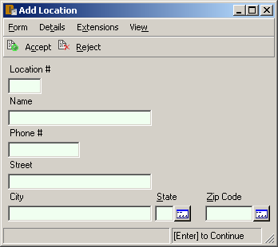
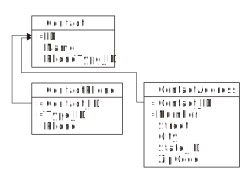
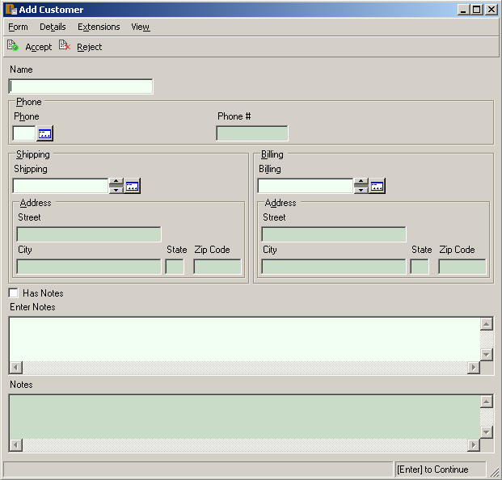
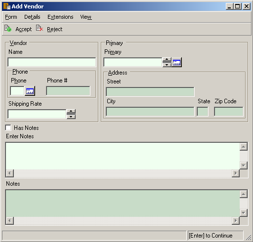
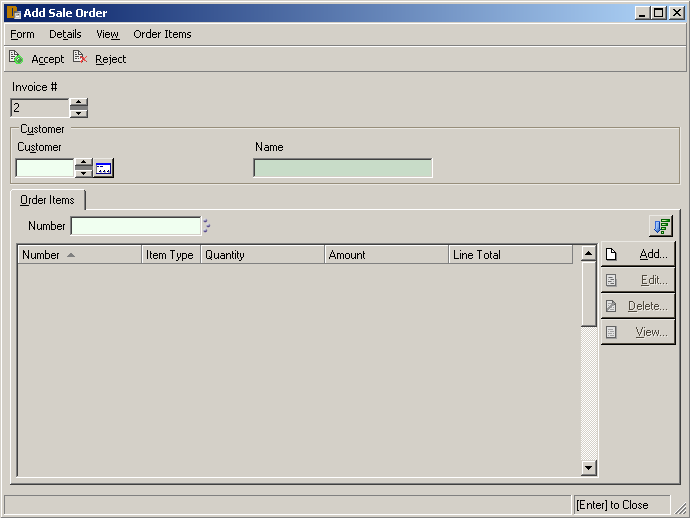

= Putting it all Together
:author: Alphora
:doctype: book

:data-uri:
:lang: en
:encoding: iso-8859-1

[[DDGPuttingItAllTogether]]
== Summary

In this chapter, we return to the running example and apply the
technologies and techniques introduced in the previous chapter to the
process of building the presentation layer of the Shipping application.
Each section will discuss building a separate portion of the
user interfaces, and explore how the Dataphor platform enables
declarative solutions to the problems of database application
development.

[[DDGPuttingItAllTogether-LocationManagement]]
== Location Management

We begin the process of building the user interfaces required for
location management by answering in detail two questions: first, what
user interfaces are required, and second, what user interfaces do the
unadorned location structures provide?

The following diagram depicts the logical design of the location tables
in the Shipping application:

.Shipping Database Design: Locations
image::../Images/LocationDiagram.svg[Location - Diagram]

From this diagram, we see that we have three tables: State, ZipCode, and
Location, with the obvious meanings. However, the diagram also shows the
relationships between these three tables in the form of reference
constraints, of which there are three: ZipCode_State, Location_ZipCode,
and Location_State.

Not only do these references enforce the integrity of the database
footnote:[We note in passing that the design is not entirely correct due
to the fact that U.S. Postal Service Zip codes do not uniquely determine
a city and state in all cases. For simplicity, we have omitted this
detail.], but they are just as important as the definitions of the
tables themselves in terms of producing intuitive and effective
user interfaces.

Given this subschema, we can answer the first question by simply
enumerating the required user interfaces:

* Search user interface for finding a location.
* Edit user interface for adding, editing, viewing, or deleting a
location.
* Search user interface for finding a state.
* Edit user interface for adding, editing, viewing, or deleting a state.
* Search user interface for finding a zipcode.
* Edit user interface for adding, editing, viewing, or deleting a
zipcode.

To answer the second question, consider the following add form based on
the unadorned Location table footnote:[The document expression for the
user interface shown is Derive('Location', 'Add'). Alternatively, the
derived form launcher can be used by right-clicking on the Location
table in the Dataphor Explorer and selecting Derive....]:

image::../Images/Part3LocationAddUnadorned.bmp[Location Add - Unadorned]

First, we note that the user interface is not exactly unadorned. There
are no metadata tags on the tables or references involved, but there are
still metadata tags on the types controlling the titles and widths of
the columns.

Regarding the lookup controls for the State and ZipCode columns, these
are simply the result of the unadorned references Location_State and
Location_ZipCode, respectively. Other than the titles, the controls are
fine, and so we will leave them. As for the titles of these controls, we
will set these by setting the titles of the State and ZipCode tables,
respectively.

The following script will set the title and plural title for the State,
ZipCode, and Location tables:

....
alter table State alter tags
{
    create static Frontend.Title = "State",
    create static Frontend.Plural.Title = "States"
};

alter table ZipCode alter tags
{
    create static Frontend.Title = "Zip Code",
    create static Frontend.Plural.Title = "Zip Codes"
};

alter table Location alter tags
{
    create static Frontend.Title = "Location",
 create static Frontend.Plural.Title = "Locations"
};
....

The plural title will be used whenever a table-level title is required,
such as the caption for a browse form. The singular title will be used
in singular contexts such as column titles, or row-level
user interfaces. With these adornments, the title of the control for the
ZipCode column will now be Zip Code, based on the singular title tag for
the table.

Although functional, the default layout of this user interface could be
considerably improved by placing some of the controls on the same
horizontal line. This can be accomplished within the derivation
framework by changing the _flow_ of the controls during user interface
layout. For the Location user interfaces, we will add a
Frontend.FlowBreak tag to the City and State_ID columns. As the
following screen shot shows, these tags temporarily change the flow for
the next control:

Note that the flowbreak tags are ignored for plural user interfaces, so
it is not necessary to limit them with a singular or form type
qualifier:

....
alter table Location
{
    alter column City alter tags { create Frontend.FlowBreak = "true" },
    alter column State_ID alter tags { create Frontend.FlowBreak = "true" }
};
....

In addition to changing the flow of controls within the user interface,
the grouping of those controls can be changed using tags. For this
user interface, we will place all the address controls in a group
labeled Location Address:

....
alter table Location
{
    alter column Street alter tags { create Frontend.Group = "Address" },
    alter column City alter tags { create Frontend.Group = "Address" },
    alter column State_ID alter tags { create Frontend.Group = "Address" },
    alter column ZipCode alter tags { create Frontend.Group = "Address" }
}
    alter tags { create Frontend.Group.Address.Title = "Location Address" };
....

The resulting user interface has a group for the address controls:

image::../Images/Part3LocationAddWithGroup.bmp[Location Add - With Group]

Note the additional table-level tag to set the title of the group. In
order to allow group-level tags to be set in this way, derivation
requires that group names be valid identifiers within D4. All the
standard tags controlling layout and titles can be used with groups.

To place a column within a particular group, use the Frontend.Group tag
on the column. Note that the column can be placed within nested groups
by using a backslash (\) to delineate successive group names. For
example:

....
alter table Location
{
    alter column Name alter tags { create Frontend.Group = "Location" },
    alter column Phone alter tags { create Frontend.Group = "Location" },
    alter column Street alter tags { alter Frontend.Group = "Location\Address" },
    alter column City alter tags { alter Frontend.Group = "Location\Address" },
    alter column State_ID alter tags { alter Frontend.Group = "Location\Address" },
    alter column ZipCode alter tags { alter Frontend.Group = "Location\Address" }
}
    alter tags
    {
        drop Frontend.Group.Address.Title,
        create Frontend.Group.Location.Address.Title = "Location Address"
    };
....

Note that the backslash becomes a qualifier (.) in the group-level tag.
The following screenshot depicts the resulting user interface:

image::../Images/Part3LocationAddWithLocationGroup.bmp[Location Add - With Location Group]

In addition to layout and other cosmetic changes, we would like to
provide as useful a user interface as possible. In addition to the
benefits of using automated user interfaces such as consistent
look-and-feel, managed hot-key assignment, and managed tab-order, the
Dataphor Server provides the proposable interfaces to allow data entry
behavior to be tailored for each application. In this case, we will use
the _change_ proposable to set the City and State_ID columns whenever a
ZipCode is chosen. The following program listing shows the event
handler:

....
//* Operator: LocationZipCodeChange
create operator LocationZipCodeChange(var ARow : typeof(Location[])) : Boolean
begin
    result := false;
    if not(IsNil(ARow.ZipCode)) and IsNil(ARow.City) and IsNil(ARow.State_ID) then
    begin
        result := true;
        var LZipRow := ZipCode[ARow.ZipCode] { ZipCode, City, State_ID };
        update ARow set { City := LZipRow.City, State_ID := LZipRow.State_ID };
    end;
end;
attach LocationZipCodeChange to ZipCode in Location on change;
....

In connection with this event handler, we note that the handler will
_not_ be translated into an application transaction context. By default,
operators that do not modify global table variables (functional
operators) such as this one are not translated. Although this behavior
can be changed using the DAE.ShouldTranslate tag on the operator, in
this case, we do not want the operator to translate into the A/T space
as it is unnecessary. This is because the operator does not update any
information in the database, and there is therefore no reason for it to
be part of the batch process of inserting or editing a location.

This is the extent of the tailoring we will do for the user interfaces
in the location management portion of the Shipping application. With
just a few lines of declarative adornments to the existing application
schema, we have tailored the appearance of the application. Moreover, we
have done so without any client-side code, even when we modified the
run-time client-side behavior of the application. The resulting
user interfaces are extremely well insulated from changes in the
application schema, indeed, they are entirely defined by the application
schema.

[[DDGPuttingItAllTogether-ContactManagement]]
== Contact Management

A significant portion of the Shipping application centers around contact
management. Many of the core requirements deal exclusively with tracking
contact information, and the main purpose of the application, invoice
management, would be useless without the ability to correlate invoice
information with contacts. This section will first consider the core
contact user interfaces, and will then build on that to provide the
Customer and Vendor user interfaces.

To begin, consider the basic contact structures, as shown in the
following diagram:

.Shipping Database Design: Contacts

The following screenshot depicts the default add user interface for the
Contact table:

image::../Images/Part3ContactAdd1.bmp[Contact Add - 1]

Notice the Details menu containing links to the ContactPhone and
ContactAddress tables for the current Contact. Notice also the group
labeled Phone, and the inclusion of a read-only control labeled Phone #.
This was done using the Frontend.Preview.Include tag on the Phone column
of the ContactPhone table. This tag is used whenever a lookup is being
embedded into a user interface, and determines which columns from the
lookup target table will be included in the user interface. All the
controls for the lookup that are brought in using the include will be
placed within a group for the lookup. The default value for this tag is
false, meaning that no columns will be brought in. This means that for
lookup tables, preview information must be explicitly specified. In
addition, if there is only one column being included from the lookup
target (as in this case), that column will appear in-line with the
lookup control.

As discussed in the Logical Application Design part of this guide,
tackling the history portions of the contact system required the use of
historical tracking tables called _during_ tables [19], and the use of
_since_ columns within the contact structures themselves. In addition,
several event handlers were defined to make the auditing transparent to
the application user. Behind the scenes, the Dataphor Server simply logs
changes to the contact information as they occur. In this section, we
will expose these history lists on the Details menu using views and
references. Because each of the three history lists (name, address, and
phone number) will be handled the same way, we will only discuss the
name history.

The first task is to provide a view of the audit trail. This is
accomplished by combining the current information (from the Contact
table) with the historical information (from the ContactNameDuring
table). The following view definition provides the required information:

....
//* View: ContactNameHistory
create view ContactNameHistory
    ContactNameDuring
        union
        (
            Contact
            {
                ID Contact_ID,
                NameSince From,
                DateTime() To,
                Name,
                NameBy By
            }
        )
        adorn
        {
            From tags { Frontend.Visible = "true" },
            key { Contact_ID, From } tags { Frontend.Visible = "false" },
            drop key { Contact_ID, From, To, Name, By },
            drop order { Name },
            order { Contact_ID, From desc } tags { Frontend.IsDefault = "true" }
        }
    tags
    {
        Frontend.Title = "Name History",
        Frontend.Caption = "Contact Name History",
        Frontend.UseList = "true",
        Frontend.Elaborate = "false",
        Frontend.Search.Visible = "false"
    };
....

In addition to providing the result set, this view definition includes
an adorn operator that further defines the user interface. First, it
includes a Frontend.Visible tag for the From column. This tag is
required because the NameSince column on which it is based is set
invisible. Without this tag, the From column would not be displayed
footnote:[An alternative solution is to declare the visible tag on the
NameSince column **static**, preventing it from being inferred with the
expression.].

Second, the adorn operator changes the inferred key of the result set by
dropping the key inferred from the **union**, and declaring a key on the
Contact_ID and From columns. This is a legitimate usage of an adorned
key because the event handlers in place on the Contact table ensure that
the value of the NameSince column in the Contact table will always be
greater than any value of the From column in the ContactNameDuring table
for a given contact.

Next, the adorn operator changes the inferred order of the result set by
dropping the order inferred on the Name column, and adding an order
based on the From column descending. This new order is also marked as
the default order for the view, instructing the derivation engine to
choose this order initially when building a user interface.

Finally, the adorn operator introduces several tags controlling the
appearance of the resulting user interface. Two of the tags, the
Frontend.Caption, and Frontend.Search.Visible, affect the actual
user interface, providing the caption of the form, and removing the
search control. The other tags affect how the user interface will be
reached from other forms, and will be discussed next.

With the view defined, we need to link it into the main contact
user interface. This is accomplished by declaring a reference from the
newly created view to the contact table:

....
//* Reference: ContactNameHistory_Contact
create reference ContactNameHistory_Contact
    ContactNameHistory { Contact_ID }
    references Contact { ID };
....

Because of the cardinalities involved, this reference will be treated as
a detail from the perspective of the Contact table. As such, it will
appear as a link on the Details menu of any derived and elaborated
Contact user interface. The title of the link is set with the
Frontend.Title tag on the view, while the UseList and Elaborate tags
control how the document expression for the link is built. The UseList
tag indicates that the form type should be List, and the Elaborate tag
turns off elaboration for the derived user interface. The result is a
menu item labeled Name History on the Details menu of the Contact form.
Selecting this menu item will display the following form:

image::../Images/Part3ContactNameHistoryList.bmp[Contact Name - History List]

Using this technique, the various menus available on a given
user interface can be customized to display whatever information is
required. We note that by default, references between views are not
enforced by the Dataphor Server.

Next, we will use the same technique to embed information directly into
the contact user interface. As part of the contact management system, we
will allow the user to enter arbitrary notes about each contact. Rather
than just allowing the user to edit the contents of existing notes, we
would like to keep a running log of notes as they are entered. In order
to accomplish this from the logical perspective, the EnterContactNotes
view was defined in the Logical Application Design part of this guide.
We repeat the definition here in order to discuss the presentation layer
aspects:

....
//* View: EnterContactNotes
create view EnterContactNotes
    ContactNotes add { nil as Notes NewNotes tags { DAE.IsComputed = "false" } }
        over { Contact_ID, NewNotes, Notes }
        adorn
        {
            NewNotes tags { Frontend.Title = "Enter Notes" },
            Notes tags { Frontend.ReadOnly = "true" }
        }
    tags
    {
        Frontend.Title = "Notes"
    };
....

This view definition adds a new column for the notes to be entered. Note
that the expression defining the column makes use of the *as* operator.
This is necessary because without it, the compiler would have no way of
inferring the type of the new column.

The DAE.IsComputed tag instructs the Dataphor Server not to recompute
the value of the column during a change proposable. Without this tag,
the value of the NewNotes column would be reset to nil on every change
event.

Next, the adorn informs the derivation engine that the old Notes column
should be displayed with a read only control, and sets the title of the
view using the Frontend.Title tag.

The following reference definition embeds the EnterContactNotes view in
the singular contact user interfaces:

....
create reference EnterContactNotes_Contact
    EnterContactNotes { Contact_ID }
    references Contact { ID }
    tags
    {
        Frontend.Visible = "false",
        Frontend.Singular.Embedded = "true"
    };
....

Because this reference is an extension from the perspective of the
Contact table, the Embedded tag is false by default. The Visible tag on
the reference prevents it from showing up on the Extensions menu, and
the Singular.Embedded tag tells the derivation engine to in-line the
extended information directly in the user interface. The following
screenshot depicts the resulting user interface:

image::../Images/Part3ContactAdd2.bmp[Contact Add - 2]

Another example of this technique involves the ability to categorize
contacts in the Shipping application. As described in the Logical
Application Design part of this guide, each contact can be associated
with multiple categories. Again, we repeat the definition of the view
here:

....
//* View: ContactCategories
create view ContactCategories
    Contact { ID }
        add
        {
            Concat
            (
                { Description, Delimiter } from
                (
                    ContactCategory
                        where Contact_ID = ID
                        join (Category { ID Category_ID, Description })
                        add { ', ' Delimiter }
                )
            ) Categories tags { DAE.IsComputed = "false" }
        }
        rename { ID Contact_ID }
    tags
    {
        Frontend.Title = "Categories"
    };
....

The resulting view provides a result set with a Categories value for
each Contact, containing a comma-delimited list of the categories
associated with that contact. This view is then attached to the Contact
table as an extension with the following reference definition:

....
create reference ContactCategories_Contact
    ContactCategories { Contact_ID }
    references Contact { ID }
    tags
    {
        Frontend.Include = "false",
        Frontend.Extension.Include = "true",
        Frontend.Extension.Title = "Categories",
        Frontend.Extension.Document = "Form('Sample.Shipping', 'ContactCategoriesEdit')"
    };
....

As far as the reference definition itself, this example is the same as
the other two. However, this definition uses the
Frontend.Extension.Document tag to set explicitly the document
expression to be used. In this case, a customization is loaded with a
call to the Form operator. The ContactCategoriesEdit form is a
customization of an edit form derived from the ContactCategories view.
The customization simply adds a button to the right of the Categories
column, and attaches it to a ShowFormAction that displays a browse of
the ContactCategory table. When the category lookup is accepted, the
selected category is appended to the current value of the Categories
column with a delimiting comma if necessary. This provides an edit
user interface for the user to select multiple categories for the
contact. This example shows that not only can the reference technique be
used to guide user interface automation for derived user interfaces, but
customized, and even from-scratch forms can be used as well.

Now that the user interfaces for the common portions of the contact
structures have been built, we can concentrate on providing the specific
user interfaces for the Customer and Vendor structures. We start with
the Customer table by building a view that combines the Contact and
Customer tables:

....
//* View: CustomerDetail
create view CustomerDetail
    Contact join Customer
    tags
    {
        Frontend.Title = "Customer",
        Frontend.Plural.Title = "Customers"
    };
....

In addition to this view definition, there are several references
created relating the Customer table to the ContactAddress table:

....
create reference Customer_Shipping_CustomerAddress Customer { ID, Shipping_Address_Number }
    references ContactAddress { Contact_ID, Number }
    tags
    {
        Frontend.Title = "Shipping Address",
        Frontend.Group.Title = "Shipping",
        Frontend.Group.FlowBreak = "true",
        Frontend.Plural.Embedded = "false"
    };

create reference Customer_Billing_CustomerAddress Customer { ID, Billing_Address_Number }
    references ContactAddress { Contact_ID, Number }
    tags
    {
        Frontend.Title = "Billing Address",
        Frontend.Group.Title = "Billing",
        Frontend.Plural.Embedded = "false"
    };
....

These references not only set the title and embedded properties for the
references, but contain the Frontend.Group tags that determine how the
entire group constructed for the lookups should be handled. The
Frontend.Group.FlowBreak tag applies a flow break to the shipping
address group, resulting in the following user interface:

Notice in particular that the effect of the references is cumulative.
The user interface not only includes the address references introduced
for the customer, but also the primary phone reference, history list
references, notes edit, and categories edit introduced for the contact.
In addition, because this is still a purely derived user interface, the
effects of changes to the base contact structures will be immediately
reflected in the customer user interfaces.

One other point to be made in connection with this user interface is
that the Address groups within the Shipping and Billing groups is
defined with Frontend.Group tags on the columns of the ContactAddress
table. The Billing and Shipping groups are constructed automatically by
derivation because of the lookup references, and the columns to be
included are specified using the Frontend.Preview.Include tag on the
columns of the ContactAddress table. This example shows the flexibility
of using tags defined on columns to define user interface
characteristics; even though the tags appear on completely separate
tables, they still affect the appearance of the customer user interface.
This level of flexibility and power is only possible because of the rich
structural inference capabilities of the Dataphor Server.

We turn now to the vendor structures. Again, we begin by defining the
VendorDetail view that combines both the Contact and Vendor tables:

....
//* View: VendorDetail
create view VendorDetail
    Contact join Vendor
        {
            ID,
            Name,
            NameSince,
            NameBy,
            Primary_PhoneType_ID,
            ShippingRate,
            Primary_Address_Number
        }
    static tags
    {
        Frontend.Title = "Vendor",
        Frontend.Plural.Title = "Vendors"
    };
....

Given this view definition, we obtain the following user interface:

image::../Images/Part3VendorAdd1.bmp[Vendor Add - 1]

Again, although functional, this user interface is too long vertically,
and would be much more cosmetically appealing if the information were
distributed more evenly horizontally. To accomplish this, we will modify
the definition of the VendorDetail view with an *adorn* operator that
will place the name, phone, and shipping rate information into a group
to the left of the primary address:

....
//* View: VendorDetail
create view VendorDetail
    Contact join Vendor
        {
            ID,
            Name,
            NameSince,
            NameBy,
            Primary_PhoneType_ID,
            ShippingRate,
            Primary_Address_Number
        }
        adorn
        {
            ID tags { Frontend.Group = "Vendor" },
            Name tags { Frontend.Group = "Vendor" },
            Primary_PhoneType_ID tags { Frontend.Group = "Vendor" },
            alter reference Contact_ContactPhone
                alter tags { create Frontend.Group = "Vendor" },
            ShippingRate tags { Frontend.Group = "Vendor" }
        }
    static tags
    {
        Frontend.Group.Vendor.FlowBreak = "true",
        Frontend.Title = "Vendor",
        Frontend.Plural.Title = "Vendors"
    };
....

Note in particular the usage of the *alter reference* clause of the
adorn operator to add a tag to the inferred reference
Contact_ContactPhone. This technique can be used to alter the treatment
of a particular reference within the derivation engine for a given view
without affecting the treatment of that reference in the rest of the
application schema. In other words, the adornment here applies only to
the inferred structural information, it does not affect the global
Contact_ContactPhone reference. The inferred reference is named the same
as the global reference on which it is based for ease of reference only.
To determine the name of an inferred reference, and what references have
been inferred for a given expression, use the
link:O-System.Diagnostics.ShowPlan.html[ShowPlan] operator.

The inferred Contact_ContactPhone reference is marked with the
Frontend.Group tag to place it within the vendor group in the resulting
user interface. The vendor group is then tagged with a FlowBreak and the
resulting user interface now has a much better horizontal distribution:

As a final addition to the vendor user interface, we will embed the
inventory types which the vendor supplies as a detail of the vendor
user interfaces:

....
create reference VendorItemType_Vendor
    VendorItemType { Vendor_ID }
    references Vendor { ID }
    tags { Frontend.Detail.Embedded = "true" };
....

The Frontend.Detail.Embedded tag instructs the derivation engine that
this reference should be embedded on all vendor user interfaces, plural
and singular. The following screenshot depicts the final add vendor
user interface:

image::../Images/Part3VendorAdd3.bmp[Vendor Add - 3]

Note that the supplies detail is slimmer vertically than a standard
embedded detail would be. This is because the VendorItemType table is
tagged with a Frontend.Grid.RowCount of 5, rather than the default 10.
This tag can be used to set the number of rows appearing in a derived
plural user interface.

This is the extend of the customization required for the contact,
customer, and vendor management user interfaces. Again, we have built
the entire presentation layer with a few simple adornments, and only a
single customized user interface. The more the presentation layer is
based solely on the application schema, the more insulated the
application will be during subsequent maintenance cycles.

[[DDGPuttingItAllTogether-InvoiceManagement]]
== Invoice Management

Now we reach the heart of the Shipping application: Invoice Management.
This is the portion of the application that actually tracks customer
orders, purchase orders, and shipping and receiving. Most of the
processes required here were built during the Logical Application Design
part of this guide, but we will repeat the necessary portions for
completeness.

We begin the discussion with the sale order entry user interface. As
with the other user interfaces, we will build this form by constructing
adorned views and references. As a starting point, consider the type of
user interface we want to end up with: what data can be provided
automatically by the system, and what data must be entered by the user?
As part of the order entry system, we could provide the ability to
select a _current_ location. This would prevent the user from having to
enter the location for the invoice each time, as well as prevent
possible entry mistakes by selecting the wrong location. The only other
piece of information required for a sale order that could not be
provided automatically is the customer, and the line item types and
quantities.

As a first step, we will construct the structures required to track the
current location, and the user interface for selecting it. Rather than
store which location a user is logged in to as a permanent fixture of
the global database, we will use _session_ tables to track the
information temporarily with the session. The user will be required to
select a current location prior to entering any sale order, and that
information will be maintained with the current session.

The following operator definition ensures that the CurrentLocation
session table has been constructed:

....
//* Operator: EnsureCurrentLocationTable
create operator EnsureCurrentLocationTable()
begin
    if not(ObjectExists('CurrentLocation')) then
        Execute
        (
            '
                create session table CurrentLocation { Location_ID : LocationID, key { } };
                create session reference CurrentLocation_Location
                    CurrentLocation { Location_ID }
                    references Location { ID }
                    tags
                    {
                        Frontend.Include = "false",
                        Frontend.Lookup.Include = "true",
                        Frontend.Lookup.Title = "Current Location"
                    };
            '
        );
end;
....

This operator creates the session table CurrentLocation, as well as a
reference from CurrentLocation to the Location table in the global
catalog. Note that this reference is allowed because it is referencing
from a session table to a global table. The other direction would not be
allowed, because the session table has a shorter scope than the global
table. Despite the fact that these are session-specific objects, they
can still be used as the input to user interface derivation. As a
result, the user interface for selecting a current location is simply a
derived edit on the CurrentLocation session table.

Once a current location has been selected, the sale order entry system
must be able to access the information. For this purpose, we provide the
CurrentLocationID() operator:

....
//* Operator: CurrentLocationID()
create operator CurrentLocationID() : LocationID
begin
    result :=
        (
            Evaluate('CurrentLocation[].Location_ID')
                with { IsFunctional = "true", IsDeterministic = "true", IsRepeatable = "true" }
        )
            as LocationID;
end
    tags { DAE.ShouldTranslate = "false" };
....

For a more in-depth discussion of this operator, refer to the
<<ModelingProcessLogic.adoc#DDGModelingProcessLogic-Session-SpecificObjects, Session-specific Objects>>
discussion in the Logical Application Design part of this
guide. For this discussion, we remark only that the operator includes a
DAE.ShouldTranslate tag instructing the Dataphor Server that this
operator should not be translated into an application transaction
because it is not necessary.

With the CurrentLocationID() defined, we are now ready to build the
actual sale order entry user interface. As with many Dataphor
user interfaces, it is based on a view definition:

....
//* View: SaleOrderEntry
create view SaleOrderEntry
    Invoice join SaleOrder
        adorn
        {
            Location_ID { default CurrentLocationID() }
                tags { Frontend.Add.Visible = "false", Frontend.Edit.Visible = "false" },
            Customer_ID tags { Frontend.Title = "Customer #" },
            drop reference Invoice_InvoiceStatus,
            drop reference Invoice_User,
            drop reference SaleOrder_Customer,
            drop reference PurchaseOrder_Invoice,
            drop reference InvoiceItem_Invoice
        }
    tags
    {
        Frontend.Title = "Sale Order"
    };

create reference SaleOrderEntry_CustomerDetail
    SaleOrderEntry { Customer_ID }
        references CustomerDetail { ID };
....

This view definition combines the Invoice and SaleOrder tables using a
natural join. The existing metadata from both tables is inferred, so
very little adornment is required. The Location_ID is defaulted to the
CurrentLocationID() operator created above, and the column is marked
invisible. The Customer_ID column is given a title, and several
references are removed. It is important to note that only the inferred
reference metadata are being removed here. The global reference
constraint definitions are unaffected by this view definition.

The resulting user interface is clean and simple:

image::../Images/Part3SaleOrderAdd1.bmp[Sale Order - Add - 1]

Next, we add the user interface for the line-items. Each line-item will
have an item type, a quantity, a price, and a total. The following view
definition gives us this user interface:

....
//* View: SaleOrderItem
// Sale order line item entry
create view SaleOrderItem
    InvoiceItem
        add { Quantity * Amount LineTotal }
        adorn
        {
            Number tags { Frontend.ReadOnly = "true" },
            Quantity tags { Frontend.FlowBreak = "true" },
            Amount tags { Frontend.FlowBreak = "true" },
            LineTotal tags { Frontend.Title = "Line Total" },
            drop reference InvoiceItem_ItemType
        }
    tags
    {
        Frontend.Title = "Order Item",
        Frontend.Plural.Title = "Order Items"
    };

create reference SaleOrderItem_SaleOrder
    SaleOrderItem { Invoice_ID } references SaleOrder { ID }
    tags
    {
        Frontend.Detail.Embedded = "true"
    };
....

The reference definition then embeds the line-item detail into the sale
order entry user interface:

In addition to providing the plural detail user interface, the above
view definition provides the singular item entry user interface.
However, before it is complete, we have to provide for the lookup to the
inventory. Note that the inferred reference for InvoiceItem_ItemType was
removed from the view definition. This was done to make room for a
lookup based on the currently selected location. This will allow us to
limit the set of inventory items available for selection on a sale order
to the inventory items available for the current location. The following
view and reference definitions provide this piece:

....
//* View: LocationItemType
create view LocationItemType
    LocationItem
        where Location_ID = CurrentLocationID()
        { ItemType_ID ID }
        join ItemType
        adorn
        {
            Description tags { Frontend.Preview.Include = "true" }
        }
    tags
    {
        Frontend.Title = "Item Type",
        Frontend.Plural.Title = "Item Types"
    };

create reference SaleOrderItem_ItemType
    SaleOrderItem { ItemType_ID }
    references LocationItemType { ID };
....

With these views and references in place, the line-item entry
user interface becomes:

image::../Images/Part3SaleOrderItemAdd.bmp[Sale Order - Add Item]

The first item to note is that the Number column has been given a value
of 1. Obviously, we do not want the user to have provide a value for the
line-item number, so we provide an operator to compute this value.

The GetNextInvoiceItemNumber operator increments a line-item generator
per invoice and returns the next line-item number. However, we cannot
use a default to provide this value because the generator is based on
the value of the Invoice_ID column, which is not known during the
default proposable call.

The value for the Invoice_ID is set by the Frontend data access layer
after the new row is constructed. When this column is set, a change
proposable is triggered, so we can attach an event handler to the change
event of the Invoice_ID column in order to achieve the desired behavior:

....
//* Operator: InvoiceItemChangeInvoiceID(var typeof(InvoiceItem[])) : Boolean
create operator InvoiceItemChangeInvoiceID(var ARow : typeof(InvoiceItem[])) : Boolean
begin
    if IsNil(ARow.Number) and not(IsNil(ARow.Invoice_ID)) then
    begin
        ARow.Number := GetNextInvoiceItemNumber(ARow.Invoice_ID);
        result := true;
    end
    else
        result := false;
end;
attach operator InvoiceItemChangeInvoiceID
    to Invoice_ID in InvoiceItem
    on change;
....

In addition to providing a value for the Number column, we can
automatically provide a value for the Amount column by looking up the
Price of the item at the current location. The following event handler
provides this behavior:

....
//* Operator: InvoiceItemChangeItemTypeID(var typeof(InvoiceItem[])) : Boolean
create operator InvoiceItemChangeItemTypeID(var ARow : typeof(InvoiceItem[])) : Boolean
begin
    if not(IsNil(ARow.ItemType_ID)) then
    begin
        ARow.Amount := LocationItem[CurrentLocationID(), ARow.ItemType_ID].Price;
        result := true;
    end
    else
        result := false;
end;
attach operator InvoiceItemChangeItemTypeID
    to ItemType_ID in InvoiceItem
    on change;
....

This operator uses the newly entered value of the ItemType_ID column
along with the CurrentLocationID() operator to lookup the Price for the
given item type at the current location. The Amount column is then set
to this amount. Note also that because the LineTotal column is
automatically computed in response to changes in the row, it does not
matter whether the Quantity column is set first, the total for the line
will be recomputed in response to either an item type change, which sets
the price, or a quantity change.

Now that the order entry user interfaces are complete, we can move on to
the purchasing user interfaces. These will be much less involved from
the user interface perspective, as all the information required to
complete a purchase order is already available based on inventory levels
and vendor information in the system.

As such, the user interface will involve simply generating a set of
bids, deciding which bid should become a purchase order, and processing
it. The first step in producing this user interface is to build the
operator that will construct the purchase orders. We begin by defining a
view that will provide a listing of the item types that need to be
ordered for each location:

....
//* View: LocationItemsToOrder
create view LocationItemsToOrder
    LocationItem
        add { OnHand + OnPurchase ProjectedOnHand }
        add
        {
            (if ProjectedOnHand < OnOrder then OnOrder - ProjectedOnHand else 0d) RequiredOnHand,
            (if ProjectedOnHand < Par then Par - ProjectedOnHand else 0d) SuggestedOnHand
        }
        add { RequiredOnHand + SuggestedOnHand ToOrder }
        where ToOrder > 0
        over { Location_ID, ItemType_ID, ToOrder }
    tags
    {
        Frontend.Title = "Inventory To Order"
    };
....

Next, we define a view that uses the LocationItemsToOrder view to
provide a listing of all vendors that supply the required item, the cost
charged by the vendor, as well as the shipping cost based on the
distance between the location and the vendor:

....
//* View: SupplyingVendors
create view SupplyingVendors
    VendorItemType
        join (Vendor rename { ID Vendor_ID })
        join (ContactAddress { Contact_ID Vendor_ID, Number Primary_Address_Number, ZipCode Source_ZipCode })
        join (ZipCode { ZipCode Source_ZipCode, Coordinate Source_Coordinate })
        join LocationItemsToOrder
        join (Location { ID Location_ID, ZipCode Target_ZipCode })
        join (ZipCode { ZipCode Target_ZipCode, Coordinate Target_Coordinate })
        add { Distance(Source_Coordinate, Target_Coordinate) Shipping_Distance }
        add { ShippingRate * Shipping_Distance Shipping_Cost }
        add { (Cost * ToOrder) + Shipping_Cost Total_Cost }
        over { Vendor_ID, Location_ID, ItemType_ID, ToOrder, Cost, Shipping_Cost, Total_Cost }
    {
        order { Vendor_ID, Location_ID, ItemType_ID, Total_Cost desc }
    }
    static tags
    {
        Frontend.Title = "Supplying Vendor",
        Frontend.Plural.Title = "Supplying Vendors"
    };
....

This view is somewhat involved, so we will provide a rough English
translation for the operation:

1.  Get the set of vendors together with the item types they supply,
2.  Retrieve the vendor information for each vendor,
3.  Retrieve the address information for the primary address of each
vendor,
4.  Retrieve the coordinate for the zipcode of each vendor address,
5.  Combine this information with the quantity needed for each item type
at each location,
6.  Retrieve the zipcode for each location,
7.  Retrieve the coordinate for the zipcode of each location,
8.  Compute the distance between the vendor and the location for each
row,
9.  Compute the shipping cost for each row, based on the distance and
shipping rate for the vendor,
10. Compute the total cost of filling the order for each item type for
each location based on the quantity required, the cost of the item type
as supplied by the vendor, and the shipping cost for the vendor,
11. Project over the interesting columns.

Next, the LocationItemsToOrder and SupplyingVendors views are used in
the CreateBidItems operator to populate the BidItem table with a row for
each location and item type with the vendor providing the lowest cost
solution to fill the required order:

....
create operator CreateBidItems(const ALocationID : LocationID)
begin
    delete BidItem where Location_ID = ALocationID;
    insert
        LocationItemsToOrder
            where Location_ID = ALocationID
            rename { Location_ID ToOrder_Location_ID, ItemType_ID ToOrder_ItemType_ID }
            where exists (VendorItemType where ItemType_ID = ToOrder_ItemType_ID)
            add
            {
                (
                    SupplyingVendors
                        where Location_ID = ToOrder_Location_ID and ItemType_ID = ToOrder_ItemType_ID
                        return 1 by { Total_Cost desc, Vendor_ID }
                )[].Vendor_ID Vendor_ID
            }
            join (Vendor rename { ID Vendor_ID } over { Vendor_ID, ShippingRate })
            rename { ToOrder_Location_ID Location_ID, ToOrder_ItemType_ID ItemType_ID }
            join VendorItemType
            over { Location_ID, ItemType_ID, Vendor_ID, ToOrder }
            rename { ToOrder Quantity }
        into BidItem;
end;
....

After executing this operator for a given location, the BidItem table
will be populated with enough information to produce purchase orders for
a given location to each supplying vendor in order to fill the required
orders at that location. Once all the operators are defined, we can
construct the purchasing user interfaces.

The actual purchasing user interface begins by displaying the set of
locations that need to order inventory, either to satisfy par, or to
fulfill orders that have been placed by customers over and above the
amount currently on hand at a given location. This is accomplished by
defining a view that simply projects LocationItemsToOrder over the
Location_ID column:

....
//* View: LocationsNeedingItems
create view LocationsNeedingItems
    LocationItemsToOrder over { Location_ID }
    tags
    {
        Frontend.Title = "Locations Needing Inventory"
    };
....

Next, we derive a list user interface based on this view, and customize
the resulting user interface. The customization adds a button to create
the bid items for the selected location. Creating the bid items first
calls the CreateBidItems action, which is a D4 script action that runs
the following code:

....
CreateBidItems(Main.Location_ID);
....

The argument Main.Location_ID is available because of the DataArgument
component attached to the CreateBidItems action. The DataArgument
component allows the columns of the specified Source to be referenced by
name within the D4 script action.

Next, the bid items are displayed by executing the ShowBidItems action.
If this form is accepted, the CreatePurchaseOrders action is executed.
In this case, the ShowBidItems action is a C# script action, which runs
the following C# script:

....
Host.Session.ExecuteScript
(
    String.Format
    (
        "CreatePurchaseOrders('{0}');",
        Main["Main.Location_ID"].AsString
    )
);
....

Note that this is simply to illustrate the use of both types of script
actions.

The main source is then refreshed (because the AfterExecute of the
CreatePurchaseOrders is set to the Refresh action for the form), and the
location no longer appears on the list, having all required inventory on
order.

The next set of user interfaces to build for the Shipping application
surround the processing of invoices. There are three types of processing
to be done: order approval, shipping, and receiving. Each of these
user interfaces is a simple customization to a derived list form for
some view. As such, we will only discuss order approval.

We begin by defining the view SaleOrdersToProcess which will form the
basis for the user interface:

....
//* View: SaleOrdersToProcess
create view SaleOrdersToProcess
    SaleOrderEntry
        where Status_ID = "NEW";
....

This view definition simply selects sale orders that have not yet been
processed. Notice that the SaleOrderEntry view is used to take advantage
of the user interface elements already defined in that view.

A derived list form is then customized to add a button for processing
the currently selected invoice. Once the invoice is processed, the main
source is refreshed and the invoice no longer appears in the list.

[[DDGPuttingItAllTogether-Conclusions]]
== Conclusions

We have now built all the entry points to the application, and simply
need to provide a portal, or main form for accessing all the
functionality. For this particular application, we will provide a main
application form (Main), a location management form (Setup), a sales
form (Sales), an inventory management form (Inventory), and a processing
form (Processing). Each of these forms simply provides links to the
various entry points required by the application. In fact, because the
functionality in the application is segmented along user roles, each
portal form could be exposed as its own application, further simplifying
the overall user interface.

Looking back over the tasks performed in building the presentation layer
of the Shipping application, we see that most of the development
centered around building views. This is only natural, as every
user interface in a database application can be seen as a "view" of the
data in the database, at least conceptually. By building the primary
definitions of all the user interfaces for a given application into the
application schema, rather than into a client-side executable as
traditional RAD platforms do, the Dataphor platform provides a
revolutionary paradigm for application development and maintenance. As
the application schema evolves, so does the application.
