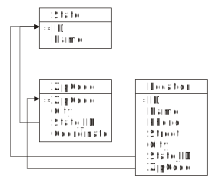
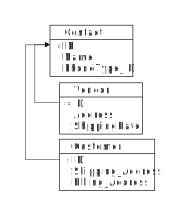

= Representing Data with Tables and Views
:author: Alphora
:doctype: book
:data-uri:
:lang: en
:encoding: iso-8859-1

[[DDGRepresentingDatawithTablesandViews]]
== Summary

This chapter discusses using tables and views to represent the data
structures of an application. The first section discusses tables, or
base table variables, and the various components that make up their
definitions. The next section discusses table-valued operators and
expressions, and the various inference mechanisms at work in the D4
compiler. The final section focuses on derived table variables,
including view updatability.

[[DDGRepresentingDatawithTablesandViews-BaseTableVariables]]
== Tables

Perhaps the most important aspect of the relational model is the idea
that tables in the database have meaning. They allow us to model some
aspect of reality, and then ask questions about that model. With this in
mind, we turn to the problem of building a database to model the
organization in the Shipping application. Recall that the requirements
of the application involve tracking shipping locations, vendors,
customers, orders, and inventory. We begin by modeling the organization
itself as a set of locations.

The following illustration provides a more detailed visual
representation of the tables involved in representing shipping locations
within the organization:

.Shipping Database Design: Locations

Note that although tabular representations such as this diagram are
often used to help visualize database designs, they are only pictorial
representations. It is important to remember that table values are not
flat structures, nor do they have any ordering, left-to-right, or
top-to-bottom. They are n-dimensional structures, where each column in
the table value corresponds to another dimension, with possible values
for that dimension taken from the type of that column.

Of course, the visual representation omits some extremely important
details such as the data types of the columns involved, and any
constraints (except for the visual representation of keys with
asterisks, and references with directed lines) that may need to be
enforced on the data. The following D4 script taken from the
Schema.LocationTables document fills in these details:

....
//* Table: Location
// Location designated by [ID] is named [Name], has phone # [Phone],
// and address [Street], [City], [State_ID], [Zip]
create table Location
{
    ID : LocationID,
    Name : ProperName tags { Frontend.Preview.Include = "true" },
    Phone : Phone,
    Street : Description
        tags { Frontend.Group = "Address" },
    City : Description
        tags { Frontend.Group = "Address", Frontend.FlowBreak = "true" },
    State_ID : StateID
        tags { Frontend.Group = "Address", Frontend.FlowBreak = "true" },
    ZipCode : Zip tags { Frontend.Group = "Address" },
    key { ID }
};

create reference Location_State
    Location { State_ID } references State { ID }
    tags { Frontend.Embedded = "false" };
create reference Location_ZipCode
    Location { ZipCode } references ZipCode { ZipCode }
    tags { Frontend.Embedded = "false" };
....

With this table definition, we can now represent any number of shipping
locations within the organization. The existence of a row in the
Location table corresponds directly with the existence of a location in
the real world. Each shipping location is given a unique identifier,
represented by the ID column. The address and phone number of the
location are also recorded. Because of the reference to the ZipCode
table, the value in the ZipCode column must correspond with the value of
the ZipCode column for some row in the ZipCode table. This guarantees
that for any location, approximate geographical coordinates can be
determined. This fact will be used later when we calculate distances
between shipping locations and vendors.

The above table definition includes several metadata tags that, along
with the definition of the table itself, are used to derive
user interfaces for the table. We will have more to say about these tags
in Part III of this guide. We include them here to show that although
this guide covers logical, presentation, and physical design
considerations separately, when developing applications in Dataphor, it
is often helpful to consider these issues as a whole.

At this point, with just a few simple tables created (State, ZipCode,
and Location), we already have a working application. To see this,
right-click on the Location table in the Dataphor Explorer and select
Browse. The resulting browse interface provides an entry point to manage
shipping locations within the organization.

The next several sections will discuss the various components of a base
table variable definition, such as columns, keys, orders, constraints
and references.

[[DDGRepresentingDatawithTablesandViews-BaseTableVariables-Columns]]
=== Columns

As mentioned in Part I, the structure of a base table variable is
explicitly specified as a set of columns in the table definition. Each
column has a name that is unique within the table, and is defined to be
of some type. Note that while D4 allows non-scalar-valued columns in
table and row type definitions, the SQL-based devices that serve as the
storage engine for the Dataphor Server do not support these kinds of
table definitions.

Each column may contain a default definition, and a set of constraint
definitions. If a default is specified on the column, it will be used in
favor of a default specified in the type definition. Any constraint
definitions specified on the column are enforced in addition to any
constraints defined in the type definition. Defaults and constraints
will be discussed in more detail in the
<<EnforcingBusinessRules.adoc#DDGEnforcingBusinessRulesDeclaratively, Enforcing Business Rules Declaratively>>
chapter.

Column definitions also contain a nilability indicator that determines
whether the column is required to have a value. Note that disallowing
nils with the nilability indicator is basically shorthand for the
constraint specification **not**(IsNil(**value**)) footnote:[There are
cases having to do with _proposables_ where the nilability indicator
provides more information to the Dataphor Server than the equivalent
constraint expression would. Proposables will be discussed in detail in
Part III of this guide. In addition, as with most declarative
statements, using the nilability indicator over the equivalent
constraint definition allows the Dataphor Server to make certain
implementation optimizations.].

[[DDGRepresentingDatawithTablesandViews-BaseTableVariables-KeysandOrders]]
=== Keys and Orders

Every table definition can have any number of keys (except 0) defined.
If no key definition is provided as part of a base table variable
definition, then all comparable columns of the table variable are
assumed as the key.

Each table definition can also include any number of order definitions.
These definitions serve two purposes in the application schema. First,
they provide the list of possible orderings for user interfaces in the
Frontend. Second, they provide a mapping for index creation in the
physical layer.

Note that the *order by* clause of a cursor definition can always be
used to request data in any order, regardless of the order definitions
provided for a table variable. Order definitions are metadata that is
used by the presentation layer and the physical layer.

Each order definition can specify any number of columns in the table
variable. The order in which the columns appear in the order definition
determines the order of the index. Each order column definition can also
include an ascending indicator, and an optional sort function.

TableDeeTableDumAn important point about table values in D4 is that the
set of columns that make up the table is not necessarily non-empty. Not
only can table values with no columns be produced by projection, but
base table variable definitions are allowed to have no columns. There
are two possible table values with no columns: the table with no columns
and no rows, and the table with no columns and one row. Note that the
table with no columns cannot have more than one row, otherwise it would
contain duplicates (a row with no columns is equal to a row with no
columns). These table values turn out to be both useful and important in
the D4 language. So much so that they have been defined in the system
catalog as the tables TableDum and TableDee, respectively footnote:[The
names TableDee and TableDum are taken from the collection of articles by
Hugh Darwen, republished as Adventures in Relationland in reference.]

Also note that just as tables are allowed to have no columns, so are
keys and references. Indeed the key of TableDum and TableDee is
obviously an empty key. When a table is defined with an empty key, the
table is effectively constrained to have at most one row. This is
because any row, no matter what the values for any of its columns, would
have the same values for no columns. The empty key is particularly
useful for database-wide settings tables that should only ever have one
row.

[[DDGRepresentingDatawithTablesandViews-BaseTableVariables-ConstraintsandReferences]]
=== Constraints and References

Table variable definitions may also include any number of constraint and
reference definitions. Constraint definitions may be row-level, or
transition constraint definitions. In either case, the constraint
expression is allowed to reference table variables in the database. If a
given constraint definition does not reference table variables in the
database, the constraint is considered immediate. Otherwise, the
constraint is considered deferred. Immediate constraints are checked
whenever a potentially violating modification occurs. Deferred
constraints, on the other hand, are checked when the transaction in
which the modification occurred is being committed.

References are directional, meaning that they originate in one table
variable, and target another. When discussing a given reference from the
perspective of the originating table variable, the reference is called a
__source reference__. When discussing a given reference from the
perspective of the referenced table variable, the reference is called a
__target reference__.

Constraints and references will be discussed in more detail in the
<<EnforcingBusinessRules.adoc#DDGEnforcingBusinessRulesDeclaratively, Enforcing Business Rules Declaratively>>
chapter.

[[DDGRepresentingDatawithTablesandViews-TableOperators]]
== Table Operators

Generally speaking, a table operator is an operator that deals primarily
with table values. This section introduces the various table operators
available in D4, and discusses the inference mechanisms of the D4
compiler that are used to determine the schema-level description of the
resulting table values. There are several important points to be made
regarding table operators in general.

First, the term _table operator_ is more of a categorization of the
system operators for use in guiding the discussion than an actual
delineation of operators. For example, some table operators, such as
*exists* and *in* take table values as arguments, but result in scalar
values. It is important to remember that operators in D4 are a general
purpose construct. Each operator can take any number of parameters of
any type, and optionally return a result of any type.

Second, it is important to remember that the operators discussed in this
section are, at least conceptually, table-level. That is, they operate
on entire table values at once, and result in a new table value. Of
course, the actual implementation is pipelined for maximum efficiency,
but this is transparent to the logical model. These operations should
not be thought of as row-at-a-time operations.

Third, when used together the operators discussed in this section form
an __algebra__. In particular, the output of one operator is a table
value and can be used as the input to another. This property is called
_closure_ and means that these operators can be chained together to form
arbitrarily complex expressions. This is very different from traditional
calculus style languages such as SQL that require that a query be
expressed in a particular form such as *select..from..where*
footnote:[In fairness, it should be noted that SQL-92 provides support
for nested query expressions within the from clause, effectively
providing for algebraic style nesting. However, because this capability
was introduced after the fact, nesting queries in SQL requires excessive
"circumlocution". In addition, many systems still do not provide support
for this feature, and even among those that do, there are often severe
limitations on its usage.].

And finally, the operators discussed in this section are all _built-in_
operators, meaning that the syntax for the invocation is built into the
D4 language. As stated above, D4 provides facilities for defining
table-valued operators over and above the built-in and system-provided
operators.

The following sections will discuss the various inference mechanisms of
the D4 compiler in general, and the behavior of each operator in
particular. The explanations for each built-in table operator will draw
on the data model of the shipping application. The full definition for
these table variables is found in the various schema documents in the
Sample.Shipping library.

Note that this discussion only includes the most common table operators.
For a complete description of all the available table operators, refer
to the <<D4TableOperators.adoc#D4LGTableExpressions, Table Operators>> chapter of the D4
Language Guide.

[[DDGRepresentingDatawithTablesandViews-TableOperators-CompilerInferenceMechanisms]]
=== Inference Mechanisms

One of the primary functions of the compiler is __semantic
verification__, or the process of ensuring that all the expressions and
invocations in a given D4 program are being used correctly. For example,
the following expression is valid syntactically:

....
"One" / "Two";
....

However, there is no overload of the division operator that takes two
parameters of type String. This expression is therefore semantically
incorrect. To put it another way, one of the primary reasons for having
types in a language is to allow the compiler to verify that a given
statement is performing a valid operation.

In order to perform this vital process of semantic verification, the
compiler uses several different types of __inference__:

* Type Inference
* Key Inference
* Order Inference
* Reference Inference
* Metadata Inference
* Characteristics

Some of these inference mechanisms such as type inference and
characteristics apply general to all expressions and statements of D4.
Others, such as key inference and metadata inference, apply specifically
to table operators.

Type inference for operators that deal primarily with scalar values is
relatively straightforward: the result type of the expression is simply
the result type of the resolved overload of the operator. For example:

....
5 + 5;
....

Because the arguments are both values of type Integer, the operator +
(iAddition) resolves to the overload signature (Integer, Integer), which
has a result type of Integer. The result type of the expression is
therefore Integer, and the type inference is complete.

Characteristic inference will be discussed in more detail in the
<<ModelingProcessLogic.adoc#DDGModelingProcessLogic, Modeling Process Logic>> chapter.

For table operators, the process is somewhat more involved than for
scalar operators, due to the amount of information that must be inferred
about a given expression. Of course, the process involves determining
the type of the result, but it also involves determining the keys,
orders, references and metadata.

All the table operators infer metadata for the columns involved in the
operation, and for the description of the result set itself. These
metadata are inferred only if the original metadata tag definition was
specified as **dynamic**, rather than **static**. Static tags are not
inferred by the metadata inference engine. Unless explicitly specified,
metadata tags are assumed to be dynamic.

The inference mechanisms used by the D4 compiler attempt to infer as
much information as possible about the result of a given expression.
Consequently, the processes being used are quite complex, and the
resulting descriptions can become quite involved. To help the developer
determine what the compiler has inferred about a given expression, the
D4 system library includes the
link:O-System.Diagnostics.ShowPlan.html[ShowPlan] operator. This
operator takes an arbitrary D4 expression as a string argument, and
returns a string representation of the compiled and bound execution plan
for the given expression, including type descriptions, inferred keys,
orders, and references, as well as device binding information. For more
information on using this operator, refer to the System Library
documentation for the operator.

[[DDGRepresentingDatawithTablesandViews-TableOperators-Projection]]
=== Specifying Columns

D4 provides several operators for specifying the set of columns to be
included in the result set. The most general of these is the _specify_
operator (\{ }) which allows columns to be specified by name, or as an
expression in terms of the source columns.

The following examples illustrate the use of the specify operator:

....
select Location { ID, Name };
....

....
ID    Name
----- --------------
01001 Location 01001
01002 Location 01002
01003 Location 01003
01004 Location 01001
....

In the above example, the result includes the key of the Location table,
namely the ID column, and so the key of the result is ID. The following
example illustrates a key-changing projection:

....
select Location { ZipCode };
....

....
ZipCode
-------
84058
84062
84604
....

The result set does not include the key of the Location table, and so
the key of the result set is all columns, or ZipCode. As a result, the
projection eliminates duplicates, and the result set has only 3 rows
(the unique set of zipcodes for all locations).

Note that the specify list is allowed to be empty. For example:

....
select Location { };
....

In this case, not only does the resulting table value have no columns,
but the resulting key has no columns as well. If the input to the
projection has any rows, the result of this projection is TableDee (the
table with no columns and one row), otherwise, the result is TableDum
(the table with no columns and no rows).

The following example illustrates the use of the specify operator to
introduce computed columns into a result set:

....
select InvoiceItem { Invoice_ID, Number, Quantity, Amount, Quantity * Amount LineTotal };
....

....
Invoice_ID Number Quantity    Amount LineTotal
---------- ------ ----------- ------ ---------
27         1      10.00000000 $2.20  $22.00
31         1      10.00000000 $2.20  $22.00
33         1      4.00000000  $2.20  $8.80
33         2      2.00000000  $4.54  $9.08
....

Note that the specify operator is shorthand for an equivalent
*add-over-rename* expression. All keys, orders, and references are
inferred as though the longhand expression had been used. The following
examples illustrate the equivalent longhand for various specify
expressions:

....
select Contact { ID, Name }
// is equivalent to
select Contact over { ID, Name }
....

....
select ContactPhone { Contact_ID ID, Phone }
// is equivalent to
select ContactPhone
    over { Contact_ID, Phone }
    rename { Contact_ID ID }
....

....
select InvoiceItem { Invoice_ID, Number Line_Number, Quantity * Amount Line_Total }
// is equivalent to
select InvoiceItem
    add { Quantity * Amount Line_Total }
    over { Invoice_ID, Number, Line_Total }
    rename { Number Line_Number }
....

As each of these examples show, a specify clause is always at least a
projection. The extension and rename operations are only included when
necessary.

For more information on the *over* and *remove* operators, refer to the
<<D4TableOperators.adoc#D4LGTableExpressions-OverandRemove, Over and Remove>> discussion
in the D4 Language Guide.

For more information on the specify operator, refer to the
<<D4TableOperators.adoc#D4LGTableExpressions-Specify, Specify>> discussion in the D4
Language Guide.

For more information on the *rename* operator, refer to the
<<D4TableOperators.adoc#D4LGTableExpressions-Rename, Rename>> discussion in the D4
Language Guide.

For more information on the *add* operator, refer to the
<<D4TableOperators.adoc#D4LGTableExpressions-Add, Extension>> discussion in the D4
Language Guide.

[[DDGRepresentingDatawithTablesandViews-TableOperators-Restriction]]
=== Specifying Rows

D4 also provides several operators for specifying the set of rows to be
included in the result set. This section discusses the *where* operator
(restriction) and the *return* operator (quota).

==== Restriction

The *where* operator involves restricting the rows to be included in the
result. This operator allows a boolean-valued expression in terms of the
columns of the input called the __restriction condition__. Every row of
the input for which the restriction condition evaluates to true is
included in the result set. This restriction condition becomes a
constraint in the result set. This fact will become useful when we
discuss view updatability in the section on Derived Table Variables.

The following examples illustrate the use of the *where* operator to
select a specific set of rows:

....
select Location where ZipCode = '84058';
....

....
ID    Name           Phone    Street      City State_ID ZipCode
----- -------------- -------- ----------- ---- -------- -------
01001 Location 01001 123-1234 41 N State  Orem UT       84058
01002 Location 01002 123-1235 878 N 800 E Orem UT       84058
....

The above example selects all rows with a ZipCode equal to '84058'. Note
that the equality comparison here is taking advantage of the implicit
conversion available from String to ZipCode. Without this conversion, we
would have to write *where* ZipCode = Zip('84058'), explicitly invoking
the Zip selector to promote the String value '84058' to a Zip value for
comparison.

Because the above example does not involve an equality comparison on the
key, the key of the result is still \{ ID }. By contrast, the following
example does change the key of the result:

....
select Location where ID = '01001';
....

....
ID    Name           Phone    Street     City State_ID ZipCode
----- -------------- -------- ---------- ---- -------- -------
01001 Location 01001 123-1234 41 N State Orem UT       84058
....

In this case, the equality comparison involves a key column, and so that
column is removed from any key of the result. Because ID is the only
column in the key, the resulting key is empty (\{ }), meaning that the
resulting table is guaranteed to have at most one row.

In other words, any time a restriction involves setting an entire key
equal to some value, the key of the result will have no columns. This
fact is particularly useful when using the row extractor to guarantee
that only a single row is involved.

For example, the following query could return multiple rows, and will
give a warning at compile-time, and an error at run-time because the
Dataphor Server cannot determine which row should be extracted from the
table:

....
select Location[].Name
....

To ensure that only one row will ever be involved, and to eliminate the
warning given by the compiler, the following query can be used:

....
select Location['01001'].Name
....

For more information on the *where* operator, refer to the
<<D4TableOperators.adoc#D4LGTableExpressions-Where, Restriction>> discussion in the D4
Language Guide.

==== Quota Queries

The *return* operator is used to limit the cardinality of the result
set. The optional *by* clause specifies the order in which the quota
operation should be performed.

The following examples illustrate the use of the *quota* operator to
limit the number of rows included in a result set:

....
select Invoice return 1;
....

....
ID Location_ID User_ID Date      Status_ID
-- ----------- ------- --------- ---------
27 01001       Admin   9/27/2004 NEW
....

In this example, the *by* clause is explicitly specified:

....
select Invoice return 1 by { ID };
....

....
ID Location_ID User_ID Date      Status_ID
-- ----------- ------- --------- ---------
27 01001       Admin   9/27/2004 NEW
....

In the following example, the result set is limited to the set of rows
with the latest Date:

....
select Invoice return 1 by { Date desc };
....

....
ID Location_ID User_ID Date      Status_ID
-- ----------- ------- --------- ---------
27 01001       Admin   9/27/2004 NEW
31 01001       Admin   9/27/2004 NEW
33 01001       Admin   9/27/2004 NEW
....

Note that omitting the *by* clause and specifying an empty *by* clause
are _not_ equivalent. This is because an empty *by* clause specifies
that the result set should include all rows that have the same value for
no columns, or in other words, all rows. For example, the following
*return* operator returns all rows in the Invoice table:

....
select Invoice return 1 by { };
....

....
ID Location_ID User_ID Date      Status_ID
-- ----------- ------- --------- ---------
27 01001       Admin   9/27/2004 NEW
31 01001       Admin   9/27/2004 NEW
33 01001       Admin   9/27/2004 NEW
....

For more information on the *return* operator, refer to the
<<D4TableOperators.adoc#D4LGTableExpressions-Quota, Quota>> discussion in the D4
Language Guide.

=== Combining Rows From Multiple Tables

D4 provides several operators for combining table values in different
ways. This section discusses the **union**, **minus**, **times**,
**intersect**, and *join* operators.

==== Union

The *union* operator combines rows from each input table value into one
result, with duplicates eliminated. The input table values must have the
same set of columns in order to apply this operator. Note that column
matching is done by name, not by ordinal position within the table
value.

The following example illustrates the use of the *union* operator to
combine the results of two queries:

....
select (SaleOrder { ID })
    union (PurchaseOrder { ID });
....

....
ID
--
27
31
33
....

For more information on the *union* operator, refer to the
<<D4TableOperators.adoc#D4LGTableExpressions-Union, Union>> discussion in the D4
Language Guide.

==== Difference

The **minus**, or difference operator includes all rows in the left
input that are not present in the right input. Both input table values
must have the same set of columns in order to apply this operator. Note
that column matching is done by name, not by ordinal position within the
table value.

The following example illustrates the use of the *minus* operator to
compute the set of contacts that are not vendors:

....
select (Contact { ID })
    minus (Vendor { ID });
....

....
ID
--
5
6
7
8
9
10
....

For more information on the *minus* operator, refer to the
<<D4TableOperators.adoc#D4LGTableExpressions-Minus, Minus>> discussion in the D4
Language Guide.

==== Join

The *join* operator combines rows from each input table value that have
matching column values for a specified set of columns. Joins may be
natural or conditioned, and they may be inner, or outer. Outer joins may
also be performed using the *lookup* keyword, which provides the same
semantics for retrieval, but different semantics for updates. The
*lookup* operator will be discussed in the updatability section.

Natural joins rely on common column names between the input table values
to perform the match. The union of the columns of both inputs become the
columns of the output, with metadata merged the same as for columns in
the *union* operator. This gives rise to three possibilities for natural
joins:

* No common columns.
+
If the inputs contain no commonly named columns, the operation is a
Cartesian product. The D4 language provides the keyword *times* to force
this type of operation. If the *times* keyword is used, the inputs are
not allowed to have common column names. If a usage of the standard
*join* keyword results in a Cartesian product, the compiler will issue a
warning.
* Some common columns.
+
If the inputs contain some commonly named columns, and some columns with
different names, the operation is a standard join. D4 provides the
*join* keyword for this purpose. The join condition is constructed as a
set of equality comparisons between values in the columns from the left
and right input in order to satisfy the join condition.
* All common columns.
+
If the inputs contain only commonly named columns (i.e. the left and
right input table values are of the same table type) then the operation
is an intersection. The D4 language provides the keyword *intersect* for
this purpose. If the *intersect* keyword is used, the inputs are not
allowed to have differing column names.

Conditioned joins require each input table to have no commonly named
columns, and allow the join condition to be specified as part of the
operation using the *by* clause. The join condition in this case is
required to consist only of equality comparisons among columns in
opposite input tables.

While inner joins include output rows only for rows where a match occurs
in both inputs, outer joins allow output rows to be included where a
match did not occur in a given input. Left outer joins allow all rows
from the left input to be included, while right outer joins allow all
rows from the right input to be included, regardless of whether a
matching row in the opposite input table value was found.

Outer joins also allow an optional *rowexists* column to be included in
the result that is true if a row in the outer table was found, and false
otherwise.

The following examples illustrate the use of the various *join*
operators to combine result sets from different queries based on the
relationship between columns in the results.

The following example depicts a natural one-to-one join:

....
select Invoice join SaleOrder;
....

....
ID Location_ID User_ID Date      Status_ID Customer_ID
-- ----------- ------- --------- --------- -----------
27 01001       Admin   9/27/2004 NEW       8
31 01001       Admin   9/27/2004 NEW       7
33 01001       Admin   9/27/2004 NEW       8
....

The only common column name in the above example is ID, which is a key
of both the left and right inputs. This means that the join is
one-to-one, and the key of the output is \{ ID }.

The following example depicts a conditioned one-to-one join:

....
select (Invoice rename I)
    join (SaleOrder rename S)
        by I.ID = S.ID
    { I.ID, I.Status_ID, S.ID, S.Customer_ID };
....

....
I.ID I.Status_ID S.ID S.Customer_ID
---- ----------- ---- -------------
27   NEW         27   8
31   NEW         31   7
33   NEW         33   8
....

In the above example, the join condition is specified by the by clause.
Because the join columns (\{ I.ID } and \{ S.ID }) form keys in both the
left and right inputs, the join is again one-to-one, but the keys of
both inputs are present in the result.

The following example depicts a conditioned left (outer) one-to-one
join:

....
select (Invoice rename I)
    left join (SaleOrder rename S)
        by I.ID = S.ID
        include rowexists
    { I.ID, I.Status_ID, rowexists, S.ID, S.Customer_ID };
....

....
I.ID I.Status_ID rowexists S.ID       S.Customer_ID
---- ----------- --------- ---------- -------------
1    COM         True      1          7
2    COM         False     <No Value> <No Value>
7    COM         False     <No Value> <No Value>
....

As with the previous example, the join condition is specific using the
by clause, and the join is again one-to-one. In this case, however, the
keys of both inputs are present, but the key of the right input is
inferred as a _sparse_ key, meaning that multiple rows may have no value
for the columns of the key.

The following example depicts a natural one-to-many join:

....
select Contact { ID, Name }
    join
    (
        ContactAddress
        {
                Contact_ID ID,
                Number,
                City,
                State_ID,
                ZipCode
            }
        );
....

....
ID Name                  Number City           State_ID ZipCode
-- --------------------- ------ -------------- -------- -------
1  KC Foods              1      Chesterfield   MA       01012
2  Hijinks Emporium      1      Albuquerque    NM       87111
3  Ralph's Wholesale     1      Denver         CO       80202
4  Thriftways            1      New Orleans    LA       70112
5  Quickie Mart          1      Orem           UT       84057
6  Super Store           1      American Fork  UT       84003
7  Emergency Essentials  1      Clearfield     UT       84017
8  Food Masters          1      Salt Lake City UT       84054
9  Unequalled Anywhere   1      Salt Lake City UT       84116
10 Universe of Discourse 1      Pleasant Grove UT       84062
10 Universe of Discourse 2      Orem           UT       84057
....

In this example, the result will in general have several rows for each
row of the left input. The key for the left input is \{ ID }, while the
key for the right input is \{ ID, Number } (after the rename). The key
of the result is therefore \{ ID, Number }.

The following example depicts a natural many-to-one join:

....
select ContactPhone { Contact_ID, PhoneType_ID, Phone }
    join (PhoneType { ID PhoneType_ID, Description });
....

....
Contact_ID PhoneType_ID Phone    Description
---------- ------------ -------- ------------
1          MOB          123-1234 Mobile Phone
2          FAX          555-1212 Fax Machine
3          MOB          877-9908 Mobile Phone
4          FAX          813-9988 Fax Machine
5          WOR          319-9989 Work Phone
6          WOR          126-6654 Work Phone
7          FAX          334-6574 Fax Machine
8          MOB          877-9988 Mobile Phone
9          WOR          133-0098 Work Phone
10         FAX          123-0122 Fax Machine
....

The result set in this case contains one row for each row in
ContactPhone, with the data from the matching PhoneType row repeated.
The key for the left input is \{ Contact_ID, PhoneType_ID }, while the
key for the right input is \{ PhoneType_ID } (after the rename). The key
of the result is therefore \{ Contact_ID, PhoneType_ID }.

The following example depicts a many-to-many join:

....
select Location { ID, Name, ZipCode }
    join (ContactAddress { Contact_ID, Number, ZipCode });
....

....
ID    Name           ZipCode Contact_ID Number
----- -------------- ------- ---------- ------
01004 Location 01004 84062   10         1
....

This examples shows Location rows that have the same ZipCode as
ContactAddress rows. Because the join column (ZipCode) does not form a
superkey of either input, the join is many-to-many. The key is therefore
the Cartesian product of the keys of the inputs, or
\{ ID, Contact_ID, Number }.

For more information on the various *join* operators, refer to the
<<D4TableOperators.adoc#D4LGTableExpressions-Join, Join>> discussion in the D4 Language
Guide.

For more information on outer joins specifically, refer to the
<<D4TableOperators.adoc#D4LGTableExpressions-OuterJoin, Outer Join>> discussion in the
D4 Language Guide.

[[DDGRepresentingDatawithTablesandViews-TableOperators-Aggregation]]
=== Computing Aggregates

Aggregation involves adding a set of columns to the result, where the
value for each of those columns is provided by computing an aggregate
value from the rows of the input. Optionally, a grouping for the rows of
the input may be specified, resulting in an output row for each group in
the input rows, with the aggregate column values computed for the set of
input rows within the group. D4 provides the *group* operator for this
purpose.

If a by clause is specified, every column in the by clause is a column
in the output, with keys, orders, and references inferred the same as
for projection of the input over the columns of the by clause. If a by
clause is not specified, the result will have one row and an empty key.
All columns in the add clause are included in the output.

The following example illustrates the use of the *group* operator to
introduce aggregated columns into a result set:

....
select SaleOrderItem
    group by { Invoice_ID }
        add { Sum(LineTotal) InvoiceTotal };
....

....
Invoice_ID InvoiceTotal
---------- ------------
27         $22.00
31         $22.00
33         $17.88
....

For more information on the *group* operator, refer to the
<<D4TableOperators.adoc#D4LGTableExpressions-Aggregate, Aggregate>> discussion in the D4
Language Guide.

The following aggregate operators are defined in the System library:

* link:O-System.Count.html[Count]
* link:O-System.Sum.html[Sum]
* link:O-System.Min.html[Min]
* link:O-System.Max.html[Max]
* link:O-System.Avg.html[Avg]
* link:O-System.All.html[All]
* link:O-System.Any.html[Any]

In addition D4 allows user-defined aggregate operators to be created
using the *create aggregate operator* statement. For more information on
creating aggregate operators, refer to
<<D4Catalog.adoc#D4LGCatalogElements-Operators-AggregateOperators, Aggregate Operators>>
in the D4 Language Guide.

[[DDGRepresentingDatawithTablesandViews-TableOperators-Adorn]]
=== Specifying Metadata

The *adorn* operator allows metadata and structural information to be
introduced within a given expression. Column metadata, defaults, and
constraints can be introduced, as well as table-level metadata, keys
footnote:[Note that keys introduced by the adorn operation are _not_
enforced by the Dataphor Server. They are allowed in the adorn operator
to allow the developer to specify additional keys that may exist within
a given table value, but are not apparent to the Dataphor Server. This
feature should be used with care, as it can lead to runtime errors if
used incorrectly.], orders, and constraints. If constraints are
introduced, a restriction is used to remove potentially violating rows
from the result. The adorn operation can also affect metadata on
inferred keys, orders, and references of the expression, as well as
remove inferred keys, orders, and references.

The adorn operator is typically used when constructing views for use in
the Frontend. As such, discussion of this operator will be deferred to
the next part.

For more information on the *adorn* operator, refer to the
<<D4TableOperators.adoc#D4LGTableExpressions-Adorn, Adorn>> discussion in the D4
Language Guide.

[[DDGRepresentingDatawithTablesandViews-TableOperators-Extraction]]
=== Extracting Rows and Columns

D4 provides two extraction operators for accessing individual values
within table and row values: the table-indexer (or row extractor), and
the column extractor.

The table-indexer expression allows a single row to be extracted from a
table value. The syntax of the expression is similar to the multi-term
indexer expression common in languages such as Pascal (e.g. LArray[2,
4]), with the addition of an optional _by clause_ to allow the columns
to be used in the indexer to be explicitly specified.

The column extractor allows access to the columns of a row value. The
column extractor is simply the dot operator invoked on a row valued
expression. For example, the following expression retrieves the value of
the Name column of a row in the Location table:

....
select Location["01001"].Name;
....

Note that although this example shows combined usage of the
table-indexer and column extractor expressions, both can be used
independently. For example:

....
begin
    var LRow := Location["01001"];
    var LName := LRow.Name;
end;
....

For more information on the table-indexer, refer to the
<<D4LanguageElements.adoc#D4LGLanguageElements-Expressions-IndexerExpression, Indexer Expression>>
discussion in the D4 Language Guide.

For more information on the column extractor, refer to the
<<D4LanguageElements.adoc#D4LGLanguageElements-Expressions-QualifierExpression, Qualifier Expression>>
discussion in the D4 Language Guide.

[[DDGRepresentingDatawithTablesandViews-DerivedTableVariables]]
== Views

In addition to base table variables, the D4 language allows for the
definition of derived table variables or __views__. Views are table
variables whose structure and content is specified by some table-valued
expression. The expression itself is allowed, but not required, to
reference other table variables, base and derived within the database.

View definitions can also include additional logical components such as
keys footnote:[Note that, as with the adorn operator, keys introduced in
view definitions are not enforced by the Dataphor Server, and should
only be specified when absolutely necessary.], orders, constraints, and
references. Constraint specifications in view definitions become part of
the restriction condition of the view, effectively limiting the rows
visible within the view to those satisfying the constraint
specifications.

Views can be involved in reference definitions, but note that the
reference constraint will be enforced via a database-wide integrity
constraint if the source or target table variable is a view. Because of
this, references that involve views are not enforced by default. This
behavior can be changed using the DAE.Enforced tag, but the
catalog-level expression will be used to enforce the constraint.
Consider rewriting the reference constraint enforcement using transition
constraints if this is deemed to be a problem.

View definitions can also include metadata specifications that are added
to the table variable in addition to the metadata inferred by the type
inference engine of the compiler.

View Updatability Update PropagationOnce defined, view references can be
used anywhere that a table-valued expression can appear. Specifically,
they can appear within any select statement, and as the target of any
data modification statement. This feature is commonly referred to as
__view updatability__. In fact, D4 takes this concept even further, and
allows arbitrary table-valued expressions to appear as the target of any
data modification statement. It is important to note that the following
discussion about the updatability rules for each operator actually
applies to all table-valued expressions, not just views.

Propagation Update PropagationUpdate PropagationThe Dataphor Server
supports full view updatability (table-valued expression updatability,
loosely speaking) by completely specifying how each operator propagates
a given data modification to the inputs. In this way, every data
modification is translated into equivalent data modifications against
the table variables involved in the expression.

This is not to say that every data modification against a view or
table-valued expression will succeed. Each data modification statement
is subject not only to the constraints defined within the global
database, but to the specific constraints introduced by the various
operations involved in the defining expression. Any data modification
that would cause a violation of any of these constraints is rejected
footnote:[More precisely, if the constraint being violated is an
immediate constraint, the data modification is rejected. Otherwise, the
transaction containing the modification that caused the constraint
violation is not allowed to be committed. An error occurs when the
transaction is being committed, rather than when the data modification
statement is executed.].

In addition to the system-defined behavior for propagating a given data
modification, the Dataphor Server allows for complete control over the
propagation rules using __language modifiers__. Language modifiers are a
general purpose construct available within expressions and statements of
the D4 language that can be used to pass information directly to the
compiler. These modifiers can be used to control the propagation
behavior of each operation within a given expression. The available
language modifiers are discussed in more detail in the D4 Language
Guide, but the commonly available modifiers that directly relate to data
modification propagation are listed below:

* PropagateInsert
+
Indicates whether or not insert propagation should occur, and if it
does, how conflicts with existing rows should be handled. Ensure
indicates that an insert of an existing row should be propagated as an
update. Ignore indicates that an insert of an existing row should not be
propagated.
* PropagateUpdate
+
Indicates whether or not update propagation should occur.
* PropagateDelete
+
Indicates whether or not delete propagation should occur.
* PropagateDefault
+
Indicates whether or not default propagation should occur.
* PropagateValidate
+
Indicates whether or not validate propagation should occur.
* PropagateChange
+
Indicates whether or not change propagation should occur.

Possible values for these modifiers are True and False. The
PropagateInsert modifier also recognizes Ensure and Ignore. The default
value for each modifier is True.

Note that for binary table operators, the modifier may be qualified with
Left or Right to indicate the input to which the modifier should be
applied.

The Dataphor Server also supports completely redefining a given data
modification statement using "instead-of" event handlers. These event
handlers can completely take the place of a given data modification.
These, and other types of event handlers will be discussed in the
<<EnforcingStimulus-ResponseRules.adoc#DDGEnforcingStimulus-ResponseRules, Enforcing Stimulus-Response Rules>>
chapter.

The following sections discuss the default update propagation rules for
each table-valued operator of the D4 language. Again, examples are taken
from the data model for the Shipping Application. The creation scripts
for this data model can be found in the schema documents of the
Sample.Shipping library.

[[DDGRepresentingDatawithTablesandViews-DerivedTableVariables-Projection]]
=== Projection

Data modification through a projection operation is accomplished by
performing the modification directly against the input. Note that in the
case of an insert, if the input does not specify a default for any
required columns that were removed by the projection operation, the
insert modification will be rejected.

Note that the *adorn* operator can be used to introduce defaults for a
given expression prior to a projection operation. For example:

....
select Invoice
    adorn { Status_ID { default 'NEW' } }
    remove { Status_ID };
....

[[DDGRepresentingDatawithTablesandViews-DerivedTableVariables-Restriction]]
=== Restriction

Data modification through a restriction operation is accomplished by
performing the modification directly against the input. Note that in the
case of an insert or update, if the restriction predicate is enforced
and the new row does not satisfy the restriction condition, the
modification will be rejected.

In addition to the modifiers available for all binary table operators,
the *where* operator also defines the following modifiers:

* EnforcePredicate
+
Indicates whether the predicate of the restriction should be enforced
for data modifications. Possible values for this modifier are True and
False.

The default value for the EnforcePredicate modifier is false, meaning
that by default, data modifications through a restriction are not
required to satisfy the restriction condition footnote:[We note that
this behavior is subject to change.].

[[DDGRepresentingDatawithTablesandViews-DerivedTableVariables-Extension]]
=== Extension

Data modification through an extension operation is accomplished by
performing the modification against the input with the extended columns
removed.

[[DDGRepresentingDatawithTablesandViews-DerivedTableVariables-Aggregation]]
=== Aggregation

Data modification through an aggregation operation is accomplished by
performing the modification against a projection of the aggregation
source over the columns in the by clause, with the aggregate columns of
the modification row removed. Note that if the aggregation does not
specify a by clause, the modification is effectively an attempt to
update a table literal, and will be rejected.

[[DDGRepresentingDatawithTablesandViews-DerivedTableVariables-Rename]]
=== Rename

Data modification through a rename operation is accomplished by
performing the modification directly against the input with the affects
of the rename operation reversed.

[[DDGRepresentingDatawithTablesandViews-DerivedTableVariables-Redefine]]
=== Redefine

Data modification through a redefine operation is accomplished by
performing the modification as though the operation were expressed
longhand.

[[DDGRepresentingDatawithTablesandViews-DerivedTableVariables-Specify]]
=== Specify

Data modification through a specify operation is accomplished by
performing the modification as though the operation were expressed
longhand.

[[DDGRepresentingDatawithTablesandViews-DerivedTableVariables-Adorn]]
=== Adorn

Data modification through an adorn operation is accomplished by
performing the modification directly against the input, with the added
stipulation that if the adorn operation includes any constraints, the
new row must satisfy the constraints.

[[DDGRepresentingDatawithTablesandViews-DerivedTableVariables-Quota]]
=== Quota

Data modification through a quota operation is accomplished by
performing the modification directly against the input.

[[DDGRepresentingDatawithTablesandViews-DerivedTableVariables-Explode]]
=== Explode

Data modification through an explode operation is accomplished by
performing the modification directly against the input, with any columns
introduced by the expression removed.

[[DDGRepresentingDatawithTablesandViews-DerivedTableVariables-Union]]
=== Union

Data modification through a union operation is accomplished by
attempting the modification in the left input and the right input. Only
if the modification is rejected in both left and right inputs is the
modification rejected. Note that only constraint violation and other
user level severity errors are considered a rejection of the
modification for this purpose. For example, an environment severity
error such as a concurrency violation would not be considered a data
modification rejection, but rather a general failure of the modification
process.

In addition to the modifiers available for all binary table operators,
the *union* operator also defines the following modifier:

* EnforcePredicate
+
Indicates whether the predicate of the resulting view should be enforced
for data modifications. Possible values for this modifier are True and
False.

The default value for the EnforcePredicate modifier for the *union*
operator is True. If the predicate for the union is not enforced, the
modification will simply be propagated to both the left and right
inputs.

[[DDGRepresentingDatawithTablesandViews-DerivedTableVariables-Difference]]
=== Difference

Data modification through a difference operation is accomplished by
attempting the modification in the right input. If the modification is
accepted in the right input, it is undone, and the data modification is
rejected. Otherwise, the modification is propagated to the left input.

In addition to the modifiers available for all binary table operators,
the *minus* operator also defines the following modifier:

* EnforcePredicate
+
Indicates whether the predicate of the resulting view should be enforced
for data modifications. Possible values for this modifier are True and
False.

The default value for the EnforcePredicate modifier for the *minus*
operator is True. If the predicate for the difference is not enforced,
the modification will simply be propagated to the left input.

[[DDGRepresentingDatawithTablesandViews-DerivedTableVariables-Join]]
=== Join

Data modification through a *join* operation is accomplished by
performing the modification against left input with the columns of the
right input removed, and performing the modification against the right
input with the columns of the left input removed. The *lookup* operator
provides a simply way to control update propagation through the
operator. Left lookups do not propagate modifications to the right side,
and right lookups do not propagate modifications to the left side.

Modification through outer joins is also affected by the *rowexists*
column. The value of this column in the row being modified effectively
governs the existence of the row in the outer input. Setting the
*rowexists* column to true will insert a row in the outer input, and
clearing it will delete a row from the outer input. Note that this
applies only to left and right __joins__, as the outer lookup operators
will not propagate modifications to the outer table.

In addition to the modifiers available for all binary table operators,
the *join* operators also define the following modifiers:

* EnforcePredicate
+
Indicates whether the join predicate of the resulting view should be
enforced for data modifications. Possible values for this modifier are
True and False. The default value for this modifier for the *join*
operators is False.
* RetrieveLeft, RetrieveRight
+
Indicates whether a change to the left join key columns should cause the
right side to be retrieved, and vice versa. Possible values for these
modifiers are True and False.
* ClearLeft, ClearRight
+
Indicates whether the absence of a row in the database corresponding to
the new values for the left join key columns should clear the right side
of the join, and vice versa. Possible values for these modifiers are
True and False.
* CoordinateLeft, CoordinateRight
+
Indicates whether a change in the left join key columns should set the
values for the right join key columns, and vice versa. Possible values
for these modifiers are True and False.
* UpdateLeftToRight
+
Indicates whether a data modification should be performed on the left
side first. By default, this is determined based on the cardinality of
the join. Many-to-one joins are updated right to left, while all other
cardinalities are update left-to-right. This functionality is useful for
ensuring that updates occur in the order determined by existing
constraints that cannot be deferred (foreign keys in an existing
system). Possible values for this modifier are True and False.
* AnyOf, AllOf
+
Determines what columns in the outer side of the join constitute the
existence of a row in that side. Row existence is defined as having a
value for any column in the AnyOf modifier, and all columns in the AllOf
modifier, if specified. By default, the AnyOf modifier is set to all
non-join-key columns in the outer side, and the AllOf modifier is empty.
The value for these modifiers is given as a semi-colon delimited list of
column names.

[[DDGRepresentingDatawithTablesandViews-UsingViews]]
== Using Views

In this section we discuss using _views_ as a mechanism for exposing
different perspectives of the database. As the motivating example,
consider the following diagram illustrating the specialization
relationship that exists between contacts, customers, and vendors:

.Shipping Database Design: Contact Specialization

As the diagram shows, both customers and vendors _are_ contacts. This
design allows the common aspects of contacts, such as name, addresses,
phone numbers, and history, to be re-used, but results in a fragmented
view of the customer and vendor entities. To use this data model
directly, we must insert a row into both Contact and Customer to insert
a single customer.

To solve this problem, we use views to provide a simplified perspective
of the Customer and Vendor entities in the logical model. The following
script shows the definition of the CustomerDetail view:

....
//* View: CustomerDetail
create view CustomerDetail
    Contact join Customer
    tags
    {
        Frontend.Title = "Customer",
        Frontend.Plural.Title = "Customers"
    };
....

Because the join is one-to-one, all keys, orders, and references are
inferred as we would expect. Furthermore, because of view updatability,
inserting a row into the CustomerDetail view inserts a row into both the
Contact and Customer tables simultaneously.

In addition, the default proposable interface determines that the
default value for the ID column in the CustomerDetail view should be
obtained by invoking default defined for the ID column of the Contact
table. This value is also used to set the ID column of the newly
inserted Customer row, and the insert into CustomerDetail succeeds,
exactly as we would expect.

While this is an admittedly simple example, it effectively illustrates
the power of logical data independence in providing a unified external
view of the database. Even though the CustomerDetail and VendorDetail
table variables are defined as views, they behave exactly as base table
variables in the logical model.

As we shall see in Part III, this logical data independence functions
not only at the logical level within the conceptual model, but, because
of the advanced inference mechanisms of the D4 compiler, extends to the
presentation layer as well, allowing views to serve as first-class entry
points into the schema from the user interface perspective.
