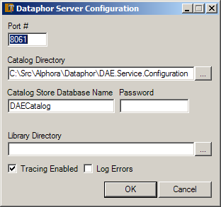

= Dataphor Service
:author: Alphora
:doctype: book

:icons:
:data-uri:
:lang: en
:encoding: iso-8859-1

[[DUGP1DataphorService]]
== Summary

The Dataphor Service allows the Dataphor Server to be run as a Microsoft
Windows Service. When hosted as a service, the Dataphor Server can be
started and stopped using the Services Manager in the Microsoft Windows
environment, or by using the Service Configuration Utility. This utility
also allows the various settings of the Dataphor Server to be configured
for the service.

This chapter is intended mainly for Dataphor administrators, but the
material would be helpful for developers as well. The discussion assumes
that the material covered in the first chapter is understood.

[[DUGP1StartingtheDataphorDAEWindowsService]]
== Starting the Dataphor Service

The Dataphor Service can be started from within the Windows service
configuration manager snap-in, or from the Dataphor Service
Configuration Utility. Information about errors that occur while
starting the Dataphor Server appear in the "System" or "Dataphor" event
logs. These logs can be viewed using the Event Viewer in the Microsoft
Windows environment. This application is available on the
Administrative Tools sub-menu of the Start menu in Microsoft Windows.

[[DUGP1InstallingtheServiceManually]]
== Manual Installation

The Dataphor Service is installed automatically by the Dataphor
installer. However, it can also be installed manually by executing
`DAEService.exe` with a parameter of `-i` as follows:

....
DAEService.exe -i
....

Once the service is installed, it will appear in the list of items
visible from the Windows service configuration snap-in in Windows. The
service can then be managed like any other Microsoft Windows Service, or
using the Dataphor Service Configuration Utility.

Installing the Dataphor service creates the files in the following
table.

[cols=",",options="header",]
|=======================================================================
|File |Description
|DAEService.InstallLog |Contains the results of attempting to install or
uninstall the Dataphor Service. If there are errors, this information
may help in correcting problems with the Dataphor service installation.

|DAEService.InstallState |Contains information used by the Dataphor
service. This file should not be modified.

|InstallUtil.InstallLog |Contains the log of actions performed during
the Dataphor Service install or uninstall process.
|=======================================================================

[[DUGDataphorService-DataphorService-InstallingMultipleInstancesoftheService]]
== Installing Multiple Instances

The Dataphor Server Service can be configured to allow multiple
instances running side by side on the same computer. To configure this:

* Make a copy of the service directory; only one service may run in a
single directory. For the copied instance (not the directory installed
by Dataphor), do the following:
* From a command prompt, navigate to the directory (copy of original)
and run the following:
+
....
daeservice -i name "Alphora Dataphor v2.0 Instance 2"
....
+
This should install an additional instance of Dataphor as a Windows
Service.
* Copy the DAEService.config file from the \Documents and Settings\All
Users\Application Data\Alphora\Dataphor\2.0 directory into the new
service directory.
* Edit the new DAEService.config file appropriately. This configuration
file _must_ point to a different library and catalog directory than any
other Dataphor Server service. If desired, the library and catalog
directory from the source service can be copied for this instance. The
port number must also be unique.
* Edit the daeservice.exe.config file and add the following within the
<configuration>... elements:
+
....
<configSections>
        <section name="dataphor" type="System.Configuration.SingleTagSectionHandler" />
    </configSections>
    <dataphor configurationFileName="C:\...\Service2\DAEService.config" />
....
+
The configurationFileName attribute should point to the target file just
created.
* Start the service. You could also test the service without starting it
first, by running the following on the command line (after changing to
the directory in question):
+
....
daeservice -run name "Alphora Dataphor v2.0 Instance 2"
....

[[DUGP1UninstallingtheServiceManually]]
== Uninstalling

The Dataphor Service can be manually uninstalled from the Windows
services list by running `DAEService.exe` with the `-u` parameter as
follows:

....
DAEService.exe -u
....

If there is an error during the install or uninstall process, the error
message will be displayed to the standard output.

[[DUGP1ServiceConfigurationUtility]]
== Service Configuration Utility

The Service Configuration Utility is a Microsoft .NET application that
can be used to start and stop the Dataphor Service, as well as configure
the various settings of the Dataphor Server. The application runs as a
background process in the system tray. Clicking on this icon will
display the main form of the Service Configuration Utility.

[[DUGP1ConfiguringtheDataphorService]]
=== Configuration

The following screen capture displays the main form of the Dataphor
Service Configuration Utility:

image::../Images/DataphorServiceConfigurationUtilityMainForm.bmp[Dataphor Service - Configuration Utility - Main Form]

To configure the service, click on the Configure button to display the
following form:

The following table describes each configuration option:

[cols=",",options="header",]
|=======================================================================
|Property |Description
|Port # a|
Defines the TCP port number used by the Dataphor Server instance to
listen for connections. The default port number is 8061.

Because there may be multiple instances of the Dataphor Server on a
given machine, each instance must listen on a unique port.

|Catalog Directory |The catalog directory setting specifies a directory
that the Dataphor Server instance will use to save and load catalog
information. If the catalog directory is unspecified, the Dataphor
Server instance will not persist catalog information, and will start
with an empty catalog. Otherwise, the Dataphor Server will use the
directory to persist the catalog.

|Catalog Store Database Name |The Catalog Store Database Name indicates
the name for the file used to store the database catalog.

|Catalog Store Password |The Catalog Store Password indicates the
password to be used for authentication with the file used to store the
database catalog.

|Library Directory |The library directory setting specifies the
directory or directories that the Dataphor Server instance will use to
search for available libraries. Each sub-directory of these directories
with the appropriate files will be considered an available library in
the Dataphor Server. If the specified catalog directory also indicates
that a given library was loaded when the server was last shut down, the
library will be loaded at startup.

|Tracing Enabled |Indicates whether internal tracing of server events is
enabled.

|Log Errors |Indicates whether the Dataphor Server will log exceptions
that are returned to clients across the CLI boundary.
|=======================================================================

Accepting the configuration by clicking OK saves the configuration
information. Note that configuration options cannot be changed while the
Dataphor Server is running. The configuration information will be saved,
and a message will be displayed indicating that the new configuration
will not be used until the Dataphor Server is re-started.

[[DUGP1OtherOptions]]
=== Other Options

The following table lists the options available for the Dataphor
Service:

[cols=",",options="header",]
|=======================================================================
|Option |Description
|Auto Start |Determines whether the Dataphor Service will start
automatically when Microsoft Windows starts.

|Show Icon in the System Tray (Options Menu) |Determines whether to
display the Dataphor Service Configuration Utility icon in the system
tray.

|Run Configuration Utility at Startup (Options Menu) |Determines whether
to start the Dataphor Service Configuration Utility when Windows starts.
|=======================================================================

[[DUGP1Troubleshooting]]
=== Troubleshooting

The following table lists some common problems and remedies.

.Dataphor Service Troubleshooting
[cols=",",options="header",]
|=======================================================================
|Problem |Reason/Suggestions
|image:../Images/Unavailable.gif[image,width=48,height=48] Start, Stop, and
Auto Start options are grayed and cannot be selected. a|
The Dataphor Service has not been installed.

Install the Dataphor Service, see
<<DUGP1InstallingtheServiceManually, Installing the Dataphor Service>>.

|image:../Images/Stopped.gif[image,width=48,height=48] Dataphor clients
cannot connect to the server. a|
Server is stopped.

Start the server.

If the server is running and clients still cannot connect, see the next
item.

If the server cannot be started (request times out) try changing the
port setting of the server.

|image:../Images/Running.gif[image,width=48,height=48] Dataphor clients
cannot connect to the server. a|
Server configuration does not match connect request from client.

Verify the configuration of the server and that the client requests
match the port number and host name of the Dataphor Server.

|=======================================================================
