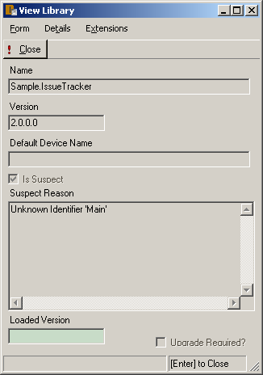

= Libraries
:author: Alphora
:doctype: book

:icons:
:data-uri:
:lang: en
:encoding: iso-8859-1

[[DUGP1Dataphoria-DataphorExplorer-Libraries]]
== Summary

The entire catalog of the Dataphor Server is segmented into logical
units called __libraries__. Each library functions as a self-contained
module of application schema. Libraries contain catalog objects, as well
as the documents required by the presentation layer to expose those
catalog objects. They also function as dependency tracking units and
extensibility points for the Dataphor platform. Each of these roles is
discussed in detail in other areas of the documentation, suffice it to
say that conceptually, libraries are modules of applications.

The libraries node is the root node for all libraries in the Dataphor
Server. Each library is represented visually as a child node. The
following screen capture displays the Dataphoria environment with the
libraries node expanded:

image::../Images/DataphorExplorerLibraries.bmp[Dataphor Explorer Libraries]

As the screen capture shows, libraries in the Dataphor Server are either
available, registered, or suspect. In addition, if a library is
registered, it may be the current library, indicated by the library name
in bold. Suspect libraries are indicated by an error icon for the
library.

[[DUGP1AvailableLibraries]]
== Available Libraries

Available libraries are simply the definition of the library. They
specify the library name, library requisites, and any files that may be
required by the library. In addition, available libraries have documents
which are available as a child node of the library node. The following
screen capture displays the library edit form:

image::../Images/DataphorExplorerLibraryEdit.bmp[Dataphor Explorer Library Edit]

This form allows for the definition of the name and directory of the
library, it's current version, any libraries that it depends on, and the
files it requires. As the form indicates, the name of a library cannot
be changed while it is registered. Also, the version number can only be
changed as long as the new version number is compatible with all
registered libraries that depend on this library.

[[DUGP1DirectoryStructureofaLibrary]]
=== Directory Structure of a Library

Physically, the definition of a library is entirely contained within a
file system directory of the same name as the library. The location of
this directory is determined when the library is created or attached.
When a new library is created, the library directory may be specified as
part of the definition of the library. If it is not specified, the
configured library directory of the Dataphor Server is used. If more
than one directory is specified, only the first one is used as the
default directory for new libraries.

In addition, existing libraries may be attached using the Attach Library
option in the Dataphor Explorer, or by using the AttachLibrary system
operator.

The definition of the library is contained within a file named with the
same name as the library, with a _d4l_ extension. The files required to
register the library, if any, must be available in this directory.

Additionally, the library contains a sub-directory called _Documents_
which contains all the files to be exposed as documents in the library
such as D4 scripts and Dataphor forms. Documents will be discussed in
more detail below.

As part of the maintenance system of the Dataphor Server, the library
may also contain a sub-directory called __Upgrades__. This directory
contains D4 scripts for each version-specific upgrade of the library.
Upgrades will also be discussed in more detail below.

[[DUGP1LibraryRequisites]]
=== Library Requisites

Libraries that a given library depends on are called __requisites__.
Each requisite names a required library, and a required version of that
library. In order to register a given library, all the requisites must
be registered, and the current version of the required library must be a
compatible version with the version of the requisite.

[[DUGP1LibraryFiles]]
=== Library Files

Each library can specify a set of files that are required in order to
register the library. These files may be Microsoft .NET assemblies
containing host implementation structures required by catalog objects in
the library, or they may simply be dependent files that the library
requires. The following screen capture shows the library file edit
screen:

image::../Images/DataphorExplorerLibraryFileEdit.bmp[Dataphor Explorer Library File Edit]

The Register as Assembly check box indicates whether the Dataphor Server
should attempt to register this file as a host-implementation assembly.
When the library is registered, all the files specified in the library
are copied into the run-time directory of the Dataphor Server. If
necessary, the files are also loaded into the Dataphor Server and the
host-implementation structures they contain are registered with the
Dataphor Server. These structures are then available for any catalog
object within the library, or any dependent library that may require
them. The system table RegisteredClasses lists the host-implementation
structures available for a given registered library.

Note that library files will also be downloaded as required by the
Frontend Clients in order to enable client-side operations required by
the data access layer. This process is transparently handled by the CLI.

[[DUGLibrarySettings]]
=== Library Settings

Each library also has an optional set of settings, which are basically
name, value pairs that can be used as configuration options for the
library. The library settings are stored with the definition of the
library, and are available even if the library is not. This means that
the registration process will have access to the library settings
defined for a library.

Library settings can be configured using the library edit page, or they
can be updated and retrieved within D4 by accessing the
System.LibrarySettings table, or by invoking the LibrarySetting
operator. Note that the library setting operator can retrieve library
settings based on the library dependency graph for the current library
so that settings can be "inherited" by dependent libraries.

[[DUGP1LibraryDocuments]]
=== Library Documents

The documents node of a given library has a child node for each document
in the library. Documents are a logical element of the library
accessible in the D4 language. In order to support the same name
resolution as other catalog objects, document names are required to be
valid identifiers.

The type of the document is indicated in brackets next to the name of
the document in the Dataphor Explorer. The document type determines what
designers are available to edit each document.

Each document type has a default designer that will be used if the
document is opened using the Open command. The Open With... command
allows the document to be opened using a designer selected from the list
of available designers for the type of the document. For example, the
default designer for a D4 script is the D4 editor, which provides syntax
highlighting and ad-hoc query execution. However, D4 scripts can also be
opened with a simple text editor because they are still text-based
documents.

In addition to opening documents, the context menu for documents allows
them to be viewed, edited, or deleted. Additional commands appropriate
to the type of the document will also be available. For example, D4
scripts have an Execute command which executes the document on the
current session. Dataphor Form Documents (dfds) have a Show command
which displays the user interface outside the context of a designer.

Note that documents can be saved as files, or loaded from files, by
dragging and dropping to and from a Windows Explorer. Documents can also
be copied within and between libraries using the familiar drag-and-drop
metaphor.

For a complete discussion of documents and designers, refer to the
Documents section later in this chapter.

[[DUGP1LibraryUpgrades]]
=== Library Upgrades

Each library may contain a set of D4 scripts corresponding to the
operations needed to bring a deployed library from it's current version
up to a new version. The following screen capture shows the upgrades
browse that is displayed when the Upgrades... command is selected from
the context menu of a library:

image::../Images/DataphorExplorerUpgradesBrowse.bmp[Dataphor Explorer Library Upgrades]

This interface allows the upgrades of a given library to be managed.
While this is largely a development-level user interface, it can also be
used by administrators to resolve problems with deployed upgrades.

Upgrades can be added or injected. When an upgrade is added, the version
number of the upgrade must be supplied manually. When an upgrade is
injected, the system automatically determines the next version number by
incrementing the _revision_ component of the library version. The
library definition is updated, as well as the loaded version of the
library.

In either case, the upgrade script is added to the library and can be
used to upgrade deployed libraries.

[[DUGP1RegisteredLibraries]]
== Registered Libraries

Available libraries can be registered by right-clicking on the library
and selecting Register. This process ensures that all required libraries
are registered, and then registers the library itself.

Registration loads all the files specified in the library definition,
registers any required assemblies, and then runs the Register d4 script,
if it exists. When the register script runs, the library being
registered is the current library, so any catalog objects created in the
register script are contained within the library.

Once a library is registered, the icon for the library will change to
indicate the registered status. Additionally, the library is now the
current library for the session, and the Schema node is available as a
child of the library node in the Dataphor Explorer.

The Set As Current command can be used to set the current library for
the session to the selected library. This is equivalent to calling the
SetLibrary operator in D4 and passing the name of the library as an
argument.

The Open Register Script command can be used to quickly open a D4 script
editor on the registration script for the library.

[[DUGP1Schema]]
=== Schema

The following screen capture displays the schema node expanded for the
Sample.Demo library:

image::../Images/DataphorExplorerLibrarySchema.bmp[Dataphor Explorer Library Schema]

The catalog objects contained within the library are divided into
categories:

* Types
* Tables
* Operators
* Constraints
* References
* Devices
* Roles

The set of objects displayed under each category can be filtered by
right-clicking and selecting one of the filter options:
Show System Objects and Show Generated Objects. System objects are
objects that are owned by the system user. Usually, only the system
library will contain system objects. Generated objects are catalog
objects that are automatically built by the compiler such as scalar type
selectors and accessors. By default, generated objects are hidden, while
system objects are visible.

The list of objects in each category can also be refreshed from this
context menu. The list of objects is not maintained in response to DDL
statements occurring on the server, so a refresh may be required to
synchronize the list of available catalog objects.

Create or drop scripts for all the objects in the library can be
obtained by right-clicking on the Schema node for the library and
selecting Emit Create Script or Emit Drop Script, respectively.

Regardless of the category of catalog object being displayed, the
right-click will always contain the following commands:

[cols=",",options="header",]
|=======================================================================
|Command |Description
|View... |Views the properties of the schema object

|Drop... |Drops the schema object and any dependents, recursively

|View Dependencies |Views the dependencies of the schema object,
recursively

|View Dependents |Views the dependents of the schema object, recursively

|Emit Create Script |Emits a create script for the schema object

|Emit Drop Script |Emits a drop script for the schema object, including
any dependents
|=======================================================================

In addition to these commands, tables and devices expose additional
behavior on the right-click.

[[DUGP1Tables]]
==== Tables

Tables can be browsed using the Browse command, or a user interface can
be derived using the Derive... command.

The Browse command uses the user interface derivation capabilities of
the Dataphor Frontend to produce a browse user interface for the table.
This provides a convenient entry point to view the data in a given
table.

The Derive... command displays a user interface that allows an arbitrary
derived user interface to be requested from the Dataphor Frontend. The
following screen capture shows this user interface:

image::../Images/DataphorExplorerDerivedFormLauncher.bmp[Dataphor Explorer Derived Form Launcher]

The Query is defaulted to the table being launched, but can be an
arbitrary table-valued D4 expression. The Page Type indicates what type
of user interface should be produced. Master Key Names and Detail Key
Names determine the derived user interface's relationship with the
calling form. The Elaborate check box indicates whether or not
derivation should perform an elaboration step on the expression for
which the user interface is derived.

Once the desired settings have been entered, click the
Launch Derived Form button to display the requested user interface. This
technique is useful for requesting user interfaces that can then be
customized.

This form can also be displayed at any time by selecting the
Launch Form... command from the *File* menu, or by pressing *F6*.

For more information on query elaboration and user interface derivation,
refer to the <<../DevelopersGuide/PresentationLayer.adoc#DDGPresentationLayer, Presentation Layer>> part of
the Dataphor Developer's Guide.

[[DUGP1Devices]]
==== Devices

The reconciliation settings for each device can be configured by
right-clicking the device and using the Reconciliation Mode sub-menu.
The following reconciliation modes are available:

[cols=",",options="header",]
|=======================================================================
|Reconciliation Mode |Description
|None |No reconciliation will be performed

|Startup |Reconciliation will be performed on device startup

|Command |Reconciliation will be performed in response to each DDL
command

|Automatic |Reconciliation will be performed when a catalog miss occurs,
and this device is the default device
|=======================================================================

[[DUGP1Loadingvs.Registering]]
=== Reconciliation and Registering

Once a library is registered, the library can be unregistered, which
will unregister all dependent libraries, drop all the catalog objects
contained within the library, and return the library to the available
status.

Both registration and unregistration can be performed with or without
reconciliation. With reconciliation means that all communication with
devices in the library will be performed normally. Wihtout
reconciliation means that no communication will be performed with
devices in the library.

For example, if the library contains base table variables that are
mapped into devices with command reconciliation turned on, unregistering
the library with reconciliation _will_ issue the corresponding drop
commands to the target system, resulting in potential data loss.
Unregistering without reconciliation, on the other hand, will never
cause a corresponding drop command to be issued to the target system,
regardless of the reconciliation settings of the device in which the
base table variable is mapped, even if the device is in a different
library than the library being unregistered.

Similarly, registering without reconciliation will create all the
catalog objects in the Dataphor Server without issuing the corresponding
create commands to the target system. This is useful if the target
system already has the necessary structures, and the catalog in the
Dataphor Server simply needs to be created to match the existing system.
Be aware that because no device-level communication is taking place,
constraints created within a registration without reconciliation are not
validated.

Note that registered assemblies cannot be unloaded from the Dataphor
Server, so in order to update library files, the Dataphor Server must be
shut down.

[[DUGP1SuspectLibraries]]
== Suspect Libraries

Suspect libraries indicate that some problem occurred while attempting
to load a given library. The library's icon will indicate that the
library is suspect rather than available. The following screen capture
shows the View Library form for a suspect library:

The Is Suspect check box indicates that the library is suspect, and the
Suspect Reason gives the reason for the suspect status. Suspect
libraries usually indicate some failure in the software or hardware
environment such as the inability to connect to a target system.

Once a library has been marked suspect, the Dataphor Server will not
attempt to reload it, even after a restart of the server. The problem
causing the suspect status must be resolved, and the library must be
manually reloaded using the Load command.

[[DUGP1UpgradingLibraries]]
== Upgrading Libraries

Each library in the Dataphor Server has two distinct version numbers
associated with it. First, the version number of the library as
contained in the definition of that library, and second, the currently
loaded version of the library.

When a library is registered, the loaded version of the library is set
to the version number defined by the library, and the library is
considered up-to-date. The loaded versions for each loaded library are
saved with the catalog state as part of shut down processing in the
Dataphor Server. Saving or backing-up the catalog will also save the
loaded versions of each loaded library.

When a library is loaded, the loaded version is also reconstructed from
the saved catalog state. If the resulting loaded version of a library is
less than the version number contained in the definition of the library,
the Dataphor Server indicates that the library is out-of-date, and the
Upgrade command becomes available on the context menu for the library.

Selecting the Upgrade command upgrades the library by applying each
upgrade script with a version number greater than the loaded version,
and less than or equal to the library version. After running each
script, the loaded version of the library is set to the version number
of the upgrade script.

Each script is run within a transaction so that if anything goes wrong,
the library is returned to the state it was in prior to running the
upgrade, and the loaded version of the library remains at the last
successful upgrade script version. Once the problem has been resolved,
the upgrade process begins again until there are no more upgrade scripts
to be run.

At this point, the library is considered up-to-date, and the loaded
version is set to the version number contained in the definition of the
library. Once a library or set of libraries has been upgraded
successfully, the catalog should be saved and backed-up as a safeguard
against system failure.
