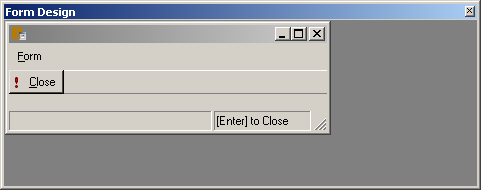

= Documents and Designers
:author: Alphora
:doctype: book

:icons:
:data-uri:
:lang: en
:encoding: iso-8859-1

[[DUGP1Dataphoria-DocumentsandDesigners]]
== Summary

The Dataphoria IDE uses _designers_ to allow developers and
administrators to create and manipulate __documents__. A document is the
logical manifestation of a file within a library in the Dataphor Server.
Each document has an associated type that is used to determine the types
of designers available for manipulating the document.

Designers can also be used to create, open, and manipulate physical
files accessible through the standard file open and save dialogs of the
Microsoft Windows platform. In addition, files opened from the physical
environment can be saved as documents in the logical environment, and
vice versa.

Note that when a physical file is opened or saved, the directory
structure of the machine running the Dataphoria IDE is used. By
contrast, documents within libraries are always saved centrally through
the Dataphor Server.

[[DUGP1Dataphoria-DocumentsandDesigners-DocumentTypes]]
== Document Types

Each document in the Dataphor Server has an associated document type.
The types of documents that Dataphoria can deal with are listed in the
Frontend.DocumentTypes table. Document types can be added to this table
as needed to extend the capabilities of Dataphoria. The following table
lists the default document types available:

.Document Types
[cols=",,,",options="header",]
|=======================================================================
|ID |Description |Data Type |Default Designer
|bmp |Bitmap |Binary |-

|cs |C# Script |String |C# Editor

|d4 |D4 Script |String |D4 Editor

|d4c |D4 Catalog (Deprecated) |String |D4 Editor

|dfd |Dataphor Form Document |String |Dataphor Form Designer

|dfdx |Customized Dataphor Form Document |String |Dataphor Customized
Form Designer

|dft |Dataphor Frontend Theme |String |XML Editor

|dnt |Dataphor Node Types |String |XML Editor

|emf |Enhanced Metafile |Binary |-

|exif |EXIF |Binary |-

|gif |GIF |Binary |-

|ico |Icon |Binary |-

|jpg |JPEG |Binary |-

|png |Portable Network Graphic |Binary |-

|sql |SQL Script |String |SQL Editor

|tiff |TIFF |Binary |-

|txt |Text |String |Text Editor

|vb |Visual Basic Script |String |Visual Basic Editor

|wmf |Windows Metafile |Binary |-

|xml |XML Document |String |XML Editor
|=======================================================================

Each document type has a Data Type which determines the underlying type
of the data the document contains. Only a designer that supports dealing
with the underlying data type of the document type can be associated
with a given document type.

[[DUGP1Dataphoria-DocumentsandDesigners-Designers]]
== Designers

There are several different designers provided in the Dataphoria IDE to
allow for the creation and manipulation of various types of documents.
The available designers are listed in the Frontend.Designers table.
Designers can be added to this table to extend the capabilities of the
Dataphoria IDE. The following table lists the available designers:

.Designers
[cols=",",options="header",]
|=======================================
|ID |Description
|CS |C# Script Editor
|D4 |D4 Script Editor
|DFD |Dataphor Form Designer
|DFDX |Dataphor Customized Form Designer
|SQL |SQL Script Editor
|Text |Text Editor
|VB |Visual Basic Script Editor
|XML |XML Editor
|=======================================

When a designer is opened, it appears as a new tab within the designer
surface:

image::../Images/DataphoriaNewTextDesigner.bmp[Dataphoria - New Tab - New Text Designer]

The file or document name is displayed as the caption of the tab. If the
contents of the designer are modified, an asterisk (*) is displayed
after the title.

Each designer adds the following commands to the File menu and toolbar:

[width="100%",cols="25%,25%,50%",options="header",]
|=======================================================================
|Command |Shortcut |Description
|Save... |Ctrl+S |Saves the contents of the current designer.

|Save As File... |Ctrl+Shift+S |Saves the contents of the current
designer as a physical file.

|Save As Document... |Ctrl+Shift+D |Saves the contents of the current
designer as a document.

|Close |Ctrl+F4 |Closes the current designer, prompting to save if the
contents of the designer have been modified.
|=======================================================================

The contents of a designer can be saved as either a file or document. If
the designer was opened from a file or document, the Save command will
simply update the source file or document appropriately. If the designer
was opened using the New... command, Dataphoria will prompt for whether
the contents should be saved as a file or a document:

If the contents are saved as a file, a standard Save File dialog is
displayed to select the location of the file. If the contents are saved
as a document, the following edit form is displayed:

The Library Name specifies in which library the document should be
saved, and is defaulted to the current library for the session. The Name
specifies the name of the object and must be a valid D4 identifier. Note
that document names are case-sensitive. The Document Type lookup allows
the document to be saved as a given type. This list is limited to the
document types associated with the designer.

[[DUGP1Text-XML]]
=== Text/XML/C#/VB

The Text designer is a simple text editor, and can be used to edit all
the string-based document types. The designer also exposes standard
clipboard functionality and search and replace capabilities. These
functions are available on the Edit menu and toolbar.

[width="100%",cols="26%,24%,50%",options="header",]
|=======================================================================
|Command |Shortcut |Description
|Cut |Ctrl+X |Removes the currently selected text and places it on the
clipboard.

|Copy |Ctrl+C |Copies the currently selected text to the clipboard.

|Paste |Ctrl+V |Pastes the current contents of the clipboard at the
current cursor location.

|Find... |Ctrl+F |Searches for a given text string within the contents
of the designer.

|Replace... |Ctrl+H |Replaces a given text string with another.

|Find Next |F3 |Repeats the last find operation.

|Undo |Ctrl+Z or Alt+BkSp |
|=======================================================================

Selecting the Find command displays the following form:

image::../Images/DataphoriaFind.bmp[Dataphoria - Find]

Selecting the Replace command displays the following form:

image::../Images/DataphoriaReplace.bmp[Dataphoria - Replace]

In addition to standard text exiting and search and replace
capabilities, the text editor supports the use of bookmarks for quickly
navigating text documents. These commands are available on the Edit menu
and toolbar.

[width="100%",cols="25%,25%,50%",options="header",]
|=======================================================================
|Command |Shortcut |Description
|Toggle Bookmark |Alt+Left Arrow |Set or clear a bookmark on the current
line.

|Previous Bookmark |Alt+Up Arrow |Navigate to the previous bookmark.

|Next Bookmark |Alt+Down Arrow |Navigate to the next bookmark.
|=======================================================================

The text designer also enables printing by selecting the Print...
command from the File menu, or by pressing Ctrl+P.

The XML, C#, and VB designers are simply text editors with syntax
highlighting for XML, C#, or Visual Basic documents, respectively. All
the editor functionality of the text designer is also available in the
these designers.

[[DUGP1D4-SQL]]
=== D4/SQL

The D4 and SQL designers are syntax-highlighting text editors with
support for ad-hoc query execution against the Dataphor Server. All the
editor functionality of the text designer is also available in the D4
and SQL designers. The additional functionality is exposed on the Script
menu.

[width="100%",cols="25%,25%,50%",options="header",]
|=======================================================================
|Command |Shortcut |Description
|Select Block |Ctrl+D |Selects the current script block.

|Execute |Ctrl+E |Executes the currently selected text, or the entire
script if no text is selected.

|Prepare |Ctrl+R |Checks the currently selected text, or the entire
script if no text is selected, for syntactic and semantic correctness by
compiling the script without executing it.

|Inject As Upgrade |Ctrl+I |Injects the currently selected text, or the
entire script if no text is selected, as an upgrade in the current
library.
|=======================================================================

The Select Block command provides a convenient mechanism for selecting a
predetermined block of the script. The D4 designer searches for the
_script block delimiter_ (//*) before and after the current cursor
position. If no script block delimiter is found before the cursor, the
beginning of the script is considered the beginning of the script block,
and similarly for the ending script block delimiter. Selecting this
command when there are no script block delimiters in the script is
effectively a select all command. The following screen capture shows the
Sample.Demo: Tables document with the first script block selected:

image::../Images/DataphoriaD4Designer.bmp[Dataphoria - D4 Designer]

In addition to being able to select the current delimited block, block
delimiters can be used as navigation points using Ctrl+, and Ctrl+. to
navigate to the previous and next block delimiter, respectively. Note
that these keys also work in combination with the Shift key to extend
the currently selected block.

Ctrl+Shift+/ will insert a block delimiter on the current line.

The Execute command executes the currently selected block. If no text is
currently selected, the entire script is executed. Any output generated
by the execution is displayed in the Results window, and any errors or
warnings that are generated are displayed in the Dataphoria warnings
view:

image::../Images/DataphoriaD4DesignerError.bmp[Dataphoria - D4 Designer Error]

Ctrl+Shift+E will execute the current line.

Double-clicking the error in the Warnings view will position the cursor
at the point in the script where the error occurred.

The Prepare command checks the script for any syntax or compiler errors
and displays them in the Warnings view.

The Inject As Upgrade command injects the script as an upgrade in the
current library.

[[DUGP1ErrorsandWarnings]]
==== Errors and Warnings

When a script is executed or prepared, the first step is to parse the
entire script and break it down into __batches__. Each top-level
statement in the script is a single batch. Errors encountered during
this process are called __syntax errors__. If any syntax errors are
found, the script is rejected, and no compilation or execution is
attempted.

Once the script has been broken down into batches, each batch is
compiled and executed separately. This allows objects that are created
in the script to be referenced by subsequent batches. Note that each
batch is a single scope, meaning that variables declared in one batch
will not be visible in subsequent batches. For example, the following
script will fail with an unknown identifier error:

....
var LInteger : Integer;
LInteger := 5;
....

In order to reference the variable LInteger, both statements must be
within the same batch. This can be accomplished using _blocks_ in the D4
language:

....
begin
    var LInteger : Integer;
    LInteger := 5;
end;
....

Errors encountered while compiling a given batch are called __compiler
errors__, and may be either errors or warnings. Errors will prevent the
batch, and all subsequent batches from being executed. Note that
subsequent batches will still be compiled in order to provide as much
feedback as possible. Warnings will not prevent the batch from being
executed, and are simply reported to the Warnings view.

Errors encountered while executing a given batch are called _run-time
errors_ and will prevent all subsequent batches from running.

All errors reported by the Dataphor Server have an associated _severity_
that can be used to help diagnose problems. The following table lists
these severities:

.Error Severities
[cols=",",options="header",]
|=======================================================================
|Severity |Description
|System |Indicates that an unexpected failure occurred in the Dataphor
Server.

|Environment |Indicates that a failure in the software or hardware
environment of the Dataphor Server has occurred such as a disk crash,
network failure, or concurrency control error.

|Application |Indicates that an application level error has occurred,
such as a syntax or compiler error, that should be resolvable by the
developer or administrator.

|User |Indicates that a user level error has occurred, such as an
integrity constraint violation, that should be resolvable by the
end-user.
|=======================================================================

[[DUGP1Results]]
==== Results

The Results window displays any output generated by the execution of the
script. The _select_ keyword is used to indicate that a given batch
should return results. Note that unlike SQL, the select keyword in D4 is
only valid as a statement, not within an expression. Note also that only
batches consisting of a single select statement will actually return
results to the Dataphoria IDE. A select statement contained within a
block is effectively invisible across the CLI.

....
// semi-colon is only required if the
// script contains multiple statements:
select DocumentTypes;

// !!Invalid use of select keyword within the in expression:
select DocumentTypes
    where DataType_Name in
        (select ScalarTypes[].Name);

// The following batch is valid,
// but will not return any results:
begin
    select DocumentTypes;
end;
....

The select statement is capable of returning not only table-valued
results, but scalar-valued results as well. For example, the following
statement is valid:

....
select 5
....

Execution output includes statistics about the amount of time the
Dataphor Server spent in each phase of processing. The statistics are
reported as prepare time and execution time. Prepare time includes
compile time, optimization time, and binding time. In addition, the
total prepare and execute time for the entire script is displayed on the
status bar after each execution.

[[DUGP1DFD-DFDX]]
=== DFD/X

The Dataphor Form Designer provides a hierarchical representation of the
nodes in a Dataphor Form. The designer attaches to a live instance of
the form being designed. The form is embedded in the designer surface
and behaves exactly as it would at run-time in an application. The
designer can also be launched directly from a live form that is hosted
within the Dataphoria IDE.

[[DUGP1DataphorForms]]
==== Dataphor Forms

A Dataphor Form is a client independent description of the visual and
non-visual elements of a user interface. These elements are all called
_nodes_ and are completely described within the form document. This
document is known as a Dataphor user-Interface Language (DIL) document.

Dataphor Forms are capable of _visual form inheritance_ in that forms
can be based on existing forms, and introduce new elements and behaviors
without affecting the parent form. Note that the parent form need not be
an actual document within a library. The base form may be, and indeed
often is, a derived user interface requested from the Dataphor Server,
or even another customized form.

This inheritance mechanism allows for customizations to be made to the
results of the user interface derivation process, while still taking
advantage of the dynamic aspects of derivation. When the underlying
application schema changes, derived user interfaces will reflect the
changes. Because customized forms save only the changes, the underlying
form can change without affecting the customizations footnote:[This
assumes, of course, that the customizations do not reference elements
that no longer exist in the new user interface. For example, if a
customization is made to the title of a column, and that column is
subsequently removed from the application schema, the customization will
be lost.].

The Frontend library exposes a wide variety of user interface elements
in both visual and non-visual classes. Nodes are available for managing
the data connections with the server and attaching data-aware controls
to this managed connection. Visual elements are available to control the
layout and flow of the elements in the form as well as miscellaneous
nodes for performing various actions.

The Dataphor Form Document (DFD) document type is a complete description
of the form. The Dataphor Customized Form Document (DFDX) document type
is a Dataphor customized user-Interface Language (DILX) document.
Documents of this type begin by naming the parent form footnote:[The
internal mechanism is actually capable of multiple visual form
inheritance, but the designer does not expose this functionality.
Multiple visual form inheritance can be achieved by editing the DFDX
document with the XML Editor and specifying any additional parent
forms.] to be used. The rest of the document describes the differences
between the parent form and the customized form.

[[DUGP1DataphorFormDesigner]]
==== Dataphor Form Designer

The following screen capture shows the Dataphor Form Designer embedded
in the designer surface of the Dataphoria IDE:

image::../Images/DataphoriaFormDesigner.bmp[Dataphoria - Form Designer]

The main designer consists of three parts: the Palette, the Tree View,
and the Properties view. In addition, the form being designed is
embedded into the designer surface:

Note that the Form Design window is shown here undocked due to space
considerations in the printed documentation. By default, the Form Design
is embedded directly into the Form Designer below all three of the above
interfaces.

[[DUGP1TreeView]]
===== Tree View

The tree view displays the contents of the Dataphor Form in terms of the
hierarchical organization of nodes in the form. Each node has a unique
name, a type that determines it's properties and behavior, and may also
have child nodes, depending on the type of the node.

Within the tree view, nodes can be repositioned using standard drag and
drop techniques. Nodes can be deleted using the Edit | Delete menu
command, or by pressing the Del key. Nodes can also be renamed by using
the Edit | Rename menu command, or by pressing the F2 key.

Pressing F1 while in the tree view will bring up the on-line
documentation for the node type of the selected node.

[[DUGP1Palette]]
===== Palette

The Palette displays the types of nodes available in the designer. These
nodes are grouped into categories. The default categories are:

[cols=",",options="header",]
|=======================================================================
|Category |Description
|Static Elements |Visual elements that provide organization and
structure to the form, but are not data-aware.

|Data Elements |Visual elements that are data-aware and require a Source
node for data binding.

|Actions |Non-Visual elements that perform various actions in the
user interface such as displaying forms, or posting modified data
values.

|Non Visual |Non-Visual elements such as menus, timers, and data
connections.
|=======================================================================

Selecting a node in the palette changes the cursor to the drop cursor
(cross-hairs). The selected node can then be dropped into the Tree view.
As the cursor is moved over the nodes in the Tree view, a target
positioning line is drawn in the tree view to show where the node will
be placed in the hierarchy.

Nodes can be added to the palette using the
Configure | Designer Libraries command. Selecting this command allows
the set of libraries used by the Form Designer to be configured. The
node types registered in each library are added to the Palette.

Pressing F1 while focused on the Palette will bring up the on-line
documentation for the type of node selected.

[[DUGP1PropertiesView]]
===== Properties View

The Properties view displays the properties for the currently selected
node. Each property can be edited by selecting the property value in the
right column of the properties view. Different types of properties have
different styles of editors.

Most properties allow the value of the property to be entered directly
within the properties editor. Reference type properties, such as Node
references, use a dropdown list to allow the property value to be
selected from a list of valid values for the property. Some properties
expose a pop-up editor that allows the value of the property to be
edited with a visual interface.

The bottom section of the properties view displays a short description
of the property.

Pressing F1 while focused on the properties view will bring up the
on-line documentation for the selected property.
