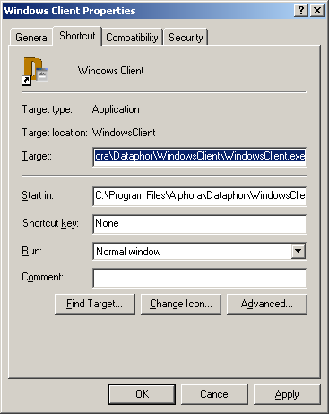

= Starting Dataphor Applications
:author: Alphora
:doctype: book

:icons:
:data-uri:
:lang: en
:encoding: iso-8859-1

[[DUGP1UsingDataphorApplications-StartingaDataphorApplication]]
== Summary
Dataphor ApplicationStarting a Dataphor Application

The first step in running a Dataphor Application is to start the desired
Frontend Client. This can be accomplished in a variety of ways,
depending on the client to be started, and the way it is installed. A
typical Windows Client installation will add the Windows Client icon to
the Start | Programs menu in the Microsoft Windows environment. For the
Web Client, the most common scenario will simply be entering the
appropriate URL into the Address window of a Web Browser.

For more information on what client should be used, and how it should be
started, consult your Dataphor Application Administrator.

[[DUGP1UsingDataphorApplications-StartingaDataphorApplication-Connecting]]
== Connecting to a Dataphor Server

Running a Dataphor Application begins with connecting to a Dataphor
Server. The first step is to select an _alias_ to use to connect. Each
alias contains settings for connecting to a Dataphor Server such as the
name of the server. The following screen capture shows the Dataphor
Server Login form that displays when the Windows Client starts:

image::../Images/DataphorServerLoginRemote.bmp[Remote logging into Dataphor Server]

Once the appropriate alias has been selected and login information
supplied, click the Login button to connect to the Dataphor Server.
Although this screen capture shows the Windows Client login form, the
process for connecting with the Web Client is the same.

For more information on configuring aliases, see the
<<Aliases.adoc#DUGP1Dataphoria-Aliases, Aliases>>
section of the Dataphoria chapter in the Using Dataphor part of the Dataphor
User's Guide.

[[DUGP1UsingDataphorApplications-StartingaDataphorApplication-SelectinganApplication]]
== Selecting an Dataphor Application

The Dataphor Server is capable of hosting multiple applications, so the
next step is to select the desired application. The following screen
capture shows the Choose Application form:

image::../Images/WindowsClientChooseApplication.bmp[Choosing an Application in Windows Client]

Select the desired application by clicking it, or using the up and down
arrow keys to highlight the application in the list. Clicking OK or
pressing Enter will launch the application. Again, this screen capture
shows the Windows Client Choose Application form, but the process is the
same for the Web Client.

[[DUGP1UsingDataphorApplications-StartingaDataphorApplication-BypassingLoginandApplicationSelection]]
== Bypassing Login and Application Selection

The Login form, the Choose Application form, or both can be bypassed at
startup by configuring a shortcut appropriately. To do this, first
create a shortcut to the Windows Client application. One way to do this
is by right-clicking on the `WindowsClient.exe` file and selecting
Send To | Desktop (create shortcut).

Right-click on the newly created shortcut and select Properties. The
following screen capture shows the resulting form:

In the Target: text box, add the following to the end of the file name:

* To automatically select the alias to use: -alias <alias name> where
<alias name> is the name of the alias to be used. For example: -alias
Remote
* To automatically select the application to run: -application
"<application id>" where <application id> is the application identifier
for the application. For example: -application "Shipping"

The application id is a unique identifier for the application on the
server. To obtain this identifier for a specific application, consult
your Dataphor Application Administrator.
