= Dataphor Rental Movie Store Tutorial
:author: Alphora
:doctype: book

:icons:
:data-uri:
:lang: en
:encoding: iso-8859-1

This tutorial is designed to walk through building an application in
Dataphor, from choosing a database design to application completion.
Although it does not cover every detail, it should provide a basic
understanding of the Dataphor Toolset and enable you to begin developing
your own applications.

*Concepts*

* <<DataphorServer.adoc#DUGP1ProductTour-DataphorServer, Connecting to a Dataphor Server>>
* <<../DevelopersGuide/D4Catalog.adoc#D4LGCatalogElements-Devices, Devices>>
* <<../DevelopersGuide/D4Catalog.adoc#D4LGCatalogElements-TableVariables, Tables>>
* <<../DevelopersGuide/D4DataManipulation.adoc#D4LGDataManipulation-SelectStatement, Queries (select)>>
* <<../DataphorReference/Tags.adoc#DRTags, Tags>>
* <<../DevelopersGuide/D4Catalog.adoc#D4LGCatalogElements-References, References>> and <<../DevelopersGuide/D4Catalog.adoc#D4LGCatalogElements-Constraints, Constraints>>
* <<../DevelopersGuide/D4Catalog.adoc#D4LGCatalogElements-Operators, Operators>>
* <<D4LGScriptsandExecution.adoc#D4LGScriptsandExecution, D4 Scripts>> and C#/VB Scripts

*Technical Terms*

[horizontal]
<<UsingDataphorForms.adoc#DUGP1UsingDataphorApplications-Forms, Form>>:: A user interface to the application and data.
link:dilrefAlphora.Dataphor.Frontend.Client.IFrame.html[Frame]:: An embedded user interface (form) as an element of a form.
Component:: A Dataphor form component. e.g., Source
Control:: A visible Dataphor form component. e.g., TextBox

== Overview

This tutorial will show how to create a Database application designed to
run a video rental store.

The tutorial is divided up into three major sections: Developing the
Database, Developing the Frontend Application, and running the
application from a Windows client and a Web client.

All of the tables, forms, and scripts are included in the Sample.Rental
library. You may type them yourself or use the ones that are included.

A few of the procedures, tables, methods, etc. were chosen in order to
teach a concept and not necessarily because it was the optimum way to
accomplish the task.

== Connect to a Dataphor Server

You need to be connected to a running Dataphor Server. This can be done
through the Dataphor Server Login, which can connect to a running server
or can create its own "in-process" server. Either method is fine. The
in-process server is stopped when Dataphoria closes. You should set a
catalog filename if you want an in-process server, so that it keeps its
catalog and all the table definitions when you restart the Dataphor
Server.

If you are not using the "in-process" server, you will need to know the
port number of the Dataphor Server when you try to connect to it from
the Frontend Client and the Application Server.

See <<Aliases.adoc#DUGP1Dataphoria-Aliases, Aliases>> for more information on
how to connect to the Dataphor Server with Dataphoria.

Once you are connected the Dataphoria Integrated Design Environment
(IDE) is displayed. See
<<Dataphoria.adoc#DUGP1Dataphoria-Introduction-Environment, Environment>>
for an explanation of this screen.

== Developing the Movie Database

The first part of this tutorial covers designing and setting up the
database. You will add each of the tables and other schema objects.

For your convenience, the Sample.Rental library already exists. Two
other libraries will be required. Right click on Sample.Rental and
select edit. In the Edit Libraries form click on the Requisites tab. If
the libraries Frontend and System are not listed, use the Add button to
add the missing libraries to the list. Then click Accept to save and
close the Edit Libraries form.

As mentioned earlier, all the forms and scripts to create the tables are
included. To view these files, expand the Sample.Rental library, then
expand the Documents folder, then double click on the document you would
like to view. The forms are named with Completed added to the name.

If you do not wish to create the scripts, tables, and forms yourself you
can execute the CopyCompleted d4 document. To execute the script, expand
the Sample.Rental library by clicking the plus (+) symbol, then expand
the Documents folder. Right click on the CopyCompleted script and select
Execute. Then right click on the Documents folder and click Refresh. Now
all the forms and frames exists.

Whether you have chosen to create the tables, forms, and scripts
yourself or have it done automatically, you now must register by
following the instruction in the Getting Started section of this
tutorial. The remainder of the tutorial assumes you are creating all the
forms, scripts, and tables yourself. If you have chosen to not do this,
simply review what was provided.

=== Getting Started

First you need to register the Sample.Rental library. Registering a
library causes the Register d4 script to be executed and makes the
library the Current library. The current library is used for any action
that does not otherwise specify a library. You can register the library
by expanding the Libraries entry in the Dataphor Explorer pane, then
right click on Sample.Rental library, and select Register. The color and
shape of the icon changes to show that the Sample.Rental library is now
registered. The Green arrow shows that the library is the current
library. For more about libraries see
<<../DevelopersGuide/D4Catalog.adoc#D4LGCatalogElements-Libraries, Libraries>>.

image::../Images/RentalTut001.png[Rental Tutorial - 1]

If during this tutorial you close Dataphoria, when you come back to the
tutorial you must ensure that Sample.Rental is set as the current
library. This will ensure that any actions take place in the
Sample.Rental library. To set a library as current, right click the
library then select Set As Current.

=== Device Setup

The Dataphor Server stores and queries data through a storage device
system. A device can be a SQL device which talks to a particular SQL
server, it can be the Memory Device which stores data in RAM, or it can
be the Simple Device. Note that the Simple Device, while it will
persists the data, is intended for small amounts of infrequently
accessed data. Custom devices can also be created for any type of data
source you may have. For more information on creating custom devices and
to download the Dataphor Storage Device Developer's Kit, go to
http://www.alphora.com/tiern.asp?ID=DATDEVFAQ.

Data inside of a memory device will be lost when the Dataphor Server
shuts down, but the table definitions will be kept and restored as part
of the catalog. This makes it useful for tasks such as development. For
production use, a persistent device such as MSSQL, Oracle, SAS, DB2, or
AS400 is used. The Dataphor Server will hand off entire queries to the
device, when it can, to optimize performance.

The default device and required libraries for a library can be specified
by editing the library settings. This can be done by selecting the
library then pressing F2.

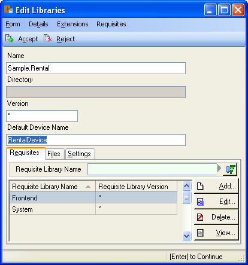

==== Using a Memory Device

As was said earlier, all the code shown is this tutorial is included in
the Document folder in the Sample.Rental library. You can open any of
the documents by double clicking the document and then execute the code
by pressing CTRL-E. Or you can open a blank d4 script by pressing CTRL-N
(or clicking File, New), then select D4 and click Accept. Again when
you've entered the code, press CTRL-E to execute all of it. If you only
want to execute a portion of the code, highlight the portion you want to
execute, then press CTRL-E.

Use the following code to create a memory device:

....
create device RentalDevice
 class "System.MemoryDevice";
....

Using a memory device is a quick and easy way to test out database
designs and will work fine for the purpose of this tutorial. However,
when the Dataphor Server is shut down, all data in the memory device is
lost. For this reason this part of the code is commented out in the
CreateDevice d4 script.

==== Using an MS SQL Device

If you wanted to use a MS SQL device you could use the following code to
create the MS SQL device:

....
insert table
{
 row
 {
  "Sample.Rental" Library_Name,
  "MSSQLDevice" Required_Library_Name,
  VersionNumberUndefined() Required_Library_Version
 }
} into LibraryRequisites;

create device RentalDevice
 reconciliation { mode = { command }, master = device }
 class "MSSQLDevice"
  attributes
  {
   "ServerName" = ".",
   "DatabaseName" = "Rental"
  };
....

The first statement sets the MSSQLDevice library as a required library.
Without this statement the create device will fail with an error message
saying the library is not required by Sample.Rental. This could be done
by selecting the Sample.Rental library then pressing F2. Then adding the
MSSQLDevice library to the Requisites.

image::../Images/RentalTut001.2.png[Rental Tutorial - 1.2]

The <<StorageIntegrationArchitecture.adoc#DDGStorageIntegrationArchitecture-Reconciliation, reconciliation>>
settings control how the Dataphor Server will reconcile its catalog with the
tables in the Device. In this case it is saying that the target system should
be considered the master copy of the schema and that the reconciliation
will occur when a command uses a particular table.

The attributes specify the name of the server running the MS SQL server
and the database name to connect to. Other attributes can also be
specified.

For more information on the options available when creating a device,
see the various devices listed in <<../DataphorReference/Libraries.adoc#DRSystemLibrary, Libraries>>.

After the MS SQL device is created CreateDeviceUser is called to tell
the Dataphor Server what MS SQL account to use for each Dataphor Server
user, as shown here.

....
CreateDeviceUser("Admin", "RentalDevice", "sa", "");
CreateDeviceUser("System", "RentalDevice", "sa", "");
....

==== Using a Simple Device

Use the following code to create a simple device:

....
create device RentalDevice
 reconciliation { mode = { command }, master = device }
 class "SimpleDevice";
....

Using a SimpleDevice is good for the small amount of data you will be
dealing with in this tutorial. In Addition it provides persistence so
that the data will be maintained if you must shutdown Dataphoria and
return later to the tutorial.

==== Using Devices

To use a device, we add "in DeviceName" to the create table statement,
as shown here.

....
create table Test in RentalDevice
{
 ID: Integer,
 key { ID }
};
....

If the *in* DeviceName part of the *create table* statement is left out,
as is the case in this tutorial, then the default device is specified by
the DefaultDeviceName setting of the current library. If the default
device setting is not set in the current library, the required libraries
of the current library are searched breadth first until a default device
is found. Ultimately, the System.Temp memory device will be used. The
System.Temp device is created and maintained by the Dataphor Server. For
more information about default devices, see
<<../DevelopersGuide/D4Catalog.adoc#D4LGCatalogElements-Libraries-DefaultDeviceResolution, Default Device Resolution>>.

Also, the SetDefaultDeviceName operator can be used to specify the
default device. Do this now, so that for the rest of the tutorial you
don't have to specify the device.

....
SetDefaultDeviceName("RentalDevice");
....

=== Ensure Generators

Dataphor allows auto-incrementing columns using maintained counters.
Each counter contains the next value to be used for a particular
identity generator.

A special generation table must be created that contains an ID string
column and a NextValue integer column.

Setting up the generators table can be done automatically by a call to
the system EnsureGenerators operator. It will check if a generators
table has already been created. If not, it will create a table called
Generators in the current library and configure it as the generation
table. The Generators table is created on the default device, or can
optionally be passed a device name. Go ahead and create the generators
table by executing the EnsureGenerators operator as shown below.

....
EnsureGenerators();
....

Then when you want to make a column auto-increment you set the default
for the column to invoke GetNextGenerator and pass it the name of the
generator to increment. An example of this is shown in the Movie table.

=== Chart of Tables

During this tutorial you will be creating several tables and views. The
following chart will help in understanding the finished system.

image::../Images/RentalTut001a.png[Rental Tutorial - 1a]

=== MovieType Table

The first table we need to create is a simple lookup. Run the following
code:

....
create type Description like String
{
 constraint LengthValid Length(value) <= 50
  tags { DAE.SimpleMessage = "The Length of the string must be less than 50 characters." }
} static tags { Storage.Length = "50" };

create table MovieType
{
 ID : String tags { Frontend.Width = "6" },
 Genre : Description tags { Frontend.Preview.Include = "true" },
 key { ID }
};
....

The first statement above creates the Description type. The
System.String type in Dataphor specifies strings of any length (up to
2GB, of course). The Description type defines a new type that can
contain strings of length 50 or less. This limitation is introduced to
ensure that the application will run regardless of where the data will
ultimately be stored. By defining a type with a known length, we can
instruct the Dataphor Server to use the appropriate size column for
storage in an SQL-based system. This is done using __scalar type maps__.

By default, the SQL-based scalar type map for System.String will use
VARCHAR(20) as the type on the target system. This would limit the data
to 20 characters. If any value over 20 characters in length were
inserted, the SQL-based system may throw an error, or worse, the data
would be lost without any error or warning. Even if the storage system
did throw an error, it is unlikely to be a user-friendly error.

To ensure you have control of the string length and the error messages
returned to the user you can create a type that is _like_ a String. You
can specify the storage length for the type using the Storage.Length
tag. A _constraint_ lets you check the data before it is sent to the
storage device and specify the error message that will be used if the
contraint is violated.

The second statement will create a table that contains two columns, an
ID column and a Genre column. It will be used to contain the different
genres of movies for our movie database and will be referenced as a
lookup from the Movie table.

The tags part of the ID column is metadata which is attached to the
column definition inside of the Dataphor Server. Programs using the
Dataphor Server, such as the Frontend Clients and Servers, can use this
metadata. In the case of the Frontend, metadata is used to control the
way a form will look when it is derived from the tables and queries. For
more information about metadata see
<<../DevelopersGuide/D4Catalog.adoc#D4LGCatalogElements-Objects-Metadata, Metadata>>.

Frontend tags can be specific or general. For example:

....
ID : Integer tags { Frontend.Visible = "false" }
....

would indicate that the ID is not to appear on any user interface (form)
regardless of what mode the user interface is in.

....
ID : Integer tags { Frontend.Browse.Visible = "false" }
....

would indicate ID will not be visible when the user-inteface (form) is
in the browse mode. When the user interface is in any other mode, ID
will be visible.

For more information about tags see <<../DataphorReference/Tags.adoc#FTRTagsDescriptions, Tags>>.

The Frontend.Width tag on the ID field indicates the display width of
the field on forms. The Frontend.Preview.Include tag on the Genre column
indicates that the field should be shown from a lookup (i.e. a form that
looks up a movie type).

The table above also has the ID column set as a key. A key is a column
or set of columns in a table that can be used to uniquely identify every
row in the table. Every table must have at least one key. If a table
definition does not include a key, all the columns of the table will be
used as the key.

Now, let's insert the movie types using the following code:

....
// Movie Types courtesy of IMDB (imdb.com)
MovieType := table {
 row { "ACT" ID, "Action" Genre },
 row { "ADV", "Adventure" },
 row { "ANM", "Animation" },
 row { "FAM", "Family" },
 row { "COM", "Comedy" },
 row { "CRI", "Crime" },
 row { "DOC", "Documentary" },
 row { "DRA", "Drama" },
 row { "FAN", "Fantasy" },
 row { "FNO", "Film-Noir" },
 row { "HOR", "Horror" },
 row { "IND", "Independent" },
 row { "MUS", "Musical" },
 row { "MYS", "Mystery" },
 row { "ROM", "Romance" },
 row { "SF",  "Science Fiction" },
 row { "THR", "Thriller" },
 row { "WAR", "War" },
 row { "WST", "Western" }
};
....

A couple of things are of note in the above code.

The first is the assignment operator := which is the equivalent of
emptying the table followed by an *insert table* \{ *row* \{ .... } }
*into* MovieType.

The *table* and *row* keywords are table and row selectors,
respectively. They are used to _select_ values of type *table* or
**row**, just as 5 is a literal selector of type System.Integer. The
selected table value is then inserted into the table.

The column names are only specified on the first row in the table
selector. The name specifiers can be omitted after the first row, in
which case the compiler will assume the names as specified on the first
row. Note that if names are supplied, the order of the columns in the
row selector does not matter. For example, the following table selectors
are equivalent:

....
table { row { 1 X, 1 Y }, row { 2 Y, 2 X } };
table { row { 1 Y, 1 X }, row { 2 X, 2 Y } };
....

=== Basic Queries

Once the data has been inserted, you can query it. Querying data in D4
is similar to SQL, but D4 queries do not have a from clause. Therefore,
in SQL where you would query *select* * *from* MovieType, in D4 we would
use *select* MovieType.

....
select MovieType
....

....
ID  Genre
--- ---------------
ACT Action
ADV Adventure
ANM Animation
COM Comedy
CRI Crime
DOC Documentary
DRA Drama
FAM Family
FAN Fantasy
FNO Film-Noir
HOR Horror
IND Independent
MUS Musical
MYS Mystery
ROM Romance
SF  Science Fiction
THR Thriller
WAR War
WST Western
....

To specify which columns should be included in the result, use the
_specify_ operator (\{ }) as shown below:

....
select MovieType { Genre };
....

....
Genre
---------------
Action
Adventure
Animation
Comedy
Crime
Documentary
Drama
Family
Fantasy
Film-Noir
Horror
Independent
Musical
Mystery
Romance
Science Fiction
Thriller
War
Western
....

The *where* operator is used to restrict the rows that will appear in
the result. However, unlike SQL, D4 is an algebraic query language, and
operators can be chained together as often as desired. For example:

....
select MovieType where ID < "F" and ID > "B";
....

....
ID Genre
--- -----------
COM Comedy
CRI Crime
DOC Documentary
DRA Drama
....

....
select (MovieType where ID < "F") where ID > "B";
....

....
ID Genre
--- -----------
COM Comedy
CRI Crime
DOC Documentary
DRA Drama
....

The preceding examples are equivalent. The latter example uses multiple
*where* operators, the former uses the logical *and* operator.

=== MovieRating Table

Run the following D4 statement to create and populate a MovieRating
table:

....
create table MovieRating
{
 ID : String tags { Frontend.Width = "10" },
 Description : Description tags { Frontend.Width = "30" },
 Position : Integer tags { Frontend.Visible = "False" },
 key { ID },
 key { Position } tags { Frontend.IsDefault = "True" }
};

MovieRating := table
{
    row { "G" ID, "General Audiences" Description, 1 Position },
    row { "PG", "Parental Guidance Suggested", 2 },
    row { "PG-13", "Parents Strongly Cautioned", 3 },
    row { "R", "Restricted", 4 },
    row { "NC-17", "No One 17 and Under Admitted", 5 },
    row { "NR", "No Rating", 6 }
};
....

The MovieRating table has two keys, which means that both the ID and the
Position must be unique.

The Frontend.IsDefault tag on the Position key tells the Frontend to
sort the rows using this key when the data is displayed.

Alternatively the table could be created as:

....
create table MovieRating
{
 ID : String tags { Frontend.Width = "10" },
 Description : Description tags { Frontend.Width = "30" },
 Position : Integer tags { Frontend.Visible = "False" },
 key { ID },
 order { Position }
};
....

Using an _order_ would still provide the sorted output by the Frontend.
However, an order does not require that each row have a unique value for
Position.

An _order_ is logically just metadata.  Orders are a hint to the
Dataphor Server, which can use them to optimize the tables with indexes.
They are also used by the Frontend to suggest search criteria along with
keys. Orders can contain multiple columns and an optional ascending or
descending (**asc** or **desc**) indicator for each column.

The Frontend will determine the default sort order for a given result
set using the first order found in the following manner:

1.  An order with a Frontend.IsDefault tag.
2.  A key with a Frontend.IsDefault tag.
3.  The first order.
4.  The first key.

The Frontend.Visible metadata tag attached to the Position column is set
to False. This tells the Frontend that Position is not to be shown in a
derived user interface.

The Position column exists to ensure that the ratings are presented in
their commonly regarded order. The order of selected tables is
undefined. This order will be maintained by the Position key when the
Frontend displays the data. To obtain the same results using a select
statement use the *order by* clause of the *select* statement. Because
tables are conceptually unordered, if the position were not retained as
a column, then the insertion order would be lost. For a full explanation
on why tables are conceptually unordered, see
<<../DevelopersGuide/DatabaseManagementConcepts.adoc#DDGP1StructuralAspect, Structural Aspect>>.

....
select MovieRating
....

....
ID    Description                  Position
----- ---------------------------- --------
G     General Audiences            1
NC-17 No One 17 and Under Admitted 5
NR    No Rating                    6
PG    Parental Guidance Suggested  2
PG-13 Parents Strongly Cautioned   3
R     Restricted                   4
....

....
select MovieRating order by { Position }
....

....
ID    Description                  Position
----- ---------------------------- --------
G     General Audiences            1
PG    Parental Guidance Suggested  2
PG-13 Parents Strongly Cautioned   3
R     Restricted                   4
NC-17 No One 17 and Under Admitted 5
NR    No Rating                    6
....

In the first example, the order of the results is arbitrary (you may
even see a different order than is shown here) because the order by
clause is not given. In the latter example, the results will always be
retrieved as shown.

=== Movie Table

The following code creates a Movie table and inserts some sample data:

....
create table Movie
{
 ID : Integer { default GetNextGenerator("Movie.ID") }
  tags { Frontend.Visible = "false" },
 Name : Description
  tags
  {
   Frontend.Width = "30",
   StaticByteSize = "40",
   Frontend.Preview.Include = "true"
  },
 Type : String tags { Frontend.Width = "6", Frontend.Browse.Visible = "false" },
 Rating : String tags { Frontend.Width = "7" },
 Year : Integer
  {
   constraint YearValid value >= 1891
    tags { DAE.SimpleMessage = "Year must be 1891 or later." }
  }
  tags { Frontend.Width = "4" },
 key { ID },
 order { Name } tags { Frontend.IsDefault = "True" },
 reference Movies_MovieType { Type } references MovieType { ID },
 reference Movies_MovieRating { Rating } references MovieRating { ID }
};

Movie := table
{
 row
 {
  GetNextGenerator("Movie.ID") ID,
  "Episode II - Attack of the Clones" Name,
  "SF" Type,
  "PG-13" Rating,
  2002 Year
 },
 row { GetNextGenerator("Movie.ID"), "Space Balls", "COM", "PG-13", 1985 },
 row { GetNextGenerator("Movie.ID"), "The Matrix", "SF", "R", 1999 },
 row { GetNextGenerator("Movie.ID"), "Ferris Beuler's Day Off", "COM", "PG", 1982 },
 row { GetNextGenerator("Movie.ID"), "The Princess Bride", "COM", "PG", 1984 },
 row { GetNextGenerator("Movie.ID"), "Crimson Tide", "ACT", "R", 1993 },
 row { GetNextGenerator("Movie.ID"), "Toy Story", "ANM", "G", 1995 },
 row { GetNextGenerator("Movie.ID"), "My Fair Lady", "MUS", "G", 1976 },
 row { GetNextGenerator("Movie.ID"), "Forget Paris", "ROM", "PG-13", 1987 },
 row { GetNextGenerator("Movie.ID"), "State Fair", "MUS", "G", 1962 }
};
....

Notice that the Movie table has an auto-incremented ID column. The
GetNextGenerator operator returns a new number each time it is called
using the generation table discussed earlier. The default is used
whenever a row is inserted that does not already contain a value for the
column.

Since the Genre column of the MovieType table will be displayed when a
Browse of the Movie table is derived, there is no need to have the Type
column also. The Frontend.Browse.Visible tag on the Type column is set
to false so the Type column will not be displayed when a Browse is
derived.

The constraint on the Year column requires that the year be 1891 or
later. In 1891 at the Edison laboratory the first tests were just being
done with the new Kinetograph (a motion picture camera).

In the section of the script where the data is being inserted, the ID
column is specified as a GetNextGenerator call for each row. Usually
this would not be necessary. The column value could be left out and each
row would default to a GetNextGenerator invocation. We, however, need
each ID to be matched to a specific movie so that they can be referenced
by the sample data in the MovieActor table correctly. If the ID column
was left out, then the undefined order of the rows would decide what ID
each movie would get.

Lastly, we have the __references__. References are special cases of
database-wide integrity constraints. A reference sets up a relationship
between two tables that is enforced by the Dataphor Server.

Two references exist in the Movie table.  One links the Rating column of
the Movie table to the ID column of the MovieRating table.  The other
links the Type column is linked of the Movie table similarly. The
reference constraint ensures that values of the Type column of the Movie
table must be either a value within the ID column of the MovieType
table, or be a value which has been marked **special**. For more
information on special values see
<<../DevelopersGuide/D4Catalog.adoc#D4LGCatalogElements-ScalarTypes-SpecialValues, Special Values>>.

Every row in the source table of the reference must either be set to a
*special* or have a corresponding row in the target table for which the
values in each column are equal.

Following the *reference* keyword the name of the reference is given.
The name is important in that it exists in the same namespace as the
tables themselves. You could run the script *drop reference*
Movie_MovieType; on the Dataphor Server and it would remove the
reference. In fact, you would need to drop the above reference before
you could drop the MovieType table.

After the reference name, a list of columns in the source table is
given. When a reference is defined with a table definition, as is the
case here, the source table is the containing table, i.e. the Movie
table.

Next, the keyword *references* is used, followed by the target table and
then a list of columns which will be required to match the source
columns. The source and target column lists must contain the same number
of columns, and will be matched in the order they appear in the column
lists. The target columns of a reference must always include a key of
the target table.

It is also important whether or not a source column is a key. If the
source column is a key, then the reference describes a one to one or
parent/extension relationship. If the source column is not a key, the
reference describes a one to many or lookup/detail relationship. This
information is used by the Dataphor Frontend to derive appropriate
user interfaces for any given table, view, or even expression. For more
information about references, see
<<../DevelopersGuide/D4Catalog.adoc#D4LGCatalogElements-References,References>>.

=== Actor Table

Use the following D4 statements to create an Actor table and insert some
test data:

....
create table Actor
{
 ID : Integer { default GetNextGenerator("Actor.ID") }
  tags { Frontend.Visible = "false" },
 Name : Description
  tags
  {
   Frontend.Width = "25",
   Frontend.Preview.Include = "true"
  },
 Gender : String
  tags
  {
   Frontend.ElementType = "Choice",
   Frontend.Choice.Items = "Female=F,Male=M",
   Frontend.Preview.Include = "true",
   Frontend.Width = "4"
  },
 key { ID },
 order { Name } tags { Frontend.IsDefault = "True" }
};

Actor := table
{
 row { GetNextGenerator("Actor.ID") ID, "Liem Neeson" Name, "M" Gender },
 row { GetNextGenerator("Actor.ID"), "Natalie Portman", "F" },
 row { GetNextGenerator("Actor.ID"), "Ewan MacGrgor", "M" },
 row { GetNextGenerator("Actor.ID"), "Frank Oz", "M" },
 row { GetNextGenerator("Actor.ID"), "Christopher Lee", "M" },
 row { GetNextGenerator("Actor.ID"), "Haden Christiansen", "M" },
 row { GetNextGenerator("Actor.ID"), "Carie Elwes", "F" },
 row { GetNextGenerator("Actor.ID"), "Mandy Patiken", "F" },
 row { GetNextGenerator("Actor.ID"), "Andrae the Giant", "M" },
 row { GetNextGenerator("Actor.ID"), "Billy Crystal", "M" },
 row { GetNextGenerator("Actor.ID"), "Pat Boone", "M" },
 row { GetNextGenerator("Actor.ID"), "Audrey Hepburn", "F" }
};
....

Of note in the above code is the metadata tags on the Gender column.
When creating a form for this table, the Frontend Server will notice
these tags and will use a radio box style control, with the options of
_Male_ or __Female__.

The test data also includes the ID explicitly, even though the ID column
is set to have auto-increment behavior. This is done for a similar
reason it was done in the Movie table's sample data: to ensure a
predictable ID for each of the rows. Alternatively, we could assign each
row an explicit ID, then update the generator table to ensure that
future IDs do not conflict.

=== MovieActor Table

Run the following code in Dataphoria to create a MovieActor table and
place some test data into it:

....
create table MovieActor
{
 Movie_ID : Integer tags { Frontend.Visible = "false" },
 Actor_ID : Integer tags { Frontend.Visible = "false" },
 key { Movie_ID, Actor_ID },
 reference MovieActor_Movie { Movie_ID }
  references Movie { ID },
 reference MovieActor_Actor { Actor_ID }
  references Actor { ID }
   tags { Frontend.Detail.Embedded = "true" }
} tags { Frontend.Title = "Movie Actor" };

MovieActor := table
{
 row { 1 Actor_ID, 1 Movie_ID },
 row { 2, 1 },
 row { 3, 1 },
 row { 4, 1 },
 row { 5, 1 },
 row { 6, 1 },
 row { 7, 5 },
 row { 8, 5 },
 row { 9, 5 },
 row { 10,5 },
 row { 10,9 },
 row { 11,10 },
 row { 12,8 }
};
....

The Dataphor Frontend Server will recognize the data manipulation
pattern of the references above and will automatically create forms to
handle the data input properly.

By default, the references will be shown as items on the form menus, but
with the Frontend.Detail.Embedded tag set to true, a browse form for the
MovieActor table will be embedded within forms for the Actor table. So,
whenever we access an actor list or row, we will also see and manipulate
his or her movies.

Note also that the key for the MovieActor has multiple columns. In this
case, the individual values within each column do not necessarily have
to be unique, but the combination of both column values must be unique.
As previously mentioned, the key concept applies to any number of
columns, including zero.

=== Viewing the Tables

In the Dataphor Explorer pane under Sample.Rental right click the Tables
entry and select refresh. This ensures that all the tables are
displayed. If the + symbol is displayed to the left of Tables, click it
to expand the listing. Now you can see all the tables that have been
created:

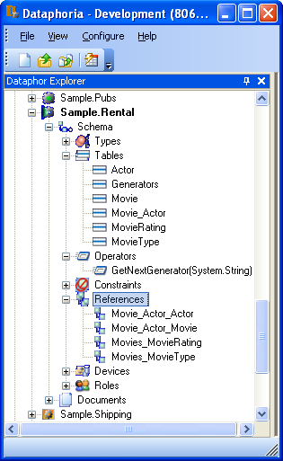

Right click the Movie table, then select `Browse` (or you can double
click the Movie table). The following form will appear:

image::../Images/RentalTut002.png[Rental Tutorial - 1]

From here you can completely manipulate the movies in the Movie table.
If you select a movie and try to change the year value to a year before
1891 you will get the error:

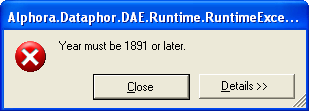

This is generated because of the constraint on the Year column in the
Movie table.

The reference from the MovieActor table causes a link under the details
menu. Select the movie Episode II - Attack of the Clones. Then click on
Details, MovieActor... and it brings up the following form:

image::../Images/RentalTut003.png[Rental Tutorial - 3]

This is a browse on the MovieActor table, but it shows only rows
associated with the current movie in the prior form. The browse also
automatically includes the proper information from the Actor table.

If you were to click add on the above form you may expect it to give you
a form to create a new actor, but it doesn't. You are still working with
the MovieActor table so it creates a lookup to the Actor table and
defaults the movie to the current one being worked with, as shown below.
If this seems confusing, browse on the MovieActor table by double
clicking on it in the Dataphor Explorer pane to get a better view of the
MovieActor table and how the Application Server derives forms for it by
default:

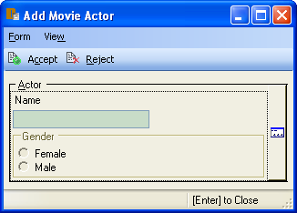

The window icon to the right of the information blocks allows you to
select the values from a lookup. You click on the window icon to select
an actor. Selecting the lookup will display the following form:

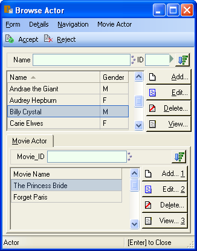

This form is a browse on the Actor table. Note, however, that the form
has accept/reject toolbar buttons rather than just close.

The Actor table has the same kind of relationship with the MovieActor
table, except that it has the Embedded metadata tag on the reference,
therefore the browse window for MovieActor is embedded inside of the
actor browse.

When you select Billy Crystal and click `Accept`, the lookup field from
the previous form is set to the currently selected Actor row, as shown
below:

image::../Images/RentalTut006.png[Rental Tutorial - 6]

Then when we click `Accept` again a row is inserted into the MovieActor
table and according to the database, Billy Crystal was in Star Wars.
Maybe he did a cameo....

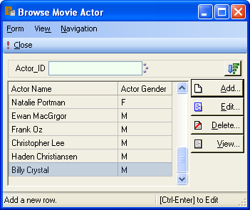

If you browse Actors by double clicking the Actor table in the Dataphor
Explorer pane, then select Billy Crystal, Star Wars will be listed as
one of his movies.

Close the Browse Movie Actor and Browse Movie forms.

== Developing a Video Rental Database

Now that we have a small movie database functioning, we can start
working on the tables for the rental application.

=== Video Table

One table is needed for all the available videos. Each row in this table
will represent a single video owned by the store which can be rented.
There can be more than one video for each movie.

Create and populate the Video table by executing the following code:

....
create table Video
{
 ID : Integer { default GetNextGenerator("Video.ID") }
  tags { Frontend.Width = "8" },
 Movie_ID : Integer tags { Frontend.Visible = "false" },
 AquiredOn : Date { default Date() }
  tags
  {
   Frontend.Preview.Visible = "false",
   Frontend.Width = "12"
  },
 TimesRented : Integer { default 0 }
  tags
  {
   Frontend.Preview.Visible = "false",
   Frontend.Width = "12"
  },
 reference Video_Movie { Movie_ID } references Movie { ID },
 key { ID }
};

Video := table
{
 row { GetNextGenerator("Video.ID") ID, 1 Movie_ID },
 row { GetNextGenerator("Video.ID"), 1 },
 row { GetNextGenerator("Video.ID"), 1 },
 row { GetNextGenerator("Video.ID"), 1 },
 row { GetNextGenerator("Video.ID"), 1 },
 row { GetNextGenerator("Video.ID"), 1 },
 row { GetNextGenerator("Video.ID"), 2 },
 row { GetNextGenerator("Video.ID"), 2 },
 row { GetNextGenerator("Video.ID"), 2 },
 row { GetNextGenerator("Video.ID"), 3 },
 row { GetNextGenerator("Video.ID"), 3 },
 row { GetNextGenerator("Video.ID"), 4 },
 row { GetNextGenerator("Video.ID"), 4 },
 row { GetNextGenerator("Video.ID"), 5 },
 row { GetNextGenerator("Video.ID"), 6 },
 row { GetNextGenerator("Video.ID"), 6 },
 row { GetNextGenerator("Video.ID"), 7 },
 row { GetNextGenerator("Video.ID"), 8 },
 row { GetNextGenerator("Video.ID"), 9 }
};
....

The Date operator returns the current date as a value of type Date. This
is used as a default value for the AquiredOn column.

=== Account Table

Next is a table that keeps track of the customer accounts that the
videos will be rented to.

....
create table Account
{
 ID : Integer { default GetNextGenerator("Account.ID") }
  tags { Frontend.Width = "8", Frontend.Add.Visible = "false" },
 Name : Description
  tags { Frontend.Width = "20", Frontend.Preview.Include = "true" },
 Phone : String,
 Address : Description
  tags { Frontend.Group = "Address", Frontend.Title = "Line 1" },
 Address2 : Description { nil }
  tags { Frontend.Group = "Address", Frontend.Title = "Line 2" },
 City : Description
  tags { Frontend.Group = "Address", Frontend.FlowBreak = "true" },
 State : String
  tags
  {
   Frontend.Group = "Address",
   Frontend.FlowBreak = "true",
   Frontend.Width = "5"
  },
 Zip : String
  tags
  {
   Frontend.Group = "Address",
   Frontend.Width = "10"
  },
 JoinedOn : Date { default Date() },
 Balance : Money { default $0 } tags { Frontend.Width = "12" },
 key { ID }
};

Account := table
{
 row
 {
  "Bryan" Name,
  "Harvest Cove" Address,
  "Orem" City,
  "UT" State,
  "84097" Zip,
  "555-4444" Phone,
  $132 Balance
 }
};
....

The Frontend.Group tags on the address columns tell the derivation
engine to group them together in a group box, as shown:

image::../Images/RentalTut008.png[Rental Tutorial - 8]

****
For more information about Frontend tags see <<../DataphorReference/Tags.adoc#FTRTagsDescriptions-FrontendTags, Frontend Tags>>.
****

Notice that the JoinedOn and Balance columns are both defaulted on a new
row. The client is able to ask the Dataphor Server what a default row
"looks like" without actually posting any data to the database.

The Address2 column type is followed by \{ *nil* }. This tells the
Dataphor Server that the column is not required and can contain no data
at all. For more information about the use of *nil* see
<<../DevelopersGuide/D4LanguageElements.adoc#D4LGNilSemantics, Nil Semantics>>.

The ID column is not visible on the add form (though it is still being
generated with its default value), yet it is visible on the other forms.
This is due to the Frontend.Add.Visible = "false" tag on the ID column.
The Add qualification specifies that the tag applies more specifically
to a particular type of "page".

The use of Frontend.Flowbreak = "true" on City and State tells the
Dataphor Server that when a form is derived, the column following the
ones containing this tag should be placed on the same line. Doing this
made State follow City, and Zip follow State all on one line.

When forms are derived by the Dataphor Server, the names associated with
the columns are generated from the table/column name. This can be
overridden using the Frontend.Title tag as seen in the Address and
Address2 columns.

=== Sale Table

Now create a table to track sales.

....
create table Sale
{
 ID : Integer { default GetNextGenerator("Sale.ID") }
  tags
  {
   Frontend.Add.Visible = "false",
   Frontend.Width = "8"
  },
 Account_ID : Integer tags { Frontend.Width = "8" },
 PurchasedOn : Date { default Date() },
 reference Sale_Account { Account_ID } references Account { ID },
 key { ID }
};
....

=== SaleItem Table

Now create a SaleItem table which will keep track of each item sold for
each sale.

....
create table SaleItem
{
 ID : Integer { default GetNextGenerator("SaleItem.ID") }
  tags { Frontend.Visible = "false" },
 Sale_ID : Integer tags { Frontend.Width = "8" },
 Description : Description,
 Cost : Money,
 reference SaleItem_Sale { Sale_ID } references Sale {ID}
  tags { Frontend.Detail.Embedded = "True" },
 key { ID }
};
....

Note that the reference has a Frontend.Detail.Embedded metadata tag.
This tells the derivation engine to put a detail browse on the
referenced table's forms (which can further be restricted to specific
forms). If the Detail was not specified, then from the referencing
table's perspective (SaleItem), the referenced table (Sale) would be
embedded. For more information about Frontend tags see
<<../DataphorReference/Tags.adoc#FTRTagsDescriptions-FrontendTags, Frontend Tags>>.

=== Rental Tables

You need to store more information when a video is rented. You need a
"special kind" of sale item specifically for renting videos. Now create
two tables to extend the SaleItem to track video rentals. Two tables are
used in order to indicate the status of the rented video.

The first table will be RentedVideo and will contain the information
about the videos that have been rented but not yet returned. One of the
keys of this table will be the Video_ID. Using Video_ID as a key will
ensure that a video can only be rented once at any given time. It must
be returned before it can be rented again.

The second table will be ReturnedVideo and will contain the information
about returned videos. When a video is returned the appropriate row in
the RentedVideo table will be deleted and a row will be inserted into
ReturnedVideo.

It would be preferable to have the name of the movie available on the
derived forms for the rental tables. The Dataphor server looks at all
first level references for Frontend.Preview.Include tags. There is one
on Name in the Movie table. But this table will not be referenced
directly by rental tables since you rent videos, not movies.

To overcome this you can create a view that includes the video ID and
movie name, then reference that from the rental tables.

....
create view VideoDetail
 Video join (Movie rename { ID Movie_ID });
....

....
create table RentedVideo
{
 Video_ID : Integer tags { Frontend.Width = "8" },
 ID : Integer tags { Frontend.Visible = "false" },
 RentedOn : Date { default Date() },
 DueOn : Date { default (Date() + Days(3)).DatePart() },
 reference RentedVideo_SaleItem { ID } references SaleItem { ID },
 reference RentedVideo_VideoDetail { Video_ID } references VideoDetail { ID },
 key { Video_ID },
 key { ID }
};

create table ReturnedVideo
{
 ID : Integer tags { Frontend.Width = "8" },
 Video_ID : Integer tags { Frontend.Width = "8" },
 RentedOn : Date,
 DueOn : Date,
 ReturnedOn : Date,
 LateFee : Money,
 reference ReturnedVideo_SaleItem { ID } references SaleItem { ID },
 reference ReturnedVideo_VideoDetail { Video_ID } references VideoDetail { ID },
 key { ID }
};
....

Look at the default for the DueOn column. Date() returns the current
date as a Date value. Days(3) returns a Timespan value equal to 3 days.
(Date()+ Days(3)) returns a DateTime value. Since you want just the date
.DataPart() truncates the DateTime value to return a Date value.

Now create an operator (sometimes called a procedure, function, routine)
named AddRental that, given a row from the RentedVideo table, updates
the appropriate row of the Video table.

....
create operator AddRental(ARow : typeof(RentedVideo[]))
begin
 update Video
  set { TimesRented := TimesRented + 1 }
  where ID = ARow.Video_ID;
end;
....

Once this operator is created, it can be called anywhere in the code,
given a row of the RentedVideo table type as an argument.

The AddRental operator can further be attached to the modification
behavior of the RentedVideo table, so that it is called after each
insert.

....
attach operator AddRental to RentedVideo on after insert;
....

For more information on operators see
<<../DevelopersGuide/D4Catalog.adoc#D4LGCatalogElements-Operators, Operators>>.

A way to view the videos that are currently available would be useful.

....
create view AvailableVideo
 VideoDetail
 left join (RentedVideo { Video_ID }) by ID = Video_ID
 include rowexists
 where not rowexists
 { ID, Name, Type, Rating, Year };
....

== Designing the User Interface

Now that the database design is essentially done, the rest of the
application logic can be built around it.

=== Creating an Entry Form

Forms are created using Dataphoria. To start a new form you can press
Ctrl-N, or click on the blank form icon under the File title, or click
File then New. Any of these will display the `Select a designer`
window:

image::../Images/RentalTut010.png[Rental Tutorial - 10]

In this window select DFD - Form Designer and click Accept. The
Dataphoria windows will look like this:

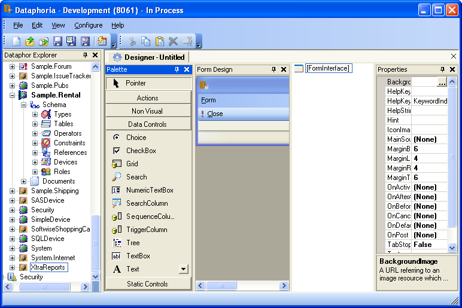

The various panes in the window can be moved, sized, or separated from
the main window completely to be displayed as you like. The thumbtack at
the top right of each pane is used to pin or release the pane. When the
tack is pointing down the pane is stationary. Clicking the tack will
turn it sideways and the pane will slide out of view when not in use.
This increases the area available for other work. To retrieve a pane
that is out of view simply move the mouse over the tab with the name of
the pane and it will slide back into view.

The panes can be moved to another location or removed from the
Dataphoria window by clicking on the strip where the name of the pane
is, Form Design for example, and dragging the pane where you would like
it.

As shown above, just to the right of the Dataphor Explorer is the
Designer. Within the Designer are four sections. The left pane is the
Palette. This is where you select the elements or components you want to
place on the form.

The Form Design pane is the preview of the form you are working on. This
is a fully functional form so you can use it as you design it.

The Properties pane is were properties of the currently selected
component are displayed and edited.

The area of the window with the text [FormInterface] is called the
Component Tree. This area will display a tree representing all the
components on the form. [FormInterface] is the root of the tree, it is
the "Root Form Component". The Component Tree is where you will place
components, move them, name them, and select them so that you can view
or modify the component's properties.

All Non Visual and Action components are children of the Root Form
Component. The only exception is the DataArgument which is always a
child of a Source or a DataScriptAction component. One and only one
visible element will be a child of the Root Form Component. This one
element is normally a Row or a Column. All other visible elements (Data
controls and Static controls) on the form will be descendents of the
that first visible element.

When the designer opens, it creates a new empty form and shows it. The
form which is currently being designed is always loaded and running, so
that we can see exactly how it looks and works.

The first form you'll create is the main form used to run the
application. Normally the first form of an application has a method for
accessing the appropriate tables or functions. In this case buttons
(triggers) are used.

First give the Form a title. Click the text [FormInterface] in the
Component Tree. The Properties for the Root Form Component are now
displayed. In the Text property enter Video Rental System. As soon as
you move the cursor out of the Text property the words will appear at
the top of the form.

Rows, columns, and groups, just to name a few, are used to control the
layout of the elements on the form. To get an idea of what this form
will look like, see the following sketch:

image::../Images/RentalTut012.png[Rental Tutorial - 12]

First place a Column on the form. In the Palette pane click Static
Controls to display the static element components. Then click Column,
move the mouse to the Component Tree and click the text [FormInterface].
This makes the Column a child of the Root Form Component. Now Dataphoria
is waiting for you to name the Column. Type MainColumn and press Enter.
If you want to change the name of a component, select the component then
press F2.

Next place a Row as a child of MainColumn by going to the Palette pane
and clicking Row, then click MainColumn in the Component Tree, and name
it ButtonRow. Now place a Column as a child of ButtonRow and name it
ButtonColumn1. Place another Column as a child of ButtonRow and name it
ButtonColumn2.

As of yet nothing has changed on the form because, although Columns and
Rows are considered visible components, they don't have any visible
components themselves.

Next place a button on the form. In the Palette pane click Trigger, move
the mouse to the Component Tree and click ButtonColumn1 so that the
Trigger will be a child of ButtonColumn1. Name the trigger
MoviesActorsTrigger and press Enter. Now in the Properties pane, change
the Text property to Movies-&Actors. Note that the button appears on the
form.

Click once on the MoviesActorsTrigger component and tap the ALT key
once. You will see the A in Movies-Actors is underlined. This indicates
the hotkey to activate this actions is Alt-A. The Ampersand (&) before
the A indicates the preferred hotkey. If the preferred key has not yet
been assigned previously in the Component Tree structure it will be
assigned to that element. It may be necessary to save the form, close
then reopen it to have a hotkey reassignment work after you change it.
Where a preference is not specified, the first available unassigned
letter in the text will be assigned.

Continue to create buttons in ButtonColumn1 named AvailableVideosTrigger
(text Available &Videos), RentalsSalesTrigger (text Rentals/&Sales), and
ReturnVideosTrigger (text Return Videos). Now do the same thing in
ButtonColumn2 for the MoviesTrigger (text View/Update &Movies),
AccountsTrigger (text View/Update Accounts), and VideosTrigger (text
View/Update Videos).

Note that the buttons all touch each other. Some space between them may
help the look of the form. In the Component Tree click on ButtonColumn1.
In the Properties pane change the MarginRight property to 10. This will
place a margin to the right of ButtonColumn1. In the Component Tree
click on MoviesActorsTrigger and change it's MarginBottom property to
10. Repeat this for each trigger.

You've got some time and thought into this form. If the power goes out
right now it would be disappointing. To save the form click the File
menu then Save As Document. The Library Name should read Sample.Rental
and the Document Type should be dfd. In the Name box type MainForm and
click Accept.

A title above the buttons would be a nice touch. To add the title, click
Static Text in the Palette pane, then click the MainColumn component in
the Component Tree. Name it TitleStaticText. In the Text property type
Welcome to Alphora Video. The TitleStaticText component will be placed
below the two rows of buttons. To move it above the buttons, click on
the TitleStaticText component and while holding the mouse button down,
drag the component up until the horizontal bar symbol is between the
MainColumn component and the ButtonRow component. Then release the mouse
button.

The form and Note Tree now looks like this:

image::../Images/RentalTut013.png[Rental Tutorial - 13]

=== Linking to Tables

The text on the button faces is grey instead of black. This is to show
that the buttons are not yet functional. You have to create actions and
tie the triggers to the actions.

Make the Movies-Actors button active in the following way. In the
Palette pane click on Actions to show the list of action components.

The various action components each perform a specific task when
executed. For example, the ShowFormAction displays a derived or
customized form when executed. Actions are executed from a Menu,
Trigger, Exposed, or several other component types.

Click on ShowFormAction then click on [FormInterface]. Name the action
ShowMoviesActorsAction. Now click on the Document property box then
click the three dots (...) at the right side of the box. A Document
Expression Editor window will open. Click the Derive tab, in the Query
box type MovieActor. The Page Type should already be Browse and
Elaborate is checked. The Master Key Names and Detail Key Names are
blank:

image::../Images/RentalTut014.png[Rental Tutorial - 14]

Click Accept. The Document property is now Derive('MovieActor',
'Browse')

This tells the Dataphor Server to derive a browse form based on the
MovieActor table.____

Click on the MoviesActorsTrigger component, click the Action property
then click on the down arrow in the property, use the list to set it to
the ShowMoviesActorsAction you just created. Now the Movies-Actors
button has black text. Click on that button, or press Alt-A, and the
Browse Movie Actor form will be displayed. Close the Browse Movie Actor
form.

Do the same for the Movie table using a ShowFormAction named
ShowMoviesAction. Connect the MoviesTrigger to it.

Dataphor can derive forms from tables or views. Do the same thing for
the AvailableVideo view using a ShowFormAction named
ShowAvailableVideoAction. Connect the AvailableVideosTrigger to the
action.

Do the same thing for the Account table using a ShowFormAction named
ShowAccountAction. Connect the AccountsTrigger to the action.

Do the same thing for the Video table using a ShowFormAction named
ShowVideoAction. Connect the VideosTrigger to the action.

=== Adding Scripts

Now get a bit fancy and put the date and time below the button columns.
Add the following elements to the Component Tree:

* (Static Controls) StaticText as child of MainColumn after ButtonRow,
name it ClockStaticText.
* (Actions) ScriptAction as child of [FormInterface], name it
SetClockAction. Set the Language property to CSharp. Set the Script
property to the following C# code:
+
....
ClockStaticText.Text =
 DateTime.Now.ToLongDateString()
 + "  "
 + DateTime.Now.ToLongTimeString();
....
+
Note: You can type the text (script) directly into the box beside the
property name Script. Another option is to click the ... button, an
editor pane will open, enter the text in the editor, then save the text
and close the editor pane.
+
IMPORTANT: You save the script by clicking the diskette icon or clicking
File, Save. Do not use Save As File or Save As Document. These scripts
are saved as part of the form, not as a separate file.
+
With a ScriptAction you can use C# or Visual Basic code to automate an
action on the client side. With a DataSciptAction you can use D4 code to
automate an action on the server side.
* (Non Visual) Timer as child of [FormInterface]. Name it ClockTimer.
Set the Interval property to 1000, that is the number of milliseconds in
one second. Set the OnElapsed property to SetClockAction. Set the
AutoReset and the Enabled properties to True.
+
This will cause the SetClockAction to be executed once each second.

You now have the current date and time displayed below the buttons on
the form. Better save your form again by pressing the diskette icon on
the Dataphoria toolbar.

=== Customizing a Form, adding Filters

Customers are going to say something like "I want a movie but I can't
remember the name. I know it has the word 'Fair' in the name. Can you
help me?".

So try to find it now. Click the View/Update Movies button. The Browse
Movie form is displayed. The automatically derived forms include a
Search group that allows you to search in any of the Key columns. Type
the word Fair in the Name box of the search group. The Ferris Beuler's
Day Off movie is now selected. If the customer wanted a movie with Fair
as the first word this would have helped but we need another tool. We
need to be able to find all the movies with the word Fair anywhere in
the title.

Close the Browse Movie form. You will now build a filter for the
MovieActor form.

Sometimes you may want to change something on a derived form, but still
desire the form to be derived from the data. That is the case this time.
Click the Movies-Actors button to bring of the Movie Actor form. Click
the Form menu and select `Customize`:

image::../Images/RentalTut015.png[Rental Tutorial - 15]

The Browse Movie Actor form is derived by the Dataphor Server based on
the metadata of the tables and tags. What you will do is add some
components (elements) to this form but leave most of it for the server
to derive. The derivation of the form will work best if you place all
additional elements at or near the bottom of the Component Tree.

To create the filter you will need to add several elements to the form:

* (Non Visual) Source as child of [FormInterface], name it FilterSource.
Set the Expression property to the D4 expression:
+
....
select TableDee add
{
 nil as String MovieName tags { DAE.IsComputed = "false" },
 nil as String ActorName tags { DAE.IsComputed = "false" }
};
....
+
Then set the Enabled property to True. Note: If the Enabled property
will not set to True, there is an error in the Expression property.
+
This element and expression gives you a place to store local variables
that you need for the form. The DAE.IsComputed tag is used to tell
Dataphor that this value is not to be automatically computed as would
normally be the case when using the add table expression.
* (Static Controls) Group as a child of RootBrowseColumn, named
FilterGroup. Set the Title property to Filter. All the other visible
controls for the filter will be descendents of the FilterGroup.
+
The Group component give you a way to collect related controls together
on a form. Some components can have no components as children, some can
have many. A Group can only have one child component so a Row or Column,
for instance, will need to be used to place several other components
within the Group component.
* (Static Controls) Row as child of FilterGroup, named FilterRow.
* (Static Controls) Trigger as a child of FilterRow, named
FilterTrigger. Don't set the Text property. It will be set in another
way later.
* (Data Controls) TextBox as child of FilterRow, named
MovieFilterTextBox. Set Width property to 20. Set Title property to Part
of Movie Name. Set Source property to FilterSource. Set ColumnName
property to MovieName. Set NilIfBlank property to True.
* (Data Controls) TextBox as child of FilterRow, named
ActorFilterTextBox. Set Width property to 20. Set Title property to Part
of Actor Name. Set Source property to FilterSource. Set ColumnName
property to ActorName. Set NilIfBlank property to True.
+
Note how much space is between the movie name and actor name text boxes
you just added. Click on the MovieFilterTextBox component in the
Component Tree. You already set the Width property to 20. This sets the
minimum width of the TextBox to approximately 20 characters. There is a
property called MaxWidth. The setting of -1 tells Dataphoria that this
box can expand as the users enters text. Change this setting to 20. Now
the box is a fixed width of approximately 20 characters. The user can
enter longer text but it will scroll in the fixed width box. For
consistency in the look and feel of the application, change the MaxWidth
property of the ActorFilterTextBox to 20 also.

You have all the visible components necessary for the filter. Now you
need the operational pieces. Take a look at the top of the Component
Tree. There is a source component named Main. That is the source for the
data that fills the Movie-Actor form. What the filter you are building
will do is set the Filter property of this source. This will be done
using a ScriptAction. A look at the Expression property for the Main
source will show that the name of the two columns we are interested in
is Movie.Name and Actor.Name.

Continue making the following additions/changes to the form:

* (Actions) ScriptAction as child [FormInterface], named SetMainFilter.
Set the Language to CSharp. Set the Script to
+
....
string LFilter = "";

if(FilterSource["MovieName"].HasValue())
  LFilter = "(Lower(Movie.Name) matches Lower(\'"
    + FilterSource["MovieName"].AsString
    + "\'))";

if(FilterSource["ActorName"].HasValue())
{
  if(LFilter != "")
  {
    LFilter += " and ";
  }
  LFilter += "(Lower(Actor.Name) matches Lower(\'"
    + FilterSource["ActorName"].AsString
    + "\'))";
};

Main.Filter = LFilter;

if(LFilter == "")
  FilterTrigger.Action = SetMainFilter;
else
  FilterTrigger.Action = ClearMainFilter;
....
+
Set the Text Property to Set Filter. This text will be displayed on the
FilterTrigger button face when its action is pointed to the
SetMainFilter action.
* Set the Action property of the FilterTrigger component to
SetMainFilter. Note the text now appears on the button face.
* (Actions) ScriptAction as child [FormInterface], named
ClearMainFilter. Set the Language to CSharp. Set the Script to
+
....
FilterTrigger.Action = SetMainFilter;

Main.Filter = "";
....
+
Set the Text Property to Clear Filter. This text will be displayed on
the FilterTrigger button face when it's action is pointed to the
ClearMainFilter action.
* Click on the FilterSource component. Change the OnRowChange property
to SetMainFilter.

The filter is now created. Before trying it save the customized form as
a dfdx document. It is necessary to save it now because the form will be
saved as it appears and with the properties of the components as they
are now. When the filter is used some properties of the Main source and
FilterTrigger are changed. If the form were saved with the properties
set to filter the incoming data, that would be how it would come up for
the user every time.

Click on File, Save As Document. The Library Name should already be
Sample.Rental. Type BrowseMovieActor in the Name box and click Accept.

Now help that customer. Type FAIR under Part of Movie Name. Press the
Set Filter button. Just two movies will now be displayed and the text on
the button face changed to Clear Filter:

image::../Images/RentalTut016.png[Rental Tutorial - 16]

So how does it all work?

1.  Text is entered into one, or both, of the Filter text boxes.
2.  When the Set Filter button is press the SetMainFilter action is
executed.
3.  If the curser is moved out of the textbox (by clicking elsewhere on
the form or pressing tab) and the contents of the textbox was changed,
the FilterSource OnRowChange property fires, executing the SetMainFilter
action.
4.  SetMainFilter creates a local variable LFilter. LFilter is used to
build the D4 filter expression that is placed in the Main source Filter
property. The text that was entered by the user is accessed by the
FilterSource["__fieldname__"].AsString expression. The strings are all
forced to lower case so that capitalization will not be a problem. If
the user clears both filter textboxes the FilterTrigger Action property
is changed back to set as this would be the same as clearing the filter.
5.  The ClearMainFilter action sets the FilterTrigger action property to
SetMainFilter and clears the Main source Filter property by setting it
to an empty string.

For another example on implementing a filter look at Sample07 in the
Sample.Components library.

One last thing to do before you can use the customized form. When the
Movie-Actor button on the MainMenu form is pressed it will still
automatically derive a form from the database. You must link that
trigger to the new customized BrowseMovieActor form.

Click File, Close to close the Designer for the BrowseMovieActor. DON'T
SAVE IT. A filter is currently set and if you save the form it will
always come up set. Closing the form is necessary so that the MainMenu
form can open it. You can only have any given form opened once in a
single session.

If the MainForm is not still open in the Desinger, double click the
MainForm in the Dataphor Explorer pane to open it. Click the
ShowMoviesActorsAction component in the Component Tree. Change the
Document property to Form('Sample.Rental', 'BrowseMovieActor'). Click
File, Save.

Now when you click the Movies-Actors button the customized form will be
displayed. If you tried it, close the Movies-Actors form now.

=== Creating a Sales Form

Now that the customer has the My Fair Lady video in hand it's time to
give the clerk a way to enter sales and rentals. On the MainForm, add
another ShowFormAction named NewRentalSaleAction. In the Document
property enter Derive('Sale', 'Add'). Set the Mode property to Insert
which indicates that the shown form should insert a new row buffer into
the dataset when shown. Link the RentalSaleTrigger to this action:

image::../Images/RentalTut017.png[Rental Tutorial - 17]

On forms, the dark green means that a field is Read Only as well as
empty. A value must be selected from a list.

A light green background on a textbox controls means that no value has
been entered into that field yet. A value must be entered into the field
before it can be posted if nulls are prohibited in the target column of
the database.

If we click on the `Add` button next to the SaleItem grid, we should see
the following:

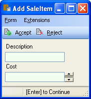

You now have the ability to put in new sales and items within the sale.

=== Renting Videos

Now give the clerks the ability to easily add movie rentals. To do this
you will create another view called NewRental using the following D4
code. This will create a new view which joins the Rental table to the
SaleItem table. Note that we can use the adorn operator to add metadata
to results of the view.

....
create view NewRental
 SaleItem join RentedVideo
 adorn
 {
  Description { default "Rental" }
  tags { Frontend.Add.ReadOnly = "true" }
 };
....

You need to customize the saleitem detail frame, that is included at the
bottom of the Add Sale form, so that the clerks can use the NewRental
view to enter rentals. To do this you need to know some information
about how the saleitem detail frame is being derived by the Dataphor
Server.

First click the Rentals/Sales button to bring up the Add Sale form.
Click Form, Customize. This will open the Add Sale form in the Live
Designer. Click on the Sample.Rental.SaleItem_SaleFrame at the bottom of
the Component Tree:

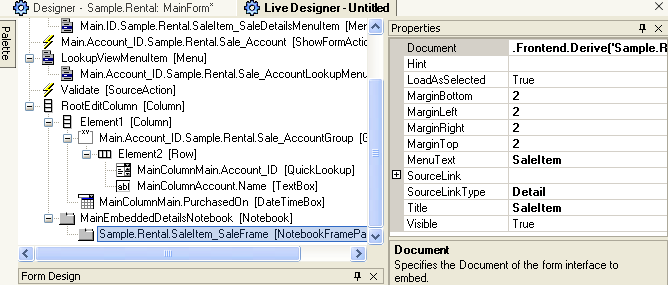

Take note of the Document Property. It reads:

....
.Frontend.Derive
(
 'Sample.Rental.SaleItem',
 'Browse',
 'Main.ID',
 'Main.Sale_ID',
 true)
....

This is the how Dataphor imbeds a detail frame into a form. The
arguments that are passed to Frontend.Derive are: 1. the Query, 2. the
Page Type, 3. the Master Key Names, 4. the Detail Key Names, 5. whether
or not to Elaborate. The Master Key Names/Detail Key Names identifies
the keys that tie the two queries. In this case the Main.ID column of
Sale and the Main.Sale_ID of SaleItem.

Copy the Document property by highlighting the entire text and pressing
Ctrl-C. Now open the saleitem detail frame in a Live Designer. Do this
by clicking File, New, select DFDX Custom From Designer, click Accept,
click on the Other tab, click in the Expression text box then paste the
text from the Document property by pressing Ctrl-V. Then click Accept.
Now you can customize the saleitem detail frame in the Dataphoria
Designer.

In the Component Tree, copy the ShowFormAction component called Add by
selecting it and pressing Ctrl-C. Then select the [FormInterface] and
press Ctrl-V to paste a copy of the component. Press F2 and change the
name of the new component to AddRental. In the Document property change
the part that reads 'Sample.Rental.SaleItem' to
'Sample.Rental.NewRental'

Change the Text property to Add Rental.... Note that this text is in the
Action instead of the Trigger. You'll leave the Text property of the
Trigger blank so it will use this text instead.

Click Trigger in the Palette pane. Then move the mouse into the
Component Tree so a black line appears between AddTrigger and
EditTrigger, then click the mouse. This adds a Trigger at that point in
the Component Tree. Name it AddRentalTrigger. Set the Action property to
AddRental. Pressing the new button should result in a form that looks
like this:

image::../Images/RentalTut020.png[Rental Tutorial - 20]

The Frontend.Add.ReadOnly tag in the NewRental view causes the
Description TextBox to be ReadOnly. When the user enters data in this
form, they are actually inserting into the NewRental view. The ability
to insert into views based on any expression is unique to Dataphor.
Close the Add NewRental form.

You may have noticed that the total of all the sale items is not
calculated or displayed. Add that now.

Add a Source named TotalSource. Set the Expression property to

....
SaleItem
 group by { Sale_ID }
  add { Sum(Cost) Total };
....

Set the Master property to Main. Set the MasterKeyNames to Main.Sale_ID.
Set the DetailKeyNames to Sale_ID. Set the Enabled property to True.
This setup makes the TotalSource participate in the Application
Transaction that will be underway when the AddSale form is in use. The
expression will give the Total of the the sale items and will be updated
each time anything changes. For more information about Application
Transactions see
<<../DevelopersGuide/DatabaseManagementConcepts.adoc#DDGP1TransactionManagement, Transaction Management>>.

Add a TextBox as a child of RootBrowseColumn and name it TotalTextBox.
Set the Source property to TotalSource. Set the ColumnName property to
Total. Set the ReadOnly property to True. Set the TabStop property to
False.

Since the Title property was left empty, the ColumnName is used as the
title of the text box on the form.

Set the TitleAlign property to Left so the title will be displayed to
the left side of the text box on the form:

image::../Images/RentalTut020b.png[Rental Tutorial - 20b]

Save the customized SaleItem frame in the System.Rental library as dfdx
document and name it SaleItemFrame. Close the SaleItemFrame Designer by
clicking File, Close.

The LiveDesigner for the Add Sale form should be active now because you
left it in the background when you copied the Document property from it.
Return to the Sample.Rental.SaleItem_SaleFrame Document property and
change it to Form('Sample.Rental', 'SaleItemFrame')

Save the customized Add Sale form in the System.Rental library as dfdx
document and name it AddSale. Close the Add Sale Live Designer by
clicking File, Close.

Lastly, in the Designer for MainForm click on the NewRentalSaleAction
component in the Component Tree. Change the Document property to
Form('Sample.Rental', 'AddSale') and save the MainForm form.

The now modified AddSale form is still open. It may be in the
background. Navigate to that form and close it.

=== Video Returns

Now to handle returned videos. Add a ShowFormAction to the MainForm
Component Tree, name it ShowRentedVideoAction. Set the Document property
to Derive('Sample.Rental.RentedVideo', 'Browse').

Click on ReturnVideoTrigger and set the Action property to
ShowRentedVideoAction. Click on the Return Video button:

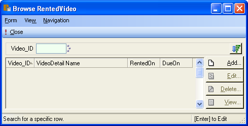

To handle the returning of the videos an operator will be created. The
following d4 code handles this.

....
create operator ReturnVideo(AVideoID : Integer)
begin
 // retrieve rental row
 var LRentedVideoRow: typeof(RentedVideo[]);
 LRentedVideoRow := RentedVideo[AVideoID by { Video_ID }];

 // calculate late fee
 var LLateFee : Money;
 if Date() > LRentedVideoRow.DueOn then
  LLateFee := (Date() - LRentedVideoRow.DueOn).Days * $2
 else
  LLateFee := $0;

 // update tables
 delete RentedVideo where Video_ID = AVideoID;

 insert table
 {
  row
  {
   LRentedVideoRow.ID ID,
   AVideoID Video_ID,
   LRentedVideoRow.RentedOn RentedOn,
   LRentedVideoRow.DueOn DueOn,
   Date() ReturnedOn,
   LLateFee LateFee
  }
 } into ReturnedVideo;

 if LLateFee > $0 then
  update Account set
  {
   Balance := Balance + LLateFee
  }
   where ID =
   (
    (Sale rename { ID SaleID })
    join SaleItem by SaleID = Sale_ID
   )[LRentedVideoRow.ID by { ID }].Account_ID;

end;
....

Look at the operator and what it is doing. The first few lines retrieve
a row from RentedVideo. A row variable of the appropriate type is
declared and then the RentedVideo record for the ID parameter is queried
from the database and stored in the row variable LRentedVideoRow.

The late fee, if any, is calculated and stored in the LLateFee variable.
Note that Date() - DueOn from LRentalRow returns a timespan which can be
represented as an integer number of days using .Days.

Finally the tables are updated. The RentedVideo record is deleted and
the ReturnedVideo record is created. If there is a late fee, the
appropriate Account record is updated. Since the ID of the Account is
stored in the Sale table, it must be retrieved by using the SaleItem row
get the Sale ID. Then use the Sale row to get the Account ID.

The following will explain how the RentedVideo form will be customized
by making the Add, Edit, Delete, and View buttons invisible so that they
are not accidentally clicked. Also how to add a Trigger and Action to
execute the ReturnVideo operator.

On the Browse RentedVideo form, click Form, Customize. For each of
AddTrigger, EditTrigger, DeleteTrigger, and ViewTrigger change the
Visible property to False.

Place a DataScriptAction component on the form and name it
ReturnVideoAction. Set the Script property to be
ReturnVideo(Main.Video_ID); and set the Text property to Return Video.

Then add a new Non Visual DataArgument component named
ReturnVideoDataArgument as a child to the ReturnVideoAction component.
Set the Source property to Main and enter Main.Video_ID in the Columns
property. This tells the DataScriptAction to make the column values from
the current row of the source available for use as arguments to the
script, which is where the value for Main.Video_ID comes from. So now
the currently selected video in the grid will get returned when the
ReturnVideo action component is executed.

Add a new Trigger above AddTrigger as a child of GridBar and name it
ReturnVideoTrigger. Change the Action property to ReturnVideoAction.

Since a DataScriptAction does not automatically refresh the data shown
on the form, you need to set things so that after the
ReturnVideoOperator executes, the data on the form is refreshed. As it
stands now the returned video will still be shown in the grid after it
has been returned. To correct this, click on the ReturnVideoAction
component and change the AfterExecute property to Refresh.

Now save the customized form in the Sample.Rental library as a dfdx
document type and name it ReturnVideo. Close the Designer for the form.
Navigate to the Rented Video form, probably in the background, and close
it.

The MainForm needs to be modified so the customized ReturnVideo form
will be displayed. Change the ShowRentedVideoAction component Action
property to Form('Sample.Rental', 'ReturnVideo') and save the MainForm
form.

=== Processing Late Fees

To complete the sales process a method of paying the late fees is
needed. The late fee total is stored in the Balance column of the
Account table. It should be applied as a line item when making a sale to
the customer.

The process of applying the late fees to a sale can be accomplished with
an operator.

....
create operator PayFees
(
 ASaleID: Integer,
 AAccountID : Integer,
 ABalance : Money
)
begin
 // create saleitem
 insert
  table
  {
   row
   {
    ASaleID Sale_ID,
    "Late Fee Payment" Description,
    ABalance Cost
   }
  } into SaleItem;

 // clear account balance
 update Account set { Balance := $0 } where ID = AAccountID;
end;
....

To facilitate the execution of this operator it will be attached to a
trigger on the AddSale form. But first the clerk must be told if there
is a balance due. Let's have the balance show on the AddSale form just
like the name does now. To do this you'll alter the Account table,
adding a tag to the Balance column.

....
alter table Account
{
 alter column Balance
  alter tags { create Frontend.Preview.Include = "true" }
};
....

Open the customized AddSale form (dfdx) in a designer by double clicking
the AddSale [dfdx] document. You will see the balance for the account is
now displayed. Make the following additions and changes:

* Add a DataScriptAction named PayFeesOperatorScript. Set the Script
property to PayFees(Main.ID, Account.ID, Account.Balance); and set the
Text property to Add Balance as Sale Item. Set the Image property to
Image("Frontend","Warning"). This text and image will be displayed on
the button face that will be added shortly.
+
Remember that the PayFees operator inserts a row into the SaleItem table
and updates the Account table to set the Balance to zero for the
selected account. Since the sale has not been finalized yet you don't
want the changes to the tables to be committed until the clerk presses
the Accept button. To make these changes become part of the Application
Transaction that the Add Sale form is running in, set the _EnlistWith_
property to __Main__. By doing this, the changes to the _SaleItem_ and
_Account_ tables will not be committed until the entire sale is
completed. For more information about Application Transactions see
<<../DevelopersGuide/DatabaseManagementConcepts.adoc#DDGP1TransactionManagement, Transaction Management>>.
* Add a Non Visual _DataArgument_ as a child of _PayFeesOperatorScript_
and name it __PayFeesData__. Set the _Columns_ property to Main.ID,
Account.ID, Account.Balance and the _Source_ property to __Main__.
* Add a Column called AccountColumn as a child of Element2 (which is a
child of Main.Account_ID.Sample.Rental.Salt_AccountGroup).
+
Add a Row called AccountRow as a child of AccountColumn.
+
Add a Row called BalanceRow as a child of AccountColumn.
* Move MainColumnSample.Rental.Sale_Account_Main.Account_ID_Lookup into
AccountRow so it becomes a child of AccountRow. Move
MainColumnAccount.Name into AccountRow so it becomes a child of
AccountRow and is below
MainColumnSample.Rental.Sale_Account_Main.Account_ID_Lookup.
* Move MainColumnAccount.Balance into BalanceRow so it becomes a child
of BalanceRow. Change the Title property of MainColumnAccount.Balance to
Balance Due.
* Add a Trigger as a child of BalanceRow so that it is below
MainColumnAccount.Balance. Name the Trigger AddBalanceTrigger. Set the
Action property to PayFeesOperatorScript.
+
Because the Text property of the Trigger is empty, the Text property of
the Action is used as the text on the button face of the Trigger.
Because the Action has an image specified it appears on the button.
+
Note the button looks too far right. Let's make this look a bit nicer.
+
Select the MainColumnAccount.Balance component and change the MaxWidth
property to 20.
* Component Reference, ScriptActionScriptActionComponent ReferenceAdd a
ScriptAction named SetBalanceVisibilityScript. Enter the following
CSharp script in the Script property:
+
....
if (Main.Enabled
    && !Main.DataView.IsEmpty()
    && Main.DataView["Account.Balance"].HasValue()
    && (Main.DataView["Account.Balance"].AsDecimal != 0))
 {
  BalanceRow.Visible = true;
 }
 else
 {
  BalanceRow.Visible = false;
 }
....
+
Select the Main source component. Set the OnRowChange property to
SetBalanceVisibilityScript. This will cause the script to be executed
each time there is a change in the row. If the conditions are correct,
as checked by the script, the balance and button will be displayed.
* Once the PayFees operator has been executed, you can't allow the
account to be changed. This is because changes to the tables are queued
in the application transaction based on the selected account. To
eliminate this possibility you can change the ReadOnly property to true
on the MainColumnSample.Rental.Sale_Account_Main.Account_ID_Lookup and
MainColumnSample.Rental.Sale_Account_Main.Account_ID controls.
+
Add a ScriptAction named BalanceChargedScript. Set the Script property
to the following CSharp script:
+
....
MainColumnSample_Rental_Sale_Account_Main_Account_ID_Lookup.ReadOnly = true;
MainColumnSample_Rental_Sale_Account_Main_Account_ID.ReadOnly = true;
BalanceRow.Visible = false;
Sample_Rental_SaleItem_SaleFrame.FrameInterfaceNode.MainSource.Refresh();
....
+
The second line hides the row that was displayed due the the balance
being due.
+
Making changes to the dataset behind the scenes as is the case with the
PayFees operator will not automatically be displayed on the SaleItem
Notebook Frame. The third line refreshes the SaleItem form.
+
Note the change in the name of the MainColumnMain.Account_ID component
name. The period has to be replaced with an underscore. This is because
CSharp uses a period to separate an object name from the property of an
object.
+
Select the PayFeesOperatorScript component. Set the AfterExecute
property to BalanceChargedScript. When the button is pressed, the
PayFees operator will be executed, then the BalanceChargedScript will be
executed.
* Your form now looks like this:
+
image::../Images/RentalTut022.png[Rental Tutorial - 22]
+
image::../Images/RentalTut023.png[Rental Tutorial - 23]

* The last thing to do is hide the components that should not be seen
when the form is first displayed.
+
Select the BalanceRow component and set the Visible property to False.

Now save the customized AddSale form before anything is changed. Close
the Designer pane for all the forms.

You have designed a database and developed an application.

=== Running the Rental Application with the Windows or Web Client

Everything to this point has been done in Dataphoria. To make the
application available to the Windows or Web clients it must be
published. You do this by dragging the MainForm to Applications in the
Dataphor Explorer as follows:

* Click and hold the left mouse button on MainForm [dfd]. While holding
the left mouse button doen, slowly move the mouse to the top of the
DataphorExplorer pane so that the libraries scroll down until you see
the Applications entry at the top.
* Drop the MainForm on Applications by releasing the left mouse button
while the mouse pointer is on Applications.
* The Edit Applications form will be displayed. Change the Description
to read Alphora Video Rental System:
+
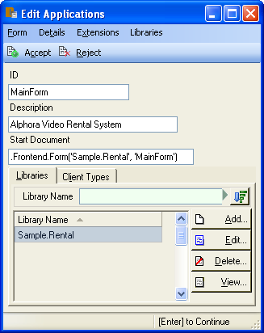

* Select the Client Types tab:
+
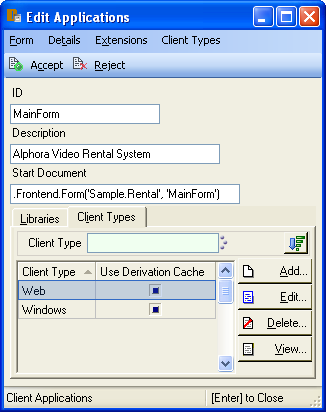

** Add the Web Client Type and the Windows Client Type.
* Click Accept
+
image::../Images/RentalTut025.png[Rental Tutorial - 25]

This gives the Windows Client and the Web Client an entry point. Now
when someone connects to the Dataphor Server using the correct port,
8061 in the example above, the Video application will be available to
them.

With the Windows Client:

image::../Images/RentalTut026.png[Rental Tutorial - 26]

The user selects the desired application and clicks OK.

With the Web Client:

image::../Images/RentalTut027.png[Rental Tutorial - 27]

The user just clicks on the desired application.
