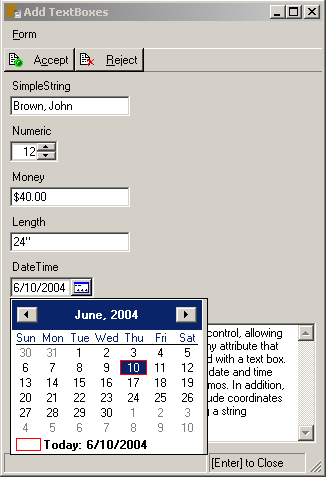
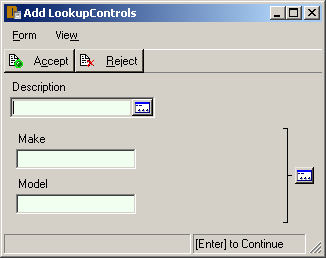

= Using Dataphor Controls (UI Components)
:author: Alphora
:doctype: book

:data-uri:
:lang: en
:encoding: iso-8859-1

[[DUGP1UsingDataphorApplications-Controls]]
== Summary

The basic components of a Dataphor form are called __controls__. Each control is
responsible for managing a specific piece of the interface such as the
contact name or phone number. There are a variety of different types of
controls in a typical Dataphor Application.

Each control on a form may have a short description associated with it
called a __hint__. This hint can be displayed by hovering the mouse
cursor over the control, or by focusing the control, which causes the
hint to be displayed in the left side of the status bar.

All controls that are capable of editing values have two important
states that are indicated visually: read only, and cleared, or no value.
The following screen capture illustrates this behavior:

image::../Images/WindowsClientControlStates.bmp[Windows Client - Control States]

Editable controls with a current value have a white background. Readonly
controls with a current value have the same color background as the rest
of the form. Note that although readonly controls do not participate in
the tab order (i.e. they cannot be reached using the Tab key), they can
still be focused, and the standard text selection capabilities apply.

Editable controls without a current value have a pale green background.
Readonly controls without a current value have a darker green
background. Note that these color settings are based on the default
Windows Client theme. Current Windows appearance settings and the theme
of the application may affect the actual colors, but the different
states will still be indicated visually.

There are relatively few different types of controls in a Dataphor
Application. This keeps the user interface simple and intuitive, without
sacrificing any power or flexibility. However, specific applications may
introduce new types of controls as necessary to support the
functionality of the application. In these cases, refer to the
documentation for the application for information about extended
controls.

The following list shows the different types of controls used in a
typical Dataphor Application:

* Text Boxes
+
Text boxes correspond to a single value and include basic text boxes,
numeric editors, date and time editors, and text memos.
* Lookup Controls
+
Lookup controls allow values to be selected from a list of valid values
using a browse.
* Choices
+
Choice controls allow values to be selected from a static list of
values.
* Image Control
+
The image control allows image values to be edited.

[[DUGP1UsingDataphorApplications-Controls-TextBoxes]]
== Text Boxes

The text box is the most common type of control, allowing values of
various types to be edited. Any value that can be displayed as text can
be edited with a text box. This includes text values, numeric values,
date and time values, as well as text blocks such as memos.

The following screen capture displays the various types of text boxes:

All text boxes support standard cut-copy-paste functionality using the
Microsoft Windows standard keys: Ctrl+X, Ctrl+C, and Ctrl+V,
respectively. In addition, standard text selection capabilities using
Ctrl and Shift in combination with the navigation keys are available.

Within a numeric text box, the up and down arrows can be used to add or
subtract one from the current value, and the PgUp and PgDn keys can be
used to add or subtract ten (10) from the current value. Note that this
is the default behavior for a numeric text box, and applications may
change this behavior as necessary.

Within a date text box, the right and left arrows can be used to select
the portions of the value to be edited, and the up and down arrows can
be used to increment and decrement the currently highlighted portion.
Clicking the button on the right side of the control will display a
calendar for selecting the date value. Pressing Alt+Down Arrow or Ins
will also display the calendar.

Note that some types of values, such as currency, have different formats
for displaying values than for editing. This allows values to be entered
without formatting, while still allowing them to be displayed with
formatting after they have been entered.

[[DUGP1UsingDataphorApplications-Controls-LookupControls]]
== Lookup Controls

Lookup controls allow values to be set based on a list of values
displayed using a browse form:

The list of available values for the lookup control can be displayed by
clicking on the lookup button on the right side of the control. In
addition, when the lookup control is focused, pressing the Ins key will
display the browse form. For full lookup controls, simply typing the
desired value will display the browse form.

Because lookup controls are typically used when lookup relationships are
involved, lookup controls will usually be accompanied by a View menu
that can be used to display the view form for the currently selected
lookup values.

When the lookup form is displayed, it will appear as close as possible
to the lookup control without covering the control. This is usually
directly beneath the control, but depending on the position of the form
within the screen, it may be above, or even to the side of the control.

Because a browse form is usually used to display the available values
for the lookup, a new value may be added to the list if a suitable one
is not present. For example, when adding a phone number and selecting a
phone number type from the list of available types, a new type may be
added without having to leave the edit form for the phone number. In
this case, the browse of available values is automatically accepted with
the newly added value selected. Focus is returned directly to the next
control on the edit form.

[[DUGP1UsingDataphorApplications-Controls-Choices]]
== Choice Controls

Choice controls allow values to be selected based on a static list of
values. One type of choice control is the __check box__, which is used
to edit "true or false" values. The following screen capture displays
the various choice controls:

image::../Images/WindowsClientChoiceControls.bmp[Windows Client - Choice Controls]

While focused on a check box, the Space bar can be used to toggle the
selection. If the check box does not have a value, a slightly grayed
check will appear in the control.

The choice control displays a _radio button_ for each possible value.
The current value is indicated by a small dot in the radio button. When
a choice control is focused, the up and down arrows can be used to
change the currently selected value. If the choice control does not have
a value, no radio button will be selected.

[[DUGP1UsingDataphorApplications-Controls-ImageControl]]
== Image Controls

Image controls allow image values to be edited:

image::../Images/WindowsClientImageControl.bmp[Windows Client - Image Control]

While focused within an image control, the standard cut-copy-paste
capabilities are available using the Ctrl+X, Ctrl+C, and Ctrl+V key
combinations, respectively.
